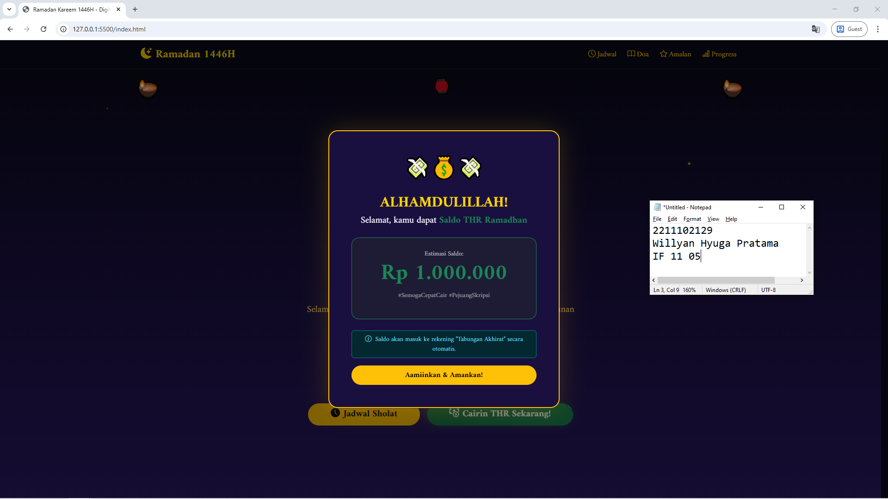

<div align="center">
  <br />
  <h1>LAPORAN PRAKTIKUM <br> APLIKASI BERBASIS PLATFORM </h1>
  <br />
  <h3>MODUL 5<br> Javascript & JQUERY </h3>
  <br />
  
  <br />
  <br />
  <br />
  <h3>Disusun Oleh :</h3>
  <p>
    <strong>Willyan Hyuga Pratama</strong>
    <br>
    <strong>2211102129</strong>
    <br>
    <strong>S1 IF-11-REG05</strong>
  </p>
  <br />
  <h3>Dosen Pengampu :</h3>
  <p>
    <strong>Dedi Agung Prabowo, S.Kom., M.Kom</strong>
  </p>
  <br />
  <br />
  <h4>Asisten Praktikum :</h4>
  <strong>Apri Pandu Wicaksono </strong>
  <br>
  <strong>Hamka Zaenul Ardi</strong>
  <br />
  <h3>LABORATORIUM HIGH PERFORMANCE <br>FAKULTAS INFORMATIKA <br>UNIVERSITAS TELKOM PURWOKERTO <br>2026 </h3>
</div>

<hr>

# Dasar Teori JavaScript dan jQuery

## 1. JavaScript (JS)

JavaScript adalah bahasa pemrograman *high-level*, *scripting*, *dynamically-typed*, dan *interpreted* yang dikembangkan pertama kali oleh **Brendan Eich** di Netscape pada tahun 1995. Saat ini, JavaScript telah menjadi salah satu bahasa pemrograman paling populer di dunia dan merupakan pilar utama dalam pengembangan web modern bersama HTML dan CSS. JavaScript memungkinkan pengembang untuk mengimplementasikan fitur-fitur kompleks pada halaman web, seperti pembaruan konten secara dinamis, validasi formulir, animasi, serta komunikasi asinkron dengan server.

JavaScript distandarisasi oleh **ECMA International** dengan nama resmi **ECMAScript (ES)**. Versi modern yang banyak digunakan saat ini adalah **ES6 (ECMAScript 2015)** ke atas, yang memperkenalkan banyak fitur penting seperti `let`/`const`, *arrow function*, *template literals*, *destructuring*, *promise*, dan *async/await*.

### 1.1. Karakteristik Utama JavaScript

| Karakteristik | Penjelasan |
|---|---|
| **Client-Side Scripting** | Kode JavaScript dieksekusi langsung di browser pengguna (*client*), bukan di server. Hal ini mengurangi beban server dan memberikan respon interaksi yang lebih cepat kepada pengguna. |
| **Interpreted** | JavaScript tidak memerlukan proses kompilasi terpisah sebelum dijalankan. Browser memiliki *JavaScript Engine* (seperti V8 di Chrome, SpiderMonkey di Firefox) yang membaca dan mengeksekusi kode secara langsung. |
| **Dynamically Typed** | Tipe data variabel ditentukan secara otomatis saat program berjalan (*runtime*), bukan saat penulisan kode. Sebuah variabel dapat menyimpan tipe data yang berbeda-beda sepanjang eksekusi program. |
| **Event-Driven** | JavaScript dirancang untuk merespons berbagai kejadian (*event*) seperti klik mouse (`click`), input keyboard (`keydown`), pengiriman formulir (`submit`), atau perubahan nilai input (`change`). |
| **Object-Based** | JavaScript mendukung paradigma pemrograman berorientasi objek (*Object-Oriented Programming*) berbasis prototipe (*prototype-based*), bukan berbasis kelas seperti Java atau C++. |

### 1.2. Tipe Data dalam JavaScript

JavaScript memiliki beberapa tipe data dasar:
- **Primitive Types**: `String`, `Number`, `Boolean`, `Null`, `Undefined`, `Symbol`, dan `BigInt`.
- **Reference Types**: `Object`, `Array`, dan `Function`.


### Source code - html
```html
<!DOCTYPE html>
<html lang="id" data-bs-theme="dark">
<head>
  <meta charset="UTF-8" />
  <meta name="viewport" content="width=device-width, initial-scale=1.0" />
  <title>Ramadan Kareem 1446H - Digital Dashboard</title>
  <link href="https://cdn.jsdelivr.net/npm/bootstrap@5.3.3/dist/css/bootstrap.min.css" rel="stylesheet" />
  <link href="https://cdn.jsdelivr.net/npm/bootstrap-icons@1.11.3/font/bootstrap-icons.min.css" rel="stylesheet" />
  <link href="https://fonts.googleapis.com/css2?family=Amiri:ital,wght@0,400;0,700;1,400&family=Scheherazade+New:wght@400;700&display=swap" rel="stylesheet" />
  <style>
    body { font-family: 'Amiri', serif; background-color: #0a0a1a; scroll-behavior: smooth; }
    .hero-bg { background: linear-gradient(180deg, #0a0a1a 0%, #1a1040 40%, #2d1b69 100%); min-height: 100vh; }
    .moon-glow { text-shadow: 0 0 40px #ffd700, 0 0 80px #ffaa00; }
    .gold-text { color: #ffd700; }
    .lantern { animation: swing 3s ease-in-out infinite; transform-origin: top center; display: inline-block; }
    .lantern:nth-child(2) { animation-delay: 0.5s; }
    @keyframes swing { 0%,100% { transform: rotate(-8deg); } 50% { transform: rotate(8deg); } }
    .star-twinkle { animation: twinkle 2s ease-in-out infinite; }
    @keyframes twinkle { 0%,100% { opacity: 1; } 50% { opacity: 0.3; } }
    .card-ramadan { background: rgba(255,255,255,0.05); border: 1px solid rgba(255,215,0,0.3); backdrop-filter: blur(15px); border-radius: 20px; }
    .progress-custom { background-color: #2d1b69; border-radius: 50px; }
    .progress-bar-custom { background: linear-gradient(90deg, #ffd700, #ff8c00); }
    .font-arabic { font-family: 'Scheherazade New', serif; font-size: 2rem; line-height: 1.8; }
    .countdown-box { background: rgba(255,215,0,0.1); border: 1px solid rgba(255,215,0,0.4); border-radius: 12px; min-width: 80px; }
    
    /* Tombol THR Styles */
    .btn-thr {
      background: linear-gradient(45deg, #157347, #198754);
      border: none;
      box-shadow: 0 0 15px rgba(25, 135, 84, 0.4);
      transition: all 0.3s cubic-bezier(0.175, 0.885, 0.32, 1.275);
      position: relative;
      overflow: hidden;
    }
    .btn-thr:hover {
      transform: scale(1.05) translateY(-3px);
      box-shadow: 0 10px 25px rgba(25, 135, 84, 0.6);
      background: linear-gradient(45deg, #198754, #28a745);
    }
    .btn-thr::after {
      content: '💸';
      position: absolute;
      top: -20px;
      right: -20px;
      font-size: 2rem;
      opacity: 0.2;
    }

    /* Modal THR Styles */
    #thrModal .modal-content {
      border: 2px solid #ffc107;
      box-shadow: 0 0 50px rgba(255, 193, 7, 0.2);
    }
    .money-rain { font-size: 3rem; animation: float 2s ease-in-out infinite; }
    @keyframes float { 0%, 100% { transform: translateY(0); } 50% { transform: translateY(-15px); } }
  </style>
</head>
<body>

<nav class="navbar navbar-expand-lg navbar-dark sticky-top" style="background: rgba(10,10,26,0.9); backdrop-filter: blur(12px); border-bottom: 1px solid rgba(255,215,0,0.2);">
  <div class="container">
    <a class="navbar-brand fw-bold fs-4 gold-text" href="#">
      <i class="bi bi-moon-stars-fill me-2"></i>Ramadan 1446H
    </a>
    <button class="navbar-toggler border-warning" type="button" data-bs-toggle="collapse" data-bs-target="#navMenu">
      <span class="navbar-toggler-icon"></span>
    </button>
    <div class="collapse navbar-collapse" id="navMenu">
      <ul class="navbar-nav ms-auto gap-2">
        <li class="nav-item"><a class="nav-link text-warning" href="#jadwal"><i class="bi bi-clock me-1"></i>Jadwal</a></li>
        <li class="nav-item"><a class="nav-link text-warning" href="#doa"><i class="bi bi-book me-1"></i>Doa</a></li>
        <li class="nav-item"><a class="nav-link text-warning" href="#amalan"><i class="bi bi-star me-1"></i>Amalan</a></li>
        <li class="nav-item"><a class="nav-link text-warning" href="#progress"><i class="bi bi-bar-chart me-1"></i>Progress</a></li>
      </ul>
    </div>
  </div>
</nav>

<section class="hero-bg d-flex align-items-center position-relative overflow-hidden">
  <div class="position-absolute top-0 start-0 w-100 h-100 pe-none">
    <span class="position-absolute star-twinkle text-warning" style="top:8%;left:12%;font-size:0.5rem;">&#9733;</span>
    <span class="position-absolute star-twinkle text-warning" style="top:20%;left:78%;font-size:0.6rem;animation-delay:1.1s;">&#9733;</span>
  </div>

  <div class="position-absolute top-0 w-100 d-flex justify-content-around pt-3">
    <span class="lantern fs-1">🪔</span>
    <span class="lantern fs-2">🏮</span>
    <span class="lantern fs-1">🪔</span>
  </div>

    <!-- Selebihnya dapat cek pada file "index.html" -->
```
🔗 [Klik di sini untuk membuka file `index.html`](index.html)

Output:



## Penjelasan
Website ini merupakan dashboard Ramadan interaktif yang kini dilengkapi dengan fitur surprise berupa tombol "Cairin THR" dengan efek visual money-rain. Menggunakan kombinasi Bootstrap 5 dan animasi CSS, fitur ini memberikan pengalaman pop-up yang seru dan memotivasi pengguna di sela-sela memantau jadwal ibadah.
