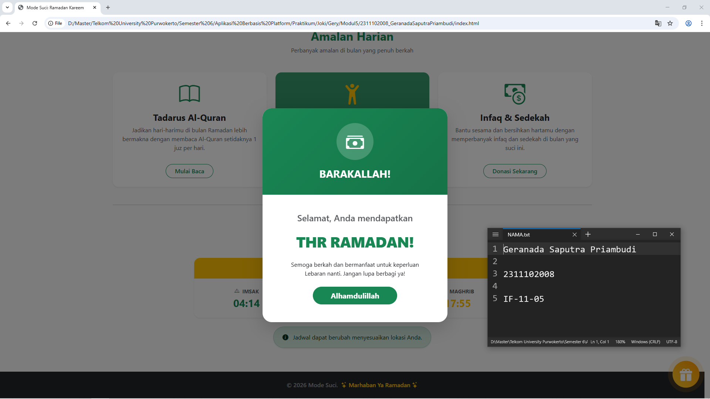
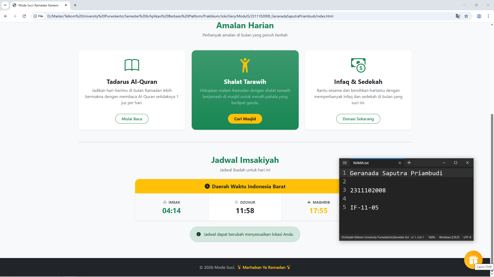

<div align="center">
  <br />
  <h1>LAPORAN PRAKTIKUM <br> APLIKASI BERBASIS PLATFORM </h1>
  <br />
  <h3>MODUL 5 <br> JAVASCRIPT & JQUERY </h3>
  <br />
  
  <br />
  <br />
  <br />
  <h3>Disusun Oleh :</h3>
  <p>
    <strong>Geranada Saputra Priambudi</strong>
    <br>
    <strong>2311102008</strong>
    <br>
    <strong>S1 IF-11-REG05</strong>
  </p>
  <br />
  <h3>Dosen Pengampu :</h3>
  <p>
    <strong>Dedi Agung Prabowo, S.Kom., M.Kom</strong>
  </p>
  <br />
  <br />
  <h4>Asisten Praktikum :</h4>
  <strong>Apri Pandu Wicaksono </strong>
  <br>
  <strong>Hamka Zaenul Ardi</strong>
  <br />
  <h3>LABORATORIUM HIGH PERFORMANCE <br>FAKULTAS INFORMATIKA <br>UNIVERSITAS TELKOM PURWOKERTO <br>2026 </h3>
</div>

<hr>

# Dasar Teori Javascript & JQUERY

1. JavaScript (JS)
JavaScript adalah bahasa pemrograman high-level, scripting, dan interpreted yang bersifat client-side. Artinya, kode dijalankan langsung di browser pengguna tanpa perlu diproses oleh server terlebih dahulu untuk interaksi UI.

Manipulasi DOM (Document Object Model): JavaScript memungkinkan pengembang untuk mengubah konten, struktur, dan gaya HTML secara dinamis.
Event Handling: JS dapat mendeteksi dan merespons tindakan pengguna seperti klik mouse, input keyboard, atau pemuatan halaman.
Asynchronous: Dengan fitur asinkron, JS dapat melakukan tugas di latar belakang tanpa menghentikan eksekusi kode lainnya.

2. jQuery
jQuery adalah pustaka (library) JavaScript lintas browser yang dirancang untuk menyederhanakan penulisan kode JavaScript. Motto utamanya adalah "Write Less, Do More".

Sintaks Ringkas: Mengganti operasi DOM yang panjang (seperti document.getElementById) dengan sintaks yang jauh lebih pendek (seperti $('#id')).
Cross-Browser Compatibility: Menangani perbedaan cara kerja JavaScript di berbagai browser (Chrome, Firefox, Safari, dll) secara otomatis.
Efek & Animasi: Menyediakan fungsi bawaan untuk membuat animasi transisi seperti fade, slide, dan toggle dengan mudah.

3. AJAX (Asynchronous JavaScript and XML)
AJAX bukanlah bahasa pemrograman, melainkan teknik yang menggabungkan JavaScript dan XML (atau sekarang lebih sering menggunakan JSON) untuk memperbarui bagian dari halaman web tanpa reload seluruh halaman.

User Experience (UX): Membuat aplikasi terasa lebih cepat dan responsif layaknya aplikasi desktop.
Data Transfer: Memungkinkan aplikasi untuk mengirim dan menerima data dari server di latar belakang.

4. JSON (JavaScript Object Notation)
JSON adalah format pertukaran data yang ringan, mudah dibaca manusia, dan mudah diproses oleh mesin. Walaupun berasal dari JavaScript, format ini didukung oleh hampir semua bahasa pemrograman modern (termasuk Python/Flask).

Struktur Data: Menggunakan format pasangan kunci dan nilai (key-value pairs) serta array.
Kegunaan: Sangat populer digunakan sebagai format database flat-file sederhana atau untuk pengiriman data melalui API.


### Source code - html
```html
<!DOCTYPE html>
<html lang="id">
<head>
    <meta charset="UTF-8">
    <meta name="viewport" content="width=device-width, initial-scale=1.0">
    <title>Mode Suci: Ramadan Kareem</title>
    <!-- Bootstrap CSS -->
    <link href="https://cdn.jsdelivr.net/npm/bootstrap@5.3.3/dist/css/bootstrap.min.css" rel="stylesheet">
    <!-- Bootstrap Icons -->
    <link href="https://cdn.jsdelivr.net/npm/bootstrap-icons@1.11.3/font/bootstrap-icons.min.css" rel="stylesheet">
    <style>
        /* Floating Button Style */
        .btn-surprise {
            position: fixed;
            bottom: 30px;
            right: 30px;
            width: 70px;
            height: 70px;
            border-radius: 50%;
            background: linear-gradient(45deg, #ffca2c, #ff9800);
            border: none;
            box-shadow: 0 10px 20px rgba(255, 152, 0, 0.4);
            z-index: 1000;
            display: flex;
            align-items: center;
            justify-content: center;
            font-size: 2rem;
            color: white;
            cursor: pointer;
            transition: all 0.3s cubic-bezier(0.175, 0.885, 0.32, 1.275);
            animation: pulse-gold 2s infinite;
        }
        .btn-surprise:hover {
            transform: scale(1.1) rotate(15deg);
            box-shadow: 0 15px 30px rgba(255, 152, 0, 0.6);

    <!-- Selebihnya dapat cek pada file "index.html" -->
```
🔗 [Klik di sini untuk membuka file `index.html`](index.html)

Output:



## Penjelasan
Membuat website landing page Ramadan interaktif yang tidak hanya menampilkan amalan harian dan jadwal imsakiyah, tetapi juga memiliki fitur tambahan berupa tombol “Cairin THR” yang menampilkan modal pop-up sebagai elemen interaktif dan hiburan bagi pengguna.
