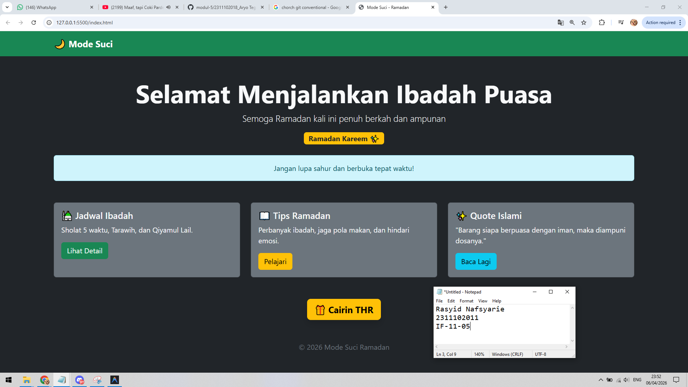
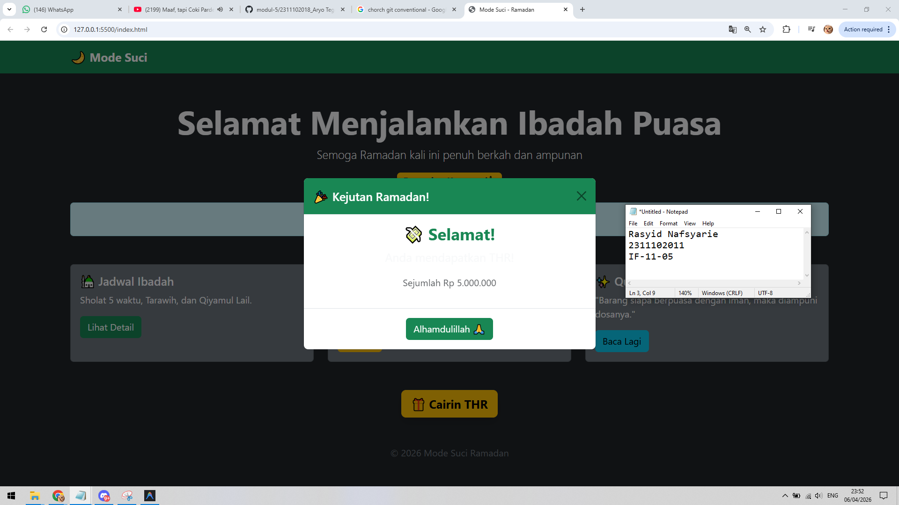

<div align="center">
  <br />
  <h1>LAPORAN PRAKTIKUM <br> APLIKASI BERBASIS PLATFORM </h1>
  <br />
  <h3>MODUL 5 <br> JAVASCRIPT & JQUERY </h3>
  <br />
  
  <br />
  <br />
  <br />
  <h3>Disusun Oleh :</h3>
  <p>
    <strong>Rasyid Nafsyarie</strong>
    <br>
    <strong>2311102011</strong>
    <br>
    <strong>S1 IF-11-REG05</strong>
  </p>
  <br />
  <h3>Dosen Pengampu :</h3>
  <p>
    <strong>Dedi Agung Prabowo, S.Kom., M.Kom</strong>
  </p>
  <br />
  <br />
  <h4>Asisten Praktikum :</h4>
  <strong>Apri Pandu Wicaksono </strong>
  <br>
  <strong>Hamka Zaenul Ardi</strong>
  <br />
  <h3>LABORATORIUM HIGH PERFORMANCE <br>FAKULTAS INFORMATIKA <br>UNIVERSITAS TELKOM PURWOKERTO <br>2026 </h3>
</div>

<hr>

# Dasar Teori Javascript & JQUERY

## Pengertian Javascript
JavaScript adalah bahasa pemrograman yang digunakan untuk membuat halaman web menjadi interaktif dan dinamis. JavaScript berjalan di sisi client (browser), sehingga dapat memanipulasi elemen HTML dan CSS secara langsung tanpa perlu reload halaman.

## Pengertian JQUERY
jQuery adalah library JavaScript yang dibuat untuk menyederhanakan penulisan kode JavaScript, terutama dalam manipulasi DOM, event handling, dan AJAX.

Dengan jQuery, penulisan kode menjadi lebih singkat dan mudah dibanding JavaScript biasa.

JavaScript adalah bahasa utama untuk membuat web menjadi interaktif, sedangkan jQuery adalah library yang membantu menyederhanakan penggunaan JavaScript. Keduanya sering digunakan bersama dalam pengembangan web untuk meningkatkan efisiensi dan kemudahan dalam coding.


## Contoh Implementasi
```html
<button class="btn btn-primary">Klik Saya</button>
```

### Source code - html
```html
<div class="modal fade" id="thrModal" tabindex="-1">
        <div class="modal-dialog modal-dialog-centered">
            <div class="modal-content text-center">

                <div class="modal-header bg-success text-white">
                    <h5 class="modal-title">🎉 Kejutan Ramadan!</h5>
                    <button type="button" class="btn-close" data-bs-dismiss="modal"></button>
                </div>

                <div class="modal-body">
                    <h3 class="fw-bold text-success">💸 Selamat!</h3>
                    <p class="fs-5">Anda mendapatkan THR!</p>
                    <p class="text-muted">Sejumlah Rp 5.000.000 </p>
                </div>

                <div class="modal-footer justify-content-center">
                    <button class="btn btn-success" data-bs-dismiss="modal">
                        Alhamdulillah 🙏
                    </button>
                </div>

            </div>
        </div>
    </div>
// Selebihnya dapat cek pada file "index.html"
```
🔗 [Klik di sini untuk membuka file `index.html`](index.html)

Output:




## Penjelasan
Fitur “Cairin THR” dibuat menggunakan komponen modal Bootstrap yang akan muncul ketika tombol diklik dengan memanfaatkan atribut data-bs-toggle dan data-bs-target. Modal ini berfungsi sebagai pop-up interaktif yang menampilkan pesan hadiah sehingga meningkatkan pengalaman pengguna tanpa perlu menggunakan JavaScript tambahan.
