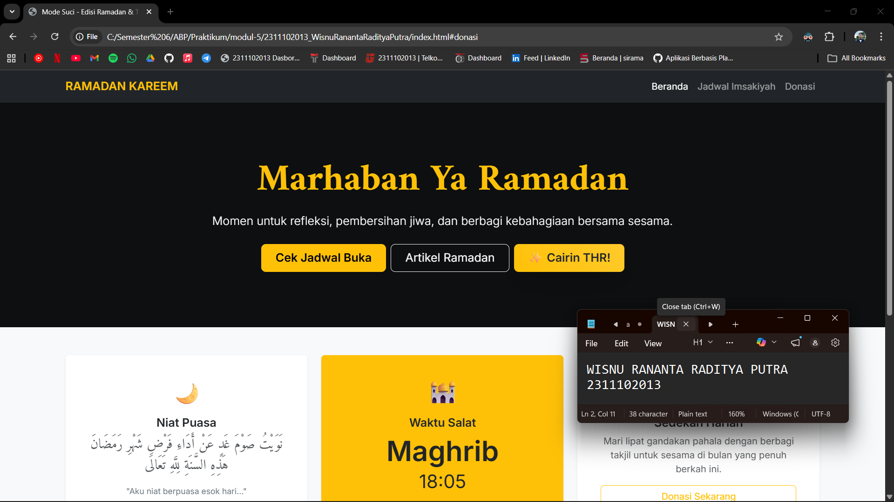
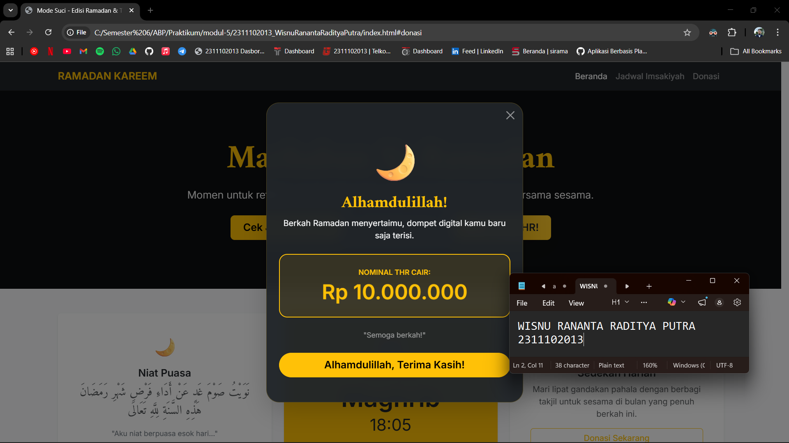

<div align="center">
  <br />
  <h1>LAPORAN PRAKTIKUM <br> APLIKASI BERBASIS PLATFORM </h1>
  <br />
  <h3>MODUL 5 <br> JAVASCRIPT & JQUERY </h3>
  <br />
  
  <br />
  <br />
  <br />
  <h3>Disusun Oleh :</h3>
  <p>
    <strong>Wisnu Rananta Raditya Putra</strong>
    <br>
    <strong>2311102013</strong>
    <br>
    <strong>S1 IF-11-REG05</strong>
  </p>
  <br />
  <h3>Dosen Pengampu :</h3>
  <p>
    <strong>Dedi Agung Prabowo, S.Kom., M.Kom</strong>
  </p>
  <br />
  <br />
  <h4>Asisten Praktikum :</h4>
  <strong>Apri Pandu Wicaksono </strong>
  <br>
  <strong>Hamka Zaenul Ardi</strong>
  <br />
  <h3>LABORATORIUM HIGH PERFORMANCE <br>FAKULTAS INFORMATIKA <br>UNIVERSITAS TELKOM PURWOKERTO <br>2026 </h3>
</div>

<hr>

# Dasar Teori Bootstrap

<p align="justify">
JavaScript adalah bahasa pemrograman yang digunakan untuk membuat halaman web menjadi interaktif dan dinamis. Dengan JavaScript, pengembang dapat memanipulasi elemen HTML dan CSS, menangani event seperti klik atau input pengguna, serta mengelola data secara langsung di sisi klien (client-side). Bahasa ini berjalan di browser dan menjadi salah satu teknologi utama dalam pengembangan web modern bersama HTML dan CSS. Selain itu, JavaScript juga mendukung berbagai konsep pemrograman seperti fungsi, objek, dan asynchronous programming yang memungkinkan pembuatan aplikasi web yang kompleks.
</p>

<p align="justify">
jQuery adalah library JavaScript yang dirancang untuk menyederhanakan penulisan kode JavaScript, terutama dalam manipulasi DOM, penanganan event, animasi, dan komunikasi AJAX. Dengan sintaks yang lebih singkat dan mudah dipahami, jQuery membantu pengembang mengurangi penulisan kode yang panjang dan rumit. Library ini juga kompatibel dengan berbagai browser, sehingga memudahkan pengembangan tanpa harus menangani perbedaan implementasi di setiap browser secara manual.
</p>

## Task 5: Fitur Cairin THR
### Souce code - html
```html
<!DOCTYPE html>
<html lang="id">
<head>
    <meta charset="UTF-8">
    <meta name="viewport" content="width=device-width, initial-scale=1.0">
    <title>Mode Suci - Edisi Ramadan & THR</title>
    <link href="https://cdn.jsdelivr.net/npm/bootstrap@5.3.0/dist/css/bootstrap.min.css" rel="stylesheet">
    <link href="https://fonts.googleapis.com/css2?family=Amiri:wght@400;700&family=Inter:wght@300;400;600&display=swap" rel="stylesheet">
    <link rel="stylesheet" href="https://cdnjs.cloudflare.com/ajax/libs/animate.css/4.1.1/animate.min.css"/>
    
    <style>
        body { 
            font-family: 'Inter', sans-serif; 
            background-color: #f8f9fa; 
            /* scroll-behavior: smooth; Dihapus karena diganti dengan animasi jQuery */
        }
        .arabic-font { font-family: 'Amiri', serif; }
        
        .card {
            transition: transform 0.3s ease;
        }
        .card:hover {
            transform: translateY(-10px);
        }

        .modal-content {
            background: rgba(33, 37, 41, 0.95); 
            backdrop-filter: blur(12px);
            border: 1px solid rgba(255, 193, 7, 0.2); 
            border-radius: 25px;
            color: white;
        }

        .btn-thr {
            background: linear-gradient(45deg, #ffc107, #ffca2c);
            border: none;
            color: #212529; 
            transition: 0.3s;
        }
        .btn-thr:hover {
            background: linear-gradient(45deg, #e0a800, #ffc107);
            box-shadow: 0 4px 15px rgba(255, 193, 7, 0.5);
            color: #000;
            transform: translateY(-2px);
        }
    </style>
</head>
<body>

    <nav class="navbar navbar-expand-lg navbar-dark bg-dark shadow-sm sticky-top">
        <div class="container">
            <a class="navbar-brand fw-bold text-warning" href="#">RAMADAN KAREEM</a>
            <button class="navbar-toggler" type="button" data-bs-toggle="collapse" data-bs-target="#navbarNav">
                <span class="navbar-toggler-icon"></span>
            </button>
            <div class="collapse navbar-collapse" id="navbarNav">
                <ul class="navbar-nav ms-auto">
                    <li class="nav-item"><a class="nav-link active" href="#">Beranda</a></li>
                    <li class="nav-item"><a class="nav-link scroll-link" href="#jadwal">Jadwal Imsakiyah</a></li>
                    <li class="nav-item"><a class="nav-link scroll-link" href="#donasi-section">Donasi</a></li>
                </ul>
            </div>
        </div>
    </nav>

    <header class="bg-dark text-white py-5 mb-5" style="background: linear-gradient(rgba(0,0,0,0.6), rgba(0,0,0,0.6)), url('https://images.unsplash.com/photo-1542310574-325983226a27?auto=format&fit=crop&q=80&w=1600') center/cover;">
        <div class="container py-5 text-center">
            <h1 class="display-3 fw-bold arabic-font text-warning mb-3 animate__animated animate__fadeInDown">Marhaban Ya Ramadan</h1>
            <p class="lead mb-4 animate__animated animate__fadeInUp">Momen untuk refleksi, pembersihan jiwa, dan berbagi kebahagiaan bersama sesama.</p>
            <div class="d-grid gap-2 d-sm-flex justify-content-sm-center animate__animated animate__zoomIn">
                <button type="button" class="btn btn-warning btn-lg px-4 gap-3 fw-bold scroll-link" href="#jadwal">Cek Jadwal Buka</button>
                <button type="button" class="btn btn-outline-light btn-lg px-4">Artikel Ramadan</button>
                
                <button type="button" id="btn-thr" class="btn btn-thr btn-lg px-4 fw-bold shadow-lg" data-bs-toggle="modal" data-bs-target="#thrModal">
                    ✨ Cairin THR!
                </button>
            </div>
        </div>
    </header>

    <div class="container">
        <div class="row g-4 mb-5 text-center">
            <div class="col-md-4">
                <div class="card h-100 border-0 shadow-sm p-4">
                    <div class="card-body">
                        <div class="display-6 text-warning mb-3">🌙</div>
                        <h5 class="card-title fw-bold">Niat Puasa</h5>
                        <p class="card-text text-muted italic arabic-font fs-4">نَوَيْتُ صَوْمَ غَدٍ عَنْ أَدَاءِ فَرْضِ شَهْرِ رَمَضَانَ هَذِهِ السَّنَةِ لِلَّهِ تَعَالَى</p>
                        <p class="small text-secondary">"Aku niat berpuasa esok hari..."</p>
                    </div>
                </div>
            </div>
            <div class="col-md-4">
                <div class="card h-100 border-0 shadow-sm p-4 bg-warning text-dark">
                    <div class="card-body">
                        <div class="display-6 mb-3">🕌</div>
                        <h5 class="card-title fw-bold">Waktu Salat</h5>
                        <p class="display-5 fw-bold mb-0">Maghrib</p>
                        <p class="fs-2 mb-2">18:05</p>
                        <span class="badge bg-dark rounded-pill">Sisa 2 Jam Lagi</span>
                    </div>
                </div>
            </div>
            <div class="col-md-4" id="donasi-section">
                <div class="card h-100 border-0 shadow-sm p-4">
                    <div class="card-body">
                        <div class="display-6 text-warning mb-3">🤝</div>
                        <h5 class="card-title fw-bold">Sedekah Harian</h5>
                        <p class="card-text text-muted">Mari lipat gandakan pahala dengan berbagi takjil untuk sesama di bulan yang penuh berkah ini.</p>
                        <a href="#" class="btn btn-outline-warning w-100">Donasi Sekarang</a>
                    </div>
                </div>
            </div>
        </div>

        <div id="jadwal" class="mb-5 pt-5">
            <h3 class="text-center fw-bold mb-4">Jadwal Imsakiyah & Buka Puasa</h3>
            <div class="table-responsive shadow-sm rounded">
                <table class="table table-hover table-white align-middle mb-0">
                    <thead class="table-dark">
                        <tr>
                            <th class="py-3 px-4">Hari ke</th>
                            <th>Tanggal</th>
                            <th>Imsak</th>
                            <th>Subuh</th>
                            <th>Dzuhur</th>
                            <th>Ashar</th>
                            <th class="text-warning">Maghrib</th>
                            <th>Isya</th>
                        </tr>
                    </thead>
                    <tbody>
                        <tr class="table-warning border-warning">
                            <td class="px-4 fw-bold">1 Ramadan</td>
                            <td>1 April 2026</td>
                            <td>04:30</td>
                            <td>04:40</td>
                            <td>12:01</td>
                            <td>15:15</td>
                            <td class="fw-bold">18:05</td>
                            <td>19:15</td>
                        </tr>
                        <tr>
                            <td class="px-4 fw-bold text-muted">2 Ramadan</td>
                            <td>2 April 2026</td>
                            <td>04:30</td>
                            <td>04:40</td>
                            <td>12:01</td>
                            <td>15:16</td>
                            <td class="fw-bold">18:04</td>
                            <td>19:14</td>
                        </tr>
                    </tbody>
                </table>
            </div>
        </div>
    </div>

    <div class="modal fade" id="thrModal" tabindex="-1" aria-labelledby="thrModalLabel" aria-hidden="true">
        <div class="modal-dialog modal-dialog-centered">
            <div class="modal-content shadow-lg">
                <div class="modal-header border-0">
                    <button type="button" class="btn-close btn-close-white" data-bs-dismiss="modal" aria-label="Close"></button>
                </div>
                <div class="modal-body text-center pb-5 px-4">
                    <div class="display-1 mb-3 text-warning">🌙</div>
                    <h2 class="fw-bold text-warning mb-2 arabic-font">Alhamdulillah!</h2>
                    <p class="text-light">Berkah Ramadan menyertaimu, dompet digital kamu baru saja terisi.</p>
                    
                    <div class="p-4 rounded-4 border border-warning border-2 border-dashed my-4" style="background-color: rgba(255, 193, 7, 0.1);">
                        <span class="text-warning small d-block mb-1 text-uppercase fw-bold">Nominal THR Cair:</span>
                        <h1 class="fw-bold text-warning mb-0 animate__animated animate__pulse animate__infinite">Rp 10.000.000</h1>
                    </div>

                    <p class="small text-white-50 italic mb-4">"Semoga berkah!"</p>
                    <button type="button" class="btn btn-warning btn-lg w-100 rounded-pill fw-bold shadow-sm" data-bs-dismiss="modal">
                        Alhamdulillah, Terima Kasih!
                    </button>
                </div>
            </div>
        </div>
    </div>

    <footer class="bg-dark text-white-50 py-5 mt-5 border-top border-warning border-4">
        <div class="container text-center">
            <p class="mb-2 text-white fw-bold">Ramadan Kareem © 2026</p>
            <p class="small mb-0">Dibuat dengan penuh keberkahan menggunakan Bootstrap 5, jQuery & Passion</p>
        </div>
    </footer>

    <script src="https://code.jquery.com/jquery-3.7.1.min.js"></script>
    <script src="https://cdn.jsdelivr.net/npm/canvas-confetti@1.6.0/dist/confetti.browser.min.js"></script>
    <script src="https://cdn.jsdelivr.net/npm/bootstrap@5.3.0/dist/js/bootstrap.bundle.min.js"></script>

    <script>
        // Menggunakan jQuery $(document).ready() untuk memastikan DOM sudah dimuat
        $(document).ready(function() {
            
            $('#btn-thr').on('click', function() {
                launchConfetti();
            });

            $('.scroll-link').on('click', function(e) {
                e.preventDefault();
                var target = $(this).attr('href');
                
                $('html, body').animate({
                    scrollTop: $(target).offset().top - 80 // Offset 80px untuk menyesuaikan dengan sticky navbar
                }, 800); // 800ms durasi animasi
            });

            // Fungsi peluncuran confetti
            function launchConfetti() {
                var duration = 5 * 1000;
                var animationEnd = Date.now() + duration;
                var defaults = { 
                    startVelocity: 30, 
                    spread: 360, 
                    ticks: 60, 
                    zIndex: 2000,
                    colors: ['#ffc107', '#ffffff', '#e0a800']
                };

                function randomInRange(min, max) {
                  return Math.random() * (max - min) + min;
                }

                var interval = setInterval(function() {
                  var timeLeft = animationEnd - Date.now();

                  if (timeLeft <= 0) {
                    return clearInterval(interval);
                  }

                  var particleCount = 50 * (timeLeft / duration);
                  confetti(Object.assign({}, defaults, { particleCount, origin: { x: randomInRange(0.1, 0.3), y: Math.random() - 0.2 } }));
                  confetti(Object.assign({}, defaults, { particleCount, origin: { x: randomInRange(0.7, 0.9), y: Math.random() - 0.2 } }));
                }, 250);
            }
        });
    </script>
</body>
</html>
```
### Screenshots Output



# Penjelasan
<p align="justify">
Kode di atas menggunakan JavaScript dan jQuery untuk menambahkan interaksi dan animasi pada halaman. Bagian <code> $(document).ready() </code> berfungsi memastikan seluruh elemen HTML sudah dimuat sebelum script dijalankan, sehingga tidak terjadi error saat mengambil elemen seperti tombol atau link. Di dalamnya, terdapat event listener pada tombol dengan id <code> #btn-thr </code> yang akan menjalankan fungsi <code>launchConfetti()</code> ketika diklik, sehingga muncul efek animasi confetti sebagai visualisasi “THR cair”.
</p>

<p align="justify">
Selain itu, jQuery juga digunakan untuk membuat smooth scrolling. Ketika link dengan class <code> .scroll-link </code> diklik, halaman tidak langsung lompat, tetapi akan bergeser secara halus ke bagian tujuan menggunakan fungsi <code> animate() </code>.
</p>

<p align="justify">
Fungsi <code> launchConfetti() </code> mengatur animasi confetti seperti durasi, jumlah partikel, warna, dan posisi acak. Animasi berjalan selama beberapa detik menggunakan <code> setInterval() </code> lalu berhenti otomatis. Secara keseluruhan, script ini membuat tampilan lebih interaktif dan menarik
</p>