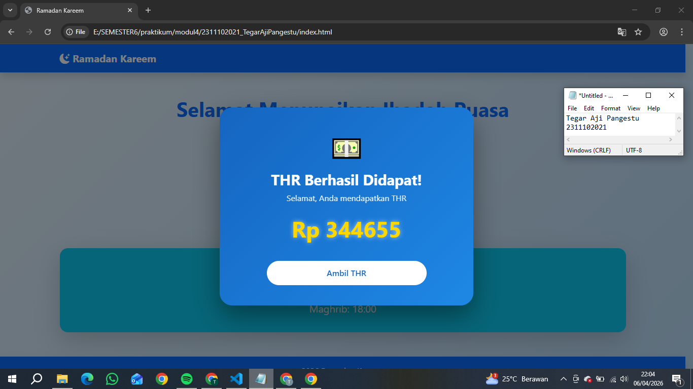

<div align="center">
  <br />
  <h1>LAPORAN PRAKTIKUM <br> APLIKASI BERBASIS PLATFORM </h1>
  <br />
  <h3>MODUL 5 <br> JAVASCRIPT & JQUERY </h3>
  <br />
  
  <br />
  <br />
  <br />
  <h3>Disusun Oleh :</h3>
  <p>
    <strong>Tegar Aji Pangestu</strong>
    <br>
    <strong>2311102021</strong>
    <br>
    <strong>S1 IF-11-REG05</strong>
  </p>
  <br />
  <h3>Dosen Pengampu :</h3>
  <p>
    <strong>Dedi Agung Prabowo, S.Kom., M.Kom</strong>
  </p>
  <br />
  <br />
  <h4>Asisten Praktikum :</h4>
  <strong>Apri Pandu Wicaksono </strong>
  <br>
  <strong>Hamka Zaenul Ardi</strong>
  <br />
  <h3>LABORATORIUM HIGH PERFORMANCE <br>FAKULTAS INFORMATIKA <br>UNIVERSITAS TELKOM PURWOKERTO <br>2026 </h3>
</div>

<hr>

# Dasar Teori
JavaScript merupakan bahasa pemrograman yang digunakan untuk membuat halaman web menjadi interaktif dan dinamis. Bahasa ini berjalan di sisi klien (browser) dan memungkinkan pengembang untuk memanipulasi elemen HTML, mengatur gaya CSS, serta merespons berbagai aksi pengguna seperti klik, input, dan navigasi. JavaScript juga mendukung konsep pemrograman modern seperti event-driven, asynchronous programming, dan penggunaan API, sehingga banyak digunakan dalam pengembangan aplikasi web maupun mobile. Seiring perkembangannya, JavaScript tidak hanya berjalan di browser, tetapi juga di sisi server menggunakan teknologi seperti Node.js.

jQuery adalah sebuah library JavaScript yang dirancang untuk menyederhanakan penulisan kode JavaScript, terutama dalam hal manipulasi DOM, penanganan event, animasi, serta komunikasi AJAX. Dengan sintaks yang lebih ringkas dan mudah dipahami, jQuery membantu developer menghemat waktu dalam pengembangan aplikasi web. Selain itu, jQuery juga mampu mengatasi perbedaan kompatibilitas antar browser, sehingga kode dapat berjalan lebih konsisten di berbagai platform. Meskipun saat ini banyak framework modern yang bermunculan, jQuery tetap menjadi dasar penting dalam memahami konsep manipulasi elemen web secara praktis.
# Tugas 4 - Mode Suci (Edisi Ramadan)
## Source code index.html
```<!-- 2311102021
Tegar Aji pangestu
S1IF-11-05 -->
<!DOCTYPE html>
<html lang="id">
<head>
  <meta charset="UTF-8">
  <meta name="viewport" content="width=device-width, initial-scale=1">
  <title>Ramadan Kareem</title>

  <!-- Bootstrap CSS -->
  <link href="https://cdn.jsdelivr.net/npm/bootstrap@5.3.0/dist/css/bootstrap.min.css" rel="stylesheet">

  <!-- Bootstrap Icons -->
  <link href="https://cdn.jsdelivr.net/npm/bootstrap-icons@1.11.1/font/bootstrap-icons.css" rel="stylesheet">
</head>

<body class="bg-primary-subtle">

  <!-- Navbar -->
  <nav class="navbar navbar-expand-lg navbar-dark bg-primary shadow">
    <div class="container">
      <span class="navbar-brand fw-bold">
        <i class="bi bi-moon-stars-fill"></i> Ramadan Kareem
      </span>
    </div>
  </nav>

  <!-- Hero -->
  <div class="container text-center py-5">
    <h1 class="fw-bold text-primary">Selamat Menunaikan Ibadah Puasa</h1>
    <p class="lead text-dark">Semoga Ramadan membawa berkah dan kedamaian</p>
  </div>

  <!-- Menu Tabs -->
  <div class="container text-center">
    <ul class="nav nav-pills justify-content-center mb-4 gap-2">
      <li class="nav-item">
        <button class="nav-link active btn btn-primary text-white" data-bs-toggle="pill" data-bs-target="#jadwal">
          <i class="bi bi-clock"></i> Jadwal
        </button>
      </li>
      <li class="nav-item">
        <button class="nav-link btn btn-outline-primary" data-bs-toggle="pill" data-bs-target="#doa">
          <i class="bi bi-book"></i> Doa
        </button>
      </li>
      <li class="nav-item">
        <button class="nav-link btn btn-outline-primary" data-bs-toggle="pill" data-bs-target="#amalan">
          <i class="bi bi-stars"></i> Amalan
        </button>
      </li>
    </ul>
  </div>

  <!-- Content -->
  <div class="container">
    <div class="tab-content">

      <!-- Jadwal -->
      <div class="tab-pane fade show active" id="jadwal">
        <div class="card shadow-lg border-0 rounded-4 text-center bg-info text-white">
          <div class="card-body">
            <h3><i class="bi bi-clock-fill"></i> Jadwal Puasa</h3>
            <p class="fs-5">Imsak: 04:30</p>
            <p class="fs-5">Maghrib: 18:00</p>
          </div>
        </div>
      </div>

      <!-- Doa -->
      <div class="tab-pane fade" id="doa">
        <div class="card shadow border-0 rounded-4">
          <div class="card-body text-center">
            <h3 class="text-primary"><i class="bi bi-book-fill"></i> Doa Ramadan</h3>
            <p class="mt-3">
              Allahumma innaka 'afuwwun tuhibbul 'afwa fa'fu 'anni
            </p>
          </div>
        </div>
      </div>

      <!-- Amalan -->
      <div class="tab-pane fade" id="amalan">
        <div class="card shadow border-0 rounded-4">
          <div class="card-body">
            <h3 class="text-primary text-center">
              <i class="bi bi-stars"></i> Amalan Ramadan
            </h3>
            <ul class="list-group list-group-flush mt-3">
              <li class="list-group-item">🌙 Sholat Tarawih</li>
              <li class="list-group-item">📖 Membaca Al-Qur'an</li>
              <li class="list-group-item">🤲 Sedekah</li>
            </ul>
          </div>
        </div>
      </div>

    </div>
  </div>

  <!-- Footer -->
  <footer class="bg-primary text-center text-light py-3 mt-5 shadow">
    <p class="mb-0">2026 Ramadan Kareem </p>
  </footer>

 
  <script src="https://code.jquery.com/jquery-3.7.1.min.js"></script>

  <!-- Bootstrap JS -->
  <script src="https://cdn.jsdelivr.net/npm/bootstrap@5.3.0/dist/js/bootstrap.bundle.min.js"></script>

 
  <script>
    $(document).ready(function(){

      // Alert saat pertama kali buka
      alert("Selamat datang di Ramadan Kareem 🌙");

      // Saat tab diklik
      $(".nav-link").click(function(){
        let menu = $(this).text().trim();
        console.log("Kamu membuka menu: " + menu);
      });

    });
  </script>

</body>
</html>
```

Output:


# Penjelasan
Program ini adalah halaman web bertema Ramadan yang dibuat menggunakan HTML, CSS, dan Bootstrap untuk tampilan responsif dan modern, di mana pengguna dapat melihat informasi seperti jadwal puasa, doa, dan amalan melalui tab navigasi, serta memiliki fitur interaktif berupa tombol “Surprise” yang ketika diklik akan menampilkan modal pop-up berdesain menarik berwarna biru yang mensimulasikan pemberian THR (Tunjangan Hari Raya) dengan nominal acak yang dianimasikan secara bertahap menggunakan JavaScript, sehingga memberikan pengalaman visual yang dinamis dan terasa seperti benar-benar mendapatkan hadiah.

