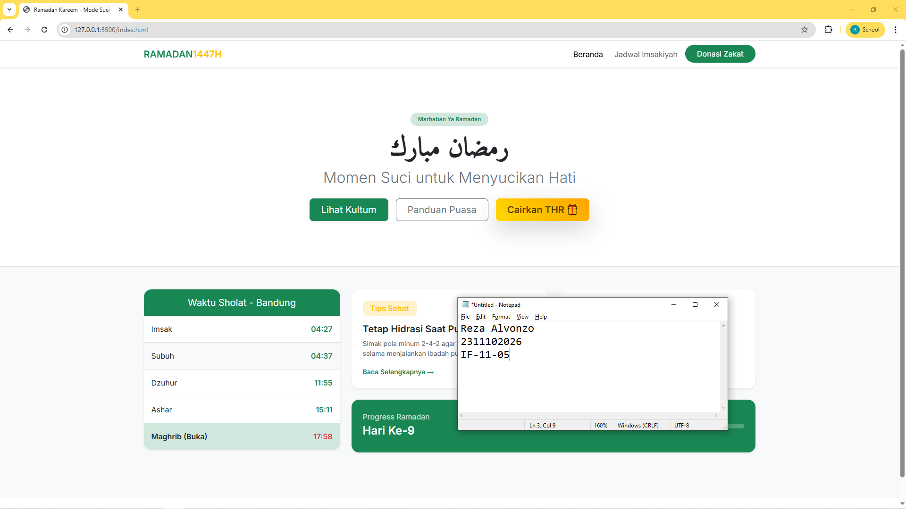
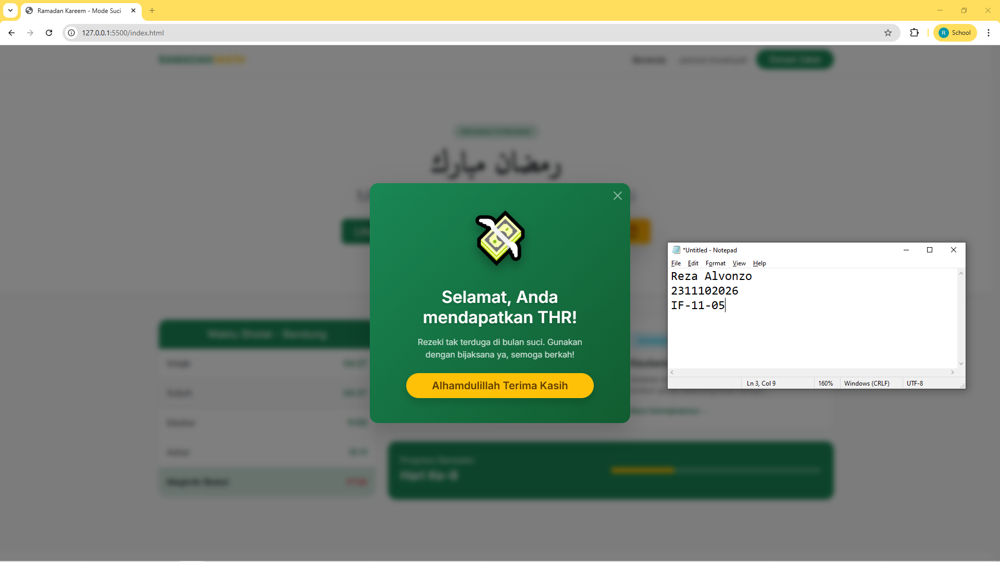

<div align="center">
  <br />
  <h1>LAPORAN PRAKTIKUM <br> APLIKASI BERBASIS PLATFORM </h1>
  <br />
  <h3>MODUL 5 <br> BOOTSTRAP </h3>
  <br />
  
  <br />
  <br />
  <br />
  <h3>Disusun Oleh :</h3>
  <p>
    <strong>Reza Alvonzo</strong>
    <br>
    <strong>2311102026</strong>
    <br>
    <strong>S1 IF-11-REG05</strong>
  </p>
  <br />
  <h3>Dosen Pengampu :</h3>
  <p>
    <strong>Dedi Agung Prabowo, S.Kom., M.Kom</strong>
  </p>
  <br />
  <br />
  <h4>Asisten Praktikum :</h4>
  <strong>Apri Pandu Wicaksono </strong>
  <br>
  <strong>Hamka Zaenul Ardi</strong>
  <br />
  <h3>LABORATORIUM HIGH PERFORMANCE <br>FAKULTAS INFORMATIKA <br>UNIVERSITAS TELKOM PURWOKERTO <br>2026 </h3>
</div>

<hr>

# Dasar Teori Bootstrap

## Pengertian Bootstrap
CSS (Cascading Style Sheets) adalah bahasa style sheet yang digunakan untuk mengatur tampilan dan format dokumen yang ditulis dalam bahasa markup (seperti HTML).

Jika HTML diibaratkan sebagai kerangka bangunan, maka CSS adalah cat, desain interior, dan estetikanya.

Fungsi Utama: Memisahkan konten (HTML) dari desain (CSS), memungkinkan konsistensi tampilan di seluruh halaman web, dan meningkatkan aksesibilitas serta kontrol tata letak.

Untuk mempercepat pengembangan, pengembang sering menggunakan framework yang sudah menyediakan class siap pakai, seperti:

Bootstrap: Berbasis komponen dan sistem grid yang matang.

Tailwind CSS: Berbasis utility-first untuk kustomisasi desain yang lebih fleksibel.

Bulma: Framework berbasis Flexbox yang modern.

## Contoh Implementasi
```html
<button class="btn btn-primary">Klik Saya</button>
```

### Source code - html
```html
<!DOCTYPE html>
<html lang="id">
<head>
    <meta charset="UTF-8">
    <meta name="viewport" content="width=device-width, initial-scale=1.0">
    <title>Ramadan Kareem - Mode Suci</title>
    <link href="https://cdn.jsdelivr.net/npm/bootstrap@5.3.2/dist/css/bootstrap.min.css" rel="stylesheet">
    <link href="https://fonts.googleapis.com/css2?family=Amiri:ital@0;1&family=Inter:wght@300;400;600&display=swap" rel="stylesheet">
    <style>
        body { font-family: 'Inter', sans-serif; background-color: #f8f9fa; }
        .arabic-font { font-family: 'Amiri', serif; }
        
        .btn-thr {
            background: linear-gradient(45deg, #FFD700, #FFA500);
            color: #5a3a00;
            border: none;
            transition: all 0.3s ease;
            animation: pulse-thr 2s infinite;
        }
        .btn-thr:hover {
            transform: scale(1.05) translateY(-2px);
            background: linear-gradient(45deg, #FFA500, #FF8C00);
            color: white;
            box-shadow: 0 10px 20px rgba(255, 165, 0, 0.4) !important;
        }
        @keyframes pulse-thr {
            0% { box-shadow: 0 0 0 0 rgba(255, 165, 0, 0.7); }
            70% { box-shadow: 0 0 0 15px rgba(255, 165, 0, 0); }
            100% { box-shadow: 0 0 0 0 rgba(255, 165, 0, 0); }
        }
        @keyframes bounce-thr {
            0%, 20%, 50%, 80%, 100% {transform: translateY(0);}
            40% {transform: translateY(-30px) scale(1.2);}
            60% {transform: translateY(-15px) scale(1.1);}
        }
    </style>
</head>
<body>

    <nav class="navbar navbar-expand-lg navbar-light bg-white shadow-sm sticky-top">
        <div class="container">
            <a class="navbar-brand fw-bold text-success" href="#">RAMADAN<span class="text-warning">1447H</span></a>
            <button class="navbar-toggler border-0" type="button" data-bs-toggle="collapse" data-bs-target="#navbarNav">
                <span class="navbar-toggler-icon"></span>
            </button>
            <div class="collapse navbar-collapse" id="navbarNav">
                <ul class="navbar-nav ms-auto gap-2">
                    <li class="nav-item"><a class="nav-link active" href="#">Beranda</a></li>
                    <li class="nav-item"><a class="nav-link" href="#">Jadwal Imsakiyah</a></li>
                    <li class="nav-item"><a class="btn btn-success rounded-pill px-4" href="#">Donasi Zakat</a></li>
                </ul>
            </div>
        </div>
    </nav>

    <header class="py-5 bg-white border-bottom">
        <div class="container py-5 text-center">
            <span class="badge rounded-pill bg-success-subtle text-success px-3 py-2 mb-3">Marhaban Ya Ramadan</span>
            <h1 class="display-4 fw-bold text-dark arabic-font">رمضان مبارك</h1>
            <h2 class="fw-light text-secondary mb-4">Momen Suci untuk Menyucikan Hati</h2>
            <div class="d-flex justify-content-center gap-3 flex-wrap">
                <button class="btn btn-success btn-lg px-4 shadow-sm">Lihat Kultum</button>
                <button class="btn btn-outline-secondary btn-lg px-4">Panduan Puasa</button>
                <button class="btn btn-warning btn-lg px-4 shadow-lg fw-bold btn-thr" data-bs-toggle="modal" data-bs-target="#thrModal" onclick="fireConfetti()">Cairkan THR 🎁</button>
            </div>
        </div>
    </header>

    <!-- Source Code lengkap dapat di akses "index.html" -->
```
🔗 [Klik di sini untuk membuka file `index.html`](index.html)
    


Output:




## Penjelasan
Gemini berkata
Website ini adalah landing page bertema Ramadan 1447H yang berfungsi sebagai pusat informasi ibadah, seperti jadwal imsakiyah, tips kesehatan, dan progres puasa. Halaman ini dibangun menggunakan Bootstrap 5 dengan fitur interaktif tambahan berupa tombol "Cairkan THR" yang memicu efek selebrasi confetti.