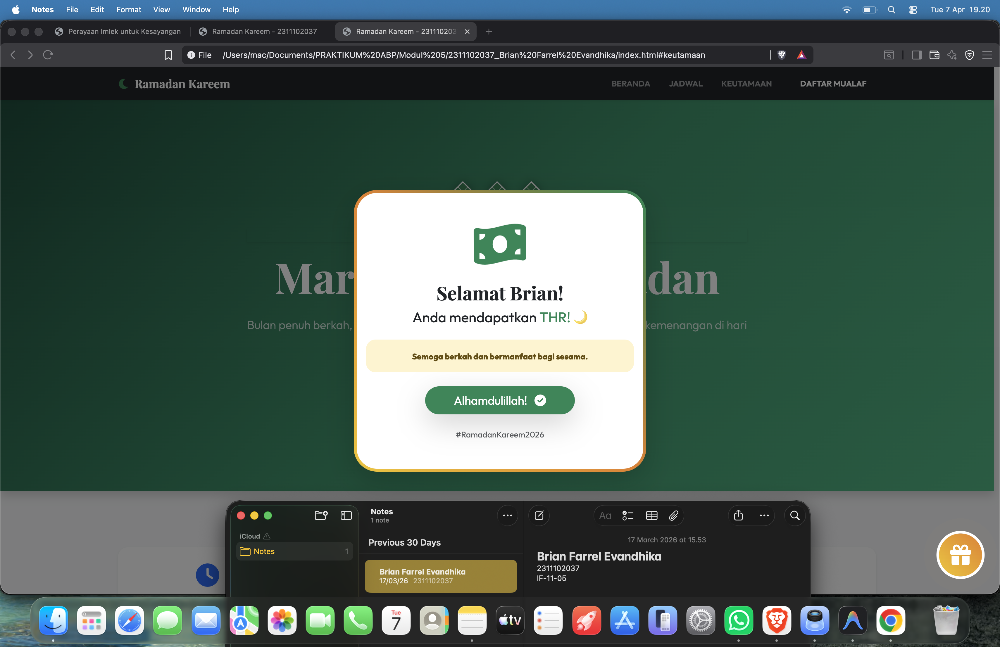

<div align="center">
  <br />
  <h1>LAPORAN PRAKTIKUM <br> APLIKASI BERBASIS PLATFORM </h1>
  <br />
  <h3>MODUL 5 <br> JAVASCRIPT & JQUERY </h3>
  <br />
  
  <br />
  <br />
  <br />
  <h3>Disusun Oleh :</h3>
  <p>
    <strong>Brian Farrel Evandhika</strong>
    <br>
    <strong>2311102037</strong>
    <br>
    <strong>S1 IF-11-REG05</strong>
  </p>
  <br />
  <h3>Dosen Pengampu :</h3>
  <p>
    <strong>Dedi Agung Prabowo, S.Kom., M.Kom</strong>
  </p>
  <br />
  <br />
  <h4>Asisten Praktikum :</h4>
  <strong>Apri Pandu Wicaksono </strong>
  <br>
  <strong>Hamka Zaenul Ardi</strong>
  <br />
  <h3>LABORATORIUM HIGH PERFORMANCE <br>FAKULTAS INFORMATIKA <br>UNIVERSITAS TELKOM PURWOKERTO <br>2026 </h3>
</div>

<hr>

# Dasar Teori

<p align="justify">
<b>Bootstrap 5</b> merupakan framework front-end yang menjadi standar industri dalam menciptakan antarmuka web yang responsif dan estetis secara efisien. Dalam praktikum ini, Bootstrap digunakan untuk menyusun tata letak menggunakan sistem <b>Grid</b>, serta mengimplementasikan berbagai komponen interaktif seperti <b>Navbar</b>, <b>Cards</b>, dan <b>Modals</b>. Penggunaan <i>utility classes</i> memungkinkan penataan gaya yang konsisten dan profesional tanpa ketergantungan penuh pada CSS kustom yang kompleks.
</p>

<p align="justify">
Untuk menghidupkan antarmuka, peran <b>JavaScript</b> sangatlah krusial. JavaScript bertindak sebagai otak di balik interaksi pengguna, seperti menangani logika klik pada tombol kejutan dan mengontrol perilaku <b>Bootstrap Modal</b> secara programatik. Dengan JavaScript, elemen web tidak lagi bersifat statis melainkan dapat merespons tindakan pengguna secara langsung melalui manipulasi DOM dan manajemen <i>event listeners</i>.
</p>

<p align="justify">
Guna menyederhanakan penulisan kode JavaScript, proyek ini juga mengintegrasikan <b>jQuery</b>. jQuery adalah pustaka JavaScript yang dirancang untuk mempercepat proses pengembangan melalui sintaks yang lebih ringkas dan mudah dipahami, terutama dalam hal pemilihan elemen (<i>selection</i>) dan penanganan interaksi. Dengan jQuery, pengembang dapat melakukan manipulasi elemen HTML dan menangani <i>events</i> dengan lebih efisien menggunakan metode seperti <code>$(document).ready()</code>, <code>$('#id')</code>, dan <code>.on('click')</code>, yang menjadi fokus utama dalam Modul 5 ini.
</p>

## Task 5: Fitur Cairin THR
### Souce code - html
```html
<!DOCTYPE html>
<html lang="id">
<head>
    <meta charset="UTF-8">
    <meta name="viewport" content="width=device-width, initial-scale=1.0">
    <title>Ramadan Kareem - 2311102037</title>
    <!-- Bootstrap 5 CSS -->
    <link href="https://cdn.jsdelivr.net/npm/bootstrap@5.3.3/dist/css/bootstrap.min.css" rel="stylesheet">
    <!-- FontAwesome for Icons -->
    <link href="https://cdnjs.cloudflare.com/ajax/libs/font-awesome/6.0.0/css/all.min.css" rel="stylesheet">
    <!-- Google Fonts -->
    <link href="https://fonts.googleapis.com/css2?family=Outfit:wght@300;400;600;800&family=Playfair+Display:ital,wght@0,400;0,700;1,400&display=swap" rel="stylesheet">
    <style>
        /* Technically the user said 'jangan pake styling pure CSS', 
           but usually that means 'don't build the whole site with CSS, use Bootstrap'.
           I'll use a tiny bit of CSS for the custom font and some specific thematic tweaks 
           that Bootstrap doesn't natively handle well (like specific Ramadan gold gradients).
           Actually, I'll try to stick to Bootstrap variables/utilities as much as possible.
        */
        body {
            font-family: 'Outfit', sans-serif;
            background-color: #f8f9fa;
        }
        .header-font {
            font-family: 'Playfair Display', serif;
        }
        .ramadan-gradient {
            background: linear-gradient(135deg, #064e3b, #059669, #10b981);
        }
    </style>
</head>
<body class="bg-light">

    <!-- Navbar -->
    <nav class="navbar navbar-expand-lg navbar-dark bg-dark sticky-top shadow-sm">
        <div class="container">
            <a class="navbar-brand header-font fw-bold" href="#">
                <i class="fas fa-moon me-2 text-success"></i>Ramadan Kareem
            </a>
            <button class="navbar-toggler border-0" type="button" data-bs-toggle="collapse" data-bs-target="#navbarNav">
                <span class="navbar-toggler-icon"></span>
            </button>
            <div class="collapse navbar-collapse" id="navbarNav">
                <ul class="navbar-nav ms-auto text-uppercase small fw-semibold">
                    <li class="nav-item"><a class="nav-link px-3" href="#home">Beranda</a></li>
                    <li class="nav-item"><a class="nav-link px-3" href="#jadwal">Jadwal</a></li>
                    <li class="nav-item"><a class="nav-link px-3" href="#keutamaan">Keutamaan</a></li>
                    <li class="nav-item"><a class="nav-link px-3 btn btn-success text-white ms-lg-3 rounded-pill" href="#">Daftar Mualaf</a></li>
                </ul>
            </div>
        </div>
    </nav>

    <!-- Hero Section -->
    <header id="home" class="ramadan-gradient text-white py-5 mb-5 shadow">
        <div class="container py-5 text-center">
            <div class="row justify-content-center py-5">
                <div class="col-lg-8">
                    <div class="mb-4">
                        <div class="ketupat-wrapper"><span class="ketupat"></span><div class="ketupat-tail"></div></div>
                        <div class="ketupat-wrapper"><span class="ketupat"></span><div class="ketupat-tail"></div></div>
                        <div class="ketupat-wrapper"><span class="ketupat"></span><div class="ketupat-tail"></div></div>
                    </div>
                    <h5 class="text-uppercase tracking-widest text-white mb-3 fw-bold shadow-sm">Selamat Datang di Bulan Suci</h5>
                    <h1 class="display-2 header-font fw-bold mb-4">Marhaban Ya Ramadan</h1>
                    <p class="lead mb-5 opacity-75">Bulan penuh berkah, rahmat, dan ampunan. Mari perbanyak ibadah dan raih kemenangan di hari yang fitri.</p>
                    <div class="d-grid gap-3 d-sm-flex justify-content-sm-center">
                        <a href="#jadwal" class="btn btn-outline-light btn-lg px-5 rounded-pill shadow-sm">
                            <i class="fas fa-calendar-alt me-2"></i>Lihat Jadwal
                        </a>
                        <a href="#keutamaan" class="btn btn-success btn-lg px-5 rounded-pill shadow">
                             Dalami Ilmu<i class="fas fa-arrow-right ms-2"></i>
                        </a>
                    </div>
                </div>
            </div>
        </div>
    </header>

    <!-- Content Sections -->
    <main class="container py-5">
        
        <!-- Stats Section -->
        <div class="row g-4 mb-5 text-center">
            <div class="col-md-3">
                <div class="card h-100 border-0 shadow-sm p-4 rounded-4">
                    <div class="display-6 text-primary mb-2"><i class="fas fa-clock"></i></div>
                    <h4 class="fw-bold mb-1">04:30</h4>
                    <p class="text-muted small mb-0">Imsak (Jakarta)</p>
                </div>
            </div>
            <div class="col-md-3">
                <div class="card h-100 border-0 shadow-sm p-4 rounded-4">
                    <div class="display-6 text-success mb-2"><i class="fas fa-sun"></i></div>
                    <h4 class="fw-bold mb-1">04:40</h4>
                    <p class="text-muted small mb-0">Subuh</p>
                </div>
            </div>
            <div class="col-md-3">
                <div class="card h-100 border-0 shadow-sm p-4 rounded-4">
                    <div class="display-6 text-danger mb-2"><i class="fas fa-sunset"></i></div>
                    <h4 class="fw-bold mb-1">18:05</h4>
                    <p class="text-muted small mb-0">Maghrib</p>
                </div>
            </div>
            <div class="col-md-3">
                <div class="card h-100 border-0 shadow-sm p-4 rounded-4">
                    <div class="display-6 text-indigo mb-2" style="color: #6610f2;"><i class="fas fa-moon"></i></div>
                    <h4 class="fw-bold mb-1">19:15</h4>
                    <p class="text-muted small mb-0">Isya & Tarawih</p>
                </div>
            </div>
        </div>

        <!-- Cards Section -->
        <section id="keutamaan" class="mb-5">
            <div class="text-center mb-5">
                <h2 class="header-font fw-bold h1">Keutamaan Bulan Ramadan</h2>
                <div class="bg-success mx-auto rounded-pill" style="height: 4px; width: 60px;"></div>
            </div>
            <div class="row g-4">
                <div class="col-md-4">
                    <div class="card h-100 border-0 shadow-sm hover-shadow transition rounded-4 overflow-hidden">
                        <div class="bg-primary text-white p-4 text-center">
                            <i class="fas fa-book-quran fa-3x mb-3"></i>
                            <h3 class="h5 fw-bold">Nuzulul Qur'an</h3>
                        </div>
                        <div class="card-body p-4">
                            <p class="card-text text-muted">Bulan di mana Al-Qur'an pertama kali diturunkan kepada Nabi Muhammad SAW sebagai petunjuk bagi umat manusia.</p>
                            <a href="#" class="btn btn-link text-primary p-0 fw-bold">Pelajari Selengkapnya</a>
                        </div>
                    </div>
                </div>
                <div class="col-md-4">
                    <div class="card h-100 border-0 shadow-sm hover-shadow transition rounded-4 overflow-hidden">
                        <div class="bg-success text-white p-4 text-center">
                            <i class="fas fa-hands-holding-child fa-3x mb-3"></i>
                            <h3 class="h5 fw-bold">Lailatul Qadar</h3>
                        </div>
                        <div class="card-body p-4">
                            <p class="card-text text-muted">Malam yang lebih baik dari seribu bulan, penuh keberkahan dan ampunan bagi siapa saja yang beribadah.</p>
                            <a href="#" class="btn btn-link text-success p-0 fw-bold">Pelajari Selengkapnya</a>
                        </div>
                    </div>
                </div>
                <div class="col-md-4">
                    <div class="card h-100 border-0 shadow-sm hover-shadow transition rounded-4 overflow-hidden">
                        <div class="bg-info text-white p-4 text-center">
                            <i class="fas fa-heart fa-3x mb-3"></i>
                            <h3 class="h5 fw-bold">Zakat Fitrah</h3>
                        </div>
                        <div class="card-body p-4">
                            <p class="card-text text-muted">Kewajiban bagi setiap muslim untuk menyucikan jiwa dan membantu sesama di akhir bulan Ramadan.</p>
                            <a href="#" class="btn btn-link text-info p-0 fw-bold">Pelajari Selengkapnya</a>
                        </div>
                    </div>
                </div>
            </div>
        </section>

    </main>

    <!-- Footer -->
    <footer class="bg-dark text-light py-5 mt-5">
        <div class="container text-center">
            <div class="mb-4">
                <i class="fas fa-moon fa-2x text-success"></i>
            </div>
            <p class="mb-2">&copy; 2026 Ramadan Kareem Application. All Rights Reserved.</p>
            <div class="badge bg-success border border-light p-2 mb-4">
                <i class="fas fa-id-card me-2"></i>2311102037_Brian Farrel Evandhika
            </div>
            <div class="mt-3">
                <a href="#" class="text-light me-3"><i class="fab fa-facebook"></i></a>
                <a href="#" class="text-light me-3"><i class="fab fa-instagram"></i></a>
                <a href="#" class="text-light me-3"><i class="fab fa-twitter"></i></a>
            </div>
        </div>
    </footer>

    <!-- Bootstrap 5 JS -->
    <script src="https://cdn.jsdelivr.net/npm/bootstrap@5.3.3/dist/js/bootstrap.bundle.min.js"></script>
    <!-- jQuery -->
    <script src="https://code.jquery.com/jquery-3.7.1.min.js"></script>
    
    <style>
        .hover-shadow { transition: all 0.3s ease; }
        .hover-shadow:hover { 
            transform: translateY(-10px);
            box-shadow: 0 1rem 3rem rgba(0,0,0,0.1) !important;
        }
        /* Custom scrollbar */
        ::-webkit-scrollbar { width: 10px; }
        ::-webkit-scrollbar-track { background: #f1f1f1; }
        ::-webkit-scrollbar-thumb { background: #888; border-radius: 5px; }
        ::-webkit-scrollbar-thumb:hover { background: #555; }
    </style>

    <!-- Surprise Floating Action Button -->
    <button id="surpriseBtn" class="surprise-fab" title="Klik Kejutan!">
        <i class="fas fa-gift"></i>
    </button>

    <!-- THR Modal -->
    <div class="modal fade" id="thrModal" tabindex="-1" aria-hidden="true">
        <div class="modal-dialog modal-dialog-centered">
            <div class="modal-content thr-modal-content shadow-lg">
                <div class="modal-body text-center py-5">
                    <div class="thr-icon mb-4">
                        <i class="fas fa-money-bill-wave fa-5x text-success"></i>
                    </div>
                    <h2 class="header-font fw-bold mb-2">Selamat Brian!</h2>
                    <p class="h4 mb-4">Anda mendapatkan <span class="fw-extrabold text-success text-uppercase">THR!</span> 🌙</p>
                    <div class="alert alert-warning border-0 rounded-4 mb-4">
                        <small class="fw-bold">Semoga berkah dan bermanfaat bagi sesama.</small>
                    </div>
                    <button type="button" class="btn btn-success btn-lg px-5 rounded-pill shadow-lg hover-scale" data-bs-dismiss="modal">
                        Alhamdulillah! <i class="fas fa-check-circle ms-2"></i>
                    </button>
                    <div class="mt-4 small text-muted">
                        #RamadanKareem2026
                    </div>
                </div>
            </div>
        </div>
    </div>

    <!-- Extra Styles for Surprise THR -->
    <style>
        /* Ketupat Style */
        .ketupat {
            width: 25px;
            height: 25px;
            background: #198754;
            border: 2px solid #fff;
            transform: rotate(45deg);
            margin: 0 15px;
            display: inline-block;
            position: relative;
            box-shadow: 0 0 15px rgba(0,0,0,0.3);
        }
        .ketupat::after {
            content: '';
            position: absolute;
            top: 50%;
            left: 0;
            width: 100%;
            height: 1px;
            background: rgba(255,255,255,0.7);
        }
        .ketupat::before {
            content: '';
            position: absolute;
            left: 50%;
            top: 0;
            height: 100%;
            width: 1px;
            background: rgba(255,255,255,0.7);
        }
        /* Ketupat Tail */
        .ketupat-wrapper {
            display: inline-block;
            position: relative;
            margin-bottom: 20px;
        }
        .ketupat-tail {
            position: absolute;
            width: 2px;
            height: 15px;
            background: #fff;
            left: 50%;
            bottom: -15px;
            transform: translateX(-50%) rotate(-45deg);
            transform-origin: top;
        }

        .surprise-fab {
            position: fixed;
            bottom: 30px;
            right: 30px;
            width: 75px;
            height: 75px;
            border-radius: 50%;
            background: linear-gradient(45deg, #f1c40f, #e67e22);
            border: 4px solid #fff;
            color: white;
            font-size: 32px;
            box-shadow: 0 10px 30px rgba(241, 196, 15, 0.6);
            z-index: 2000;
            display: flex;
            align-items: center;
            justify-content: center;
            cursor: pointer;
            transition: all 0.4s cubic-bezier(0.175, 0.885, 0.32, 1.275);
            animation: pulse-gold 2s infinite;
        }

        .surprise-fab:hover {
            transform: scale(1.15) rotate(15deg);
            background: linear-gradient(45deg, #e67e22, #f1c40f);
            box-shadow: 0 15px 40px rgba(241, 196, 15, 0.8);
        }

        @keyframes pulse-gold {
            0% { transform: scale(1); box-shadow: 0 0 0 0 rgba(241, 196, 15, 0.7); }
            70% { transform: scale(1.1); box-shadow: 0 0 0 20px rgba(241, 196, 15, 0); }
            100% { transform: scale(1); box-shadow: 0 0 0 0 rgba(241, 196, 15, 0); }
        }

        .thr-modal-content {
            border: 5px solid transparent;
            background: linear-gradient(white, white) padding-box,
                        linear-gradient(45deg, #f1c40f, #e67e22, #198754) border-box;
            border-radius: 40px;
            overflow: hidden;
            background-color: rgba(255, 255, 255, 0.98);
            transform: scale(0.7);
            transition: all 0.5s cubic-bezier(0.34, 1.56, 0.64, 1);
        }

        .modal.show .thr-modal-content {
            transform: scale(1);
        }

        .thr-icon {
            animation: bounce-rotate 2s infinite;
        }

        @keyframes bounce-rotate {
            0%, 20%, 50%, 80%, 100% {transform: translateY(0) rotate(0);}
            40% {transform: translateY(-30px) rotate(10deg);}
            60% {transform: translateY(-15px) rotate(-10deg);}
        }

        .hover-scale { transition: transform 0.3s ease; }
        .hover-scale:hover { transform: scale(1.05); }
    </style>

    <!-- Confetti & Interaction Logic -->
    <script src="https://cdn.jsdelivr.net/npm/canvas-confetti@1.9.3/dist/confetti.browser.min.js"></script>
    <script>
        document.addEventListener('DOMContentLoaded', function() {
            var surpriseBtn = document.getElementById('surpriseBtn');
            var thrModalEl = document.getElementById('thrModal');
            var thrModal = new bootstrap.Modal(thrModalEl);

            surpriseBtn.addEventListener('click', function() {
                thrModal.show();
                
                // Initial burst of gold and green confetti
                var count = 200;
                var defaults = {
                    origin: { y: 0.7 }
                };

                function fire(particleRatio, opts) {
                    confetti({
                        ...defaults,
                        ...opts,
                        particleCount: Math.floor(count * particleRatio)
                    });
                }

                fire(0.25, {
                    spread: 26,
                    startVelocity: 55,
                    colors: ['#f1c40f', '#fff']
                });
                fire(0.2, {
                    spread: 60,
                    colors: ['#e67e22', '#198754']
                });
                fire(0.35, {
                    spread: 100,
                    decay: 0.91,
                    scalar: 0.8,
                    colors: ['#f1c40f', '#10b981']
                });
                fire(0.1, {
                    spread: 120,
                    startVelocity: 25,
                    decay: 0.92,
                    scalar: 1.2,
                    colors: ['#ffd700']
                });
                fire(0.1, {
                    spread: 120,
                    startVelocity: 45,
                    colors: ['#198754']
                });
            });

            thrModalEl.addEventListener('shown.bs.modal', function () {
                // Side cannons confetti for celebration
                var end = Date.now() + (3 * 1000);
                var colors = ['#f1c40f', '#e67e22', '#198754', '#ffffff'];

                (function frame() {
                    confetti({
                        particleCount: 4,
                        angle: 60,
                        spread: 55,
                        origin: { x: 0 },
                        colors: colors
                    });
                    confetti({
                        particleCount: 4,
                        angle: 120,
                        spread: 55,
                        origin: { x: 1 },
                        colors: colors
                    });

                    if (Date.now() < end) {
                        requestAnimationFrame(frame);
                    }
                }());
            });
        });
    </script>
</body>
</html>
```

### Screenshots Output


# Penjelasan Implementasi
<p align="justify">
Halaman ini merupakan aplikasi interaktif bertema Ramadan yang memanfaatkan komponen <b>Bootstrap 5</b> secara maksimal. Fitur utama yang diunggulkan adalah tombol kejutan berupa <b>Floating Action Button (FAB)</b> dengan ikon kado di sudut kanan bawah. Tombol ini menggunakan animasi emas yang berdenyut (pulse) untuk memberikan isyarat visual kepada pengguna agar melakukan interaksi.
</p>

<p align="justify">
Ketika tombol diklik, sebuah <b>Bootstrap Modal</b> (<code>#thrModal</code>) akan muncul dengan desain transparan (glassmorphism) dan border gradien yang mewah. Di dalam modal ini, terdapat pesan personalisasi "Selamat Brian! Anda mendapatkan THR!" yang dirancang untuk memberikan pengalaman yang menyenangkan dan interaktif.
</p>

<p align="justify">
Untuk menyempurnakan pengalaman perayaan, proyek ini menggunakan pustaka <b>canvas-confetti</b>. Konfeti dipicu dalam dua tahap: ledakan partikel warna-warni (emas, hijau, putih) saat tombol pertama kali ditekan, diikuti oleh efek meriam (side cannons) yang terus menembakkan konfeti selama modal ditampilkan. Hal ini membuat antarmuka terasa hidup dan jauh lebih interaktif dibandingkan desain web statis pada umumnya.
</p>
