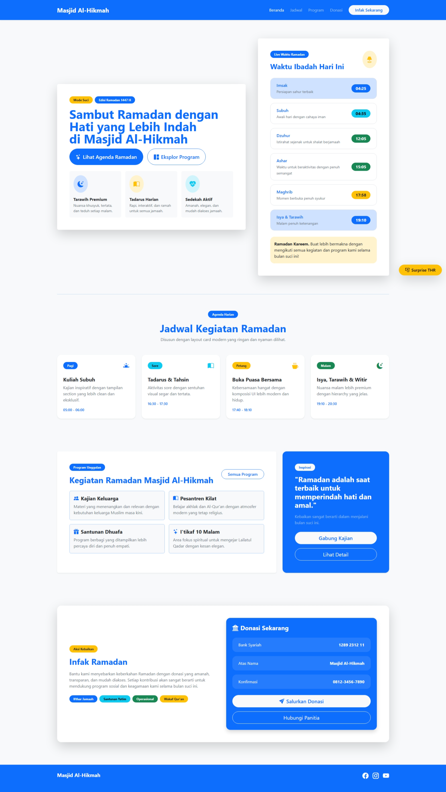
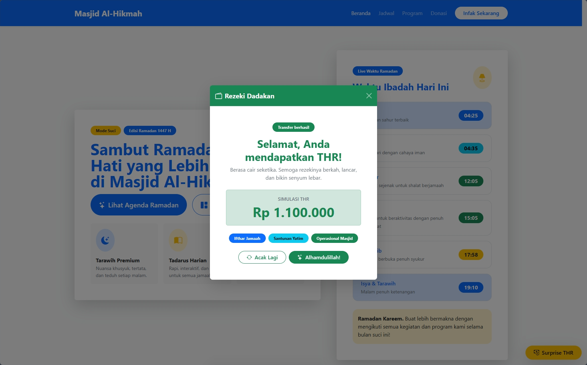

<div align="center">
  <br />
  <h1>LAPORAN PRAKTIKUM <br> APLIKASI BERBASIS PLATFORM </h1>
  <br />
  <h3>MODUL 5 <br> Bootstrap </h3>
  <br />
  
  <br />
  <br />
  <br />
  <h3>Disusun Oleh :</h3>
  <p>
    <strong>Muhammad Aulia Muzzaki Nugraha</strong>
    <br>
    <strong>2311102051</strong>
    <br>
    <strong>S1 IF-11-REG05</strong>
  </p>
  <br />
  <h3>Dosen Pengampu :</h3>
  <p>
    <strong>Dedi Agung Prabowo, S.Kom., M.Kom</strong>
  </p>
  <br />
  <br />
  <h4>Asisten Praktikum :</h4>
  <strong>Apri Pandu Wicaksono </strong>
  <br>
  <strong>Hamka Zaenul Ardi</strong>
  <br />
  <h3>LABORATORIUM HIGH PERFORMANCE <br>FAKULTAS INFORMATIKA <br>UNIVERSITAS TELKOM PURWOKERTO <br>2026 </h3>
</div>

<hr>

# Dasar Teori Bootstrap

## Pengertian Bootstrap
Bootstrap adalah framework front-end berbasis HTML, CSS, dan JavaScript yang digunakan untuk mempermudah pembuatan tampilan website yang responsif dan modern. Bootstrap menyediakan berbagai komponen dan sistem layout yang siap digunakan.

---

## Cara Menggunakan Bootstrap (CDN)
```html
<!DOCTYPE html>
<html>
<head>
  <meta charset="UTF-8">
  <title>Bootstrap Dasar</title>
  <link href="https://cdn.jsdelivr.net/npm/bootstrap@5.3.0/dist/css/bootstrap.min.css" rel="stylesheet">
</head>
<body>

  <h1 class="text-center">Hello Bootstrap</h1>

</body>
</html>
```

### Source code - html
```html
<!DOCTYPE html>
<html lang="id">
  <head>
    <meta charset="UTF-8" />
    <meta name="viewport" content="width=device-width, initial-scale=1.0" />
    <title>Masjid Al-Hikmah - Mode Suci Ramadan</title>
    <link
      href="https://cdn.jsdelivr.net/npm/bootstrap@5.3.3/dist/css/bootstrap.min.css"
      rel="stylesheet"
    />
    <link
      rel="stylesheet"
      href="https://cdn.jsdelivr.net/npm/bootstrap-icons@1.11.3/font/bootstrap-icons.min.css"
    />
    <link rel="stylesheet" href="style.css" />
  </head>
  <body class="text-dark">
    <nav class="navbar navbar-expand-lg sticky-top py-3">
      <div class="container">
        <div class="navbar navbar-dark rounded-5 w-100 px-3 px-lg-4 mica-panel">
          <a class="navbar-brand fw-bold fs-4" href="#">Masjid Al-Hikmah</a>
          <button
            class="navbar-toggler border-0 shadow-none"
            type="button"
            data-bs-toggle="collapse"
            data-bs-target="#navRamadan"
// Source Code lengkap dapat di akses "index.html"
```
🔗 [Klik di sini untuk membuka file `index.html`](./index.html)


Output:




# Penjelasan
Halaman website bertema Ramadan untuk Masjid Al-Hikmah pada versi ini dibangun full menggunakan Bootstrap 5.3 tanpa CSS native kustom. Struktur halaman terdiri dari navbar sticky, section beranda, jadwal, program, dan donasi yang disusun dengan grid system serta komponen Bootstrap seperti card, badge, button, alert, dan modal. Tampilan visual diatur menggunakan utility class Bootstrap untuk warna, spasi, tipografi, bayangan, dan responsivitas agar tetap rapi di desktop maupun mobile. Fitur interaktif ditambahkan lewat tombol Surprise THR yang memunculkan modal pop-up berisi pesan "Selamat, Anda mendapatkan THR!". Di dalam modal, JavaScript menjalankan simulasi nominal THR acak dengan animasi hitung angka, status transfer, dan tombol "Acak Lagi" sehingga pengalaman pengguna terasa lebih hidup tanpa bergantung pada stylesheet kustom.