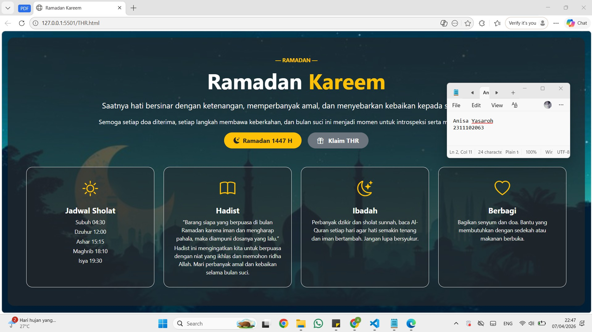
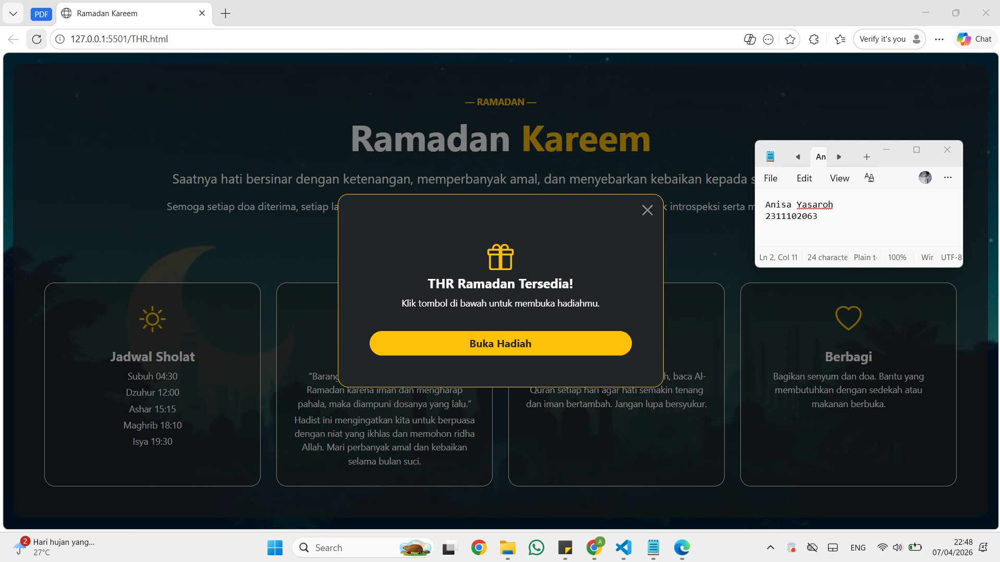
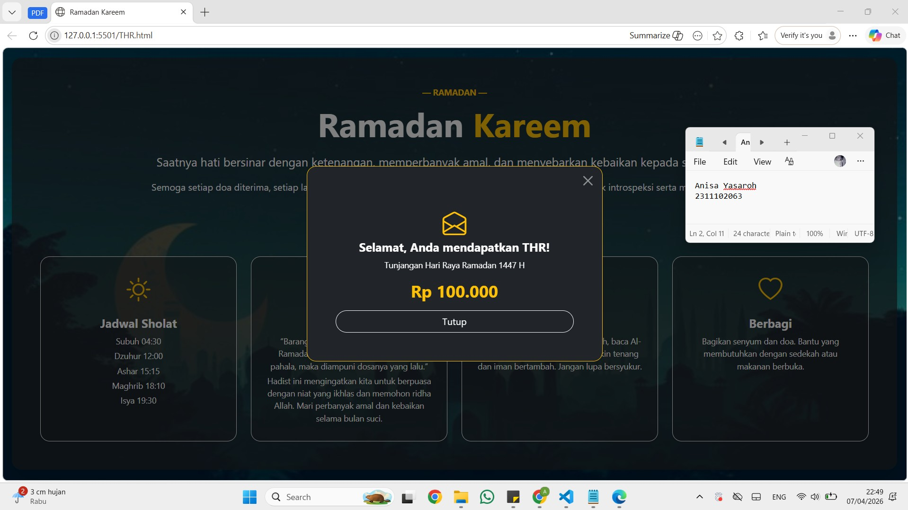

<div align="center">
  <br />
  <h1>LAPORAN PRAKTIKUM <br> APLIKASI BERBASIS PLATFORM </h1>
  <br />
  <h3>MODUL 5 <br> JAVASCRIPT DAN JQUERY </h3>
  <br />
  
  <br />
  <br />
  <br />
  <h3>Disusun Oleh :</h3>
  <p>
    <strong>Anisa Yasaroh</strong>
    <br>
    <strong>2311102063</strong>
    <br>
    <strong>S1 IF-11-REG05</strong>
  </p>
  <br />
  <h3>Dosen Pengampu :</h3>
  <p>
    <strong>Dedi Agung Prabowo, S.Kom., M.Kom</strong>
  </p>
  <br />
  <br />
  <h4>Asisten Praktikum :</h4>
  <strong>Apri Pandu Wicaksono </strong>
  <br>
  <strong>Hamka Zaenul Ardi</strong>
  <br />
  <h3>LABORATORIUM HIGH PERFORMANCE <br>FAKULTAS INFORMATIKA <br>UNIVERSITAS TELKOM PURWOKERTO <br>2026 </h3>
</div>

<hr>

## Dasar Teori

JavaScript adalah bahasa pemrograman yang digunakan untuk membuat halaman web menjadi lebih interaktif dan dinamis. Dengan JavaScript, pengembang dapat memanipulasi elemen HTML melalui DOM (Document Object Model), seperti mengubah isi konten, menampilkan atau menyembunyikan elemen, serta menangani berbagai event seperti klik tombol. JavaScript berjalan di sisi client (browser), sehingga memungkinkan interaksi pengguna berlangsung secara langsung tanpa perlu memuat ulang halaman. Dalam pengembangan web, JavaScript berperan penting dalam menciptakan pengalaman pengguna yang lebih interaktif.

jQuery merupakan library JavaScript yang mempermudah penulisan kode dengan sintaks yang lebih sederhana dan ringkas. Dengan jQuery, proses seleksi elemen, manipulasi DOM, serta penanganan event dapat dilakukan dengan lebih mudah menggunakan simbol `$`. Library ini membantu meningkatkan efisiensi pengembangan karena menyediakan berbagai fungsi siap pakai. Meskipun JavaScript murni sudah semakin berkembang, jQuery tetap digunakan karena kemudahan penggunaannya dalam membangun fitur interaktif pada halaman web.

## Penjelasan Kode JavaScript & jQuery

Kode ini menggunakan Bootstrap untuk membuat tampilan web responsif dan terstruktur. Class-class Bootstrap dipakai untuk mengatur susunan elemen dan tampilan visual. Modal THR dibuat interaktif menggunakan JavaScript dan jQuery, sehingga tombol-tombol dapat merespon klik pengguna dengan langsung mengubah tampilan konten secara dinamis.

## Task 5: Fitur Cairin THR

```html
<!-- 2311102063
Anisa Yasaroh
IF-11-REG05 -->

<!DOCTYPE html>
<html lang="id">

<head>
  <meta charset="UTF-8">
  <title>Ramadan Kareem</title>

  <link href="https://cdn.jsdelivr.net/npm/bootstrap@5.3.2/dist/css/bootstrap.min.css" rel="stylesheet">

  <link href="https://cdn.jsdelivr.net/npm/bootstrap-icons@1.11.3/font/bootstrap-icons.css" rel="stylesheet">
</head>

<body class="min-vh-100 position-relative">

  

  <div
    class="position-relative d-flex flex-column align-items-center justify-content-center min-vh-100 text-center px-3">
    <div class="bg-dark bg-opacity-75 rounded-4 p-5 shadow-lg w-100 w-md-75">

      <p class="text-warning fw-bold text-uppercase small mb-2">— Ramadan —</p>
      <h1 class="display-4 fw-bolder mb-3 text-white">Ramadan <span class="text-warning">Kareem</span></h1>

      <p class="fs-5 mb-3 text-white">
        Saatnya hati bersinar dengan ketenangan, memperbanyak amal, dan menyebarkan kebaikan kepada semua orang.
      </p>

      <p class="fs-6 mb-3 text-white">
        Semoga setiap doa diterima, setiap langkah membawa keberkahan, dan bulan suci ini menjadi momen untuk
        introspeksi serta memperkuat iman.
      </p>

      <div class="mb-4 d-flex justify-content-center gap-3 flex-wrap">
        <span class="badge rounded-pill bg-warning text-dark px-4 py-2 fs-6 d-inline-flex align-items-center gap-2">
          <i class="bi bi-moon-stars-fill"></i> Ramadan 1447 H
        </span>

        <button id="klaimThrBtn" class="btn btn-secondary fw-bold rounded-pill px-4 py-2" data-bs-toggle="modal"
          data-bs-target="#thrModal">
          <i class="bi bi-gift me-2"></i> Klaim THR
        </button>
      </div>

      <div class="row g-4 mt-4">
        <div class="col-md-6 col-lg-3">
          <div class="card text-center p-4 shadow-sm bg-dark bg-opacity-50 border border-light rounded-4 h-100">
            <i class="bi bi-sun fs-1 text-warning mb-3"></i>
            <h5 class="fw-bold text-white mb-2">Jadwal Sholat</h5>
            <p class="small text-white mb-1">Subuh 04:30</p>
            <p class="small text-white mb-1">Dzuhur 12:00</p>
            <p class="small text-white mb-1">Ashar 15:15</p>
            <p class="small text-white mb-1">Maghrib 18:10</p>
            <p class="small text-white mb-0">Isya 19:30</p>
          </div>
        </div>

        <div class="col-md-6 col-lg-3">
          <div class="card text-center p-4 shadow-sm bg-dark bg-opacity-50 border border-light rounded-4 h-100">
            <i class="bi bi-book fs-1 text-warning mb-3"></i>
            <h5 class="fw-bold text-white mb-2">Hadist</h5>
            <p class="small text-white mb-1">
              “Barang siapa yang berpuasa di bulan Ramadan karena iman dan mengharap pahala, maka diampuni dosanya yang
              lalu.”
            </p>
            <p class="small text-white mb-1">
              Hadist ini mengingatkan kita untuk berpuasa dengan niat yang ikhlas dan memohon ridha Allah.
            </p>
          </div>
        </div>

        <div class="col-md-6 col-lg-3">
          <div class="card text-center p-4 shadow-sm bg-dark bg-opacity-50 border border-light rounded-4 h-100">
            <i class="bi bi-moon-stars fs-1 text-warning mb-3"></i>
            <h5 class="fw-bold text-white mb-2">Ibadah</h5>
            <p class="small text-white mb-1">
              Perbanyak dzikir dan sholat sunnah, baca Al-Quran setiap hari agar hati semakin tenang.
            </p>
          </div>
        </div>

        <div class="col-md-6 col-lg-3">
          <div class="card text-center p-4 shadow-sm bg-dark bg-opacity-50 border border-light rounded-4 h-100">
            <i class="bi bi-heart fs-1 text-warning mb-3"></i>
            <h5 class="fw-bold text-white mb-2">Berbagi</h5>
            <p class="small text-white mb-1">
              Bagikan senyum dan doa. Bantu yang membutuhkan dengan sedekah atau makanan berbuka.
            </p>
          </div>
        </div>
      </div>

    </div>
  </div>

  <div class="modal fade" id="thrModal" tabindex="-1">
    <div class="modal-dialog modal-dialog-centered">
      <div class="modal-content bg-dark text-center rounded-4 border border-warning">

        <div class="modal-header border-0">
          <button class="btn-close btn-close-white ms-auto" data-bs-dismiss="modal"></button>
        </div>

        <div class="modal-body px-5 pb-5">

          <div id="step1">
            <i class="bi bi-gift text-warning fs-1 mb-3"></i>
            <h5 class="text-white fw-bold">THR Ramadan Tersedia!</h5>
            <p class="text-white small">Klik tombol di bawah untuk membuka hadiahmu.</p>
            <button id="bukaThr" class="btn btn-warning text-dark fw-bold rounded-pill w-100 mt-3">
              Buka Hadiah
            </button>
          </div>

          <div id="step2" class="d-none">
            <i class="bi bi-envelope-open text-warning fs-1 mb-3"></i>
            <h5 class="text-white fw-bold">Selamat, Anda mendapatkan THR!</h5>
            <p class="text-white small">Tunjangan Hari Raya Ramadan 1447 H</p>
            <h3 class="text-warning fw-bolder my-3">Rp 100.000</h3>
            <button class="btn btn-outline-light rounded-pill w-100" data-bs-dismiss="modal">Tutup</button>
          </div>

        </div>

      </div>
    </div>
  </div>

  <script src="https://cdn.jsdelivr.net/npm/bootstrap@5.3.2/dist/js/bootstrap.bundle.min.js"></script>

  <script src="https://code.jquery.com/jquery-3.7.1.min.js"></script>

  <script>
    $(document).ready(function () {

      $("#klaimThrBtn").click(function () {
        $(this).removeClass("btn-secondary").addClass("btn-warning");
      });

      $("#bukaThr").click(function () {
        $("#step1").addClass("d-none");
        $("#step2").removeClass("d-none");
      });

    });
  </script>

</body>

</html>
```
### Screenshot Output




## Penjelasan Code

Kode HTML ini membuat halaman web bertema Ramadan Kareem dengan tampilan yang rapi dan responsif menggunakan Bootstrap. Layout halaman diatur dengan grid system (`row` dan `col`) serta utility class seperti `text-center`, `bg-dark`, `fw-bold`, dan `rounded-4` untuk mengatur posisi, warna, dan tampilan elemen. Konten utama menampilkan ucapan Ramadan, badge, tombol Klaim THR, serta empat card informasi (Jadwal Sholat, Hadist, Ibadah, Berbagi) dengan ikon dari Bootstrap Icons.

Fitur interaktif pada modal THR menggunakan JavaScript dan jQuery. Ketika tombol Klaim THR ditekan, warna tombol berubah, dan tombol Buka Hadiah menampilkan step kedua modal tanpa memuat ulang halaman, sehingga pengalaman pengguna lebih dinamis dan responsif.