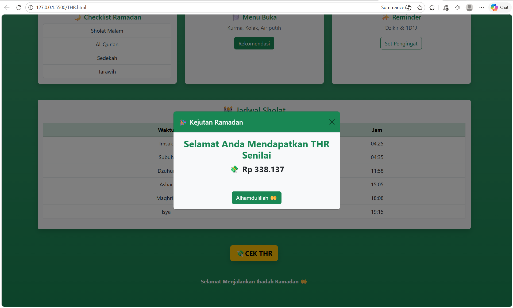

<div align="center">
  <br />
  <h1>LAPORAN PRAKTIKUM <br> APLIKASI BERBASIS PLATFORM </h1>
  <br />
  <h3>MODUL 5 <br> JS & JQuery </h3>
  <br />
  
  <br />
  <br />
  <br />
  <h3>Disusun Oleh :</h3>
  <p>
    <strong>Fitri Kusumaningtyas</strong>
    <br>
    <strong>2311102068</strong>
    <br>
    <strong>S1 IF-11-REG05</strong>
  </p>
  <br />
  <h3>Dosen Pengampu :</h3>
  <p>
    <strong>Dedi Agung Prabowo, S.Kom., M.Kom</strong>
  </p>
  <br />
  <br />
  <h4>Asisten Praktikum :</h4>
  <strong>Apri Pandu Wicaksono </strong>
  <br>
  <strong>Hamka Zaenul Ardi</strong>
  <br />
  <h3>LABORATORIUM HIGH PERFORMANCE <br>FAKULTAS INFORMATIKA <br>UNIVERSITAS TELKOM PURWOKERTO <br>2026 </h3>
</div>

<hr>

## 1. Dasar Teori

JavaScript merupakan bahasa pemrograman yang digunakan untuk menambahkan interaktivitas pada halaman web. JavaScript berjalan di sisi klien (client-side) dan memungkinkan halaman web merespons tindakan pengguna seperti klik tombol, input form, serta manipulasi tampilan secara dinamis tanpa perlu memuat ulang halaman. Dengan JavaScript, elemen HTML dapat diakses melalui DOM (Document Object Model) kemudian diubah konten, atribut, maupun strukturnya. Pada Task 6, JavaScript digunakan untuk menyimpan data produk dalam array, menampilkan data ke tabel, serta menjalankan operasi CRUD seperti tambah, edit, dan hapus data.

Untuk mempermudah penggunaan JavaScript, digunakan library jQuery. jQuery merupakan pustaka JavaScript yang dirancang untuk menyederhanakan manipulasi DOM, penanganan event, serta pengambilan data seperti JSON. Dengan jQuery, penulisan kode menjadi lebih ringkas dibandingkan JavaScript murni. Contohnya, pemilihan elemen menggunakan selector `$("#id")`, penanganan event klik menggunakan `.click()`, serta pengambilan data JSON menggunakan `$.getJSON()`.

## 2. Source Code

### Source Code HTML
```html
<!DOCTYPE html>
<!-- Fitri Kusumaningtyas 2311102068 -->
<html lang="id">
<head>
    <meta charset="UTF-8">
    <meta name="viewport" content="width=device-width, initial-scale=1.0">
    <title>Mode Suci Ramadan</title>

    <link href="https://cdn.jsdelivr.net/npm/bootstrap@5.3.0/dist/css/bootstrap.min.css" rel="stylesheet">
</head>

<body class="bg-success bg-gradient">

    <div class="container py-5">

        <h1 class="text-center fw-bold mb-5 text-light">
            🌙 Ramadan Kareem 🌙
        </h1>

        <div class="row g-4">

            <div class="col-md-4">
                <div class="card shadow border-0 h-100 bg-light">
                    <div class="card-body text-center">
                        <h5 class="text-success">🌙 Checklist Ramadan</h5>
                        <ul class="list-group">
                            <li class="list-group-item">Sholat Malam</li>
                            <li class="list-group-item">Al-Qur'an</li>
                            <li class="list-group-item">Sedekah</li>
                            <li class="list-group-item">Tarawih</li>
                        </ul>
                    </div>
                </div>
            </div>

            <div class="col-md-4">
                <div class="card shadow border-0 h-100 bg-light">
                    <div class="card-body text-center">
                        <h5 class="text-success">🍽️ Menu Buka</h5>
                        <p class="text-muted">Kurma, Kolak, Air putih</p>
                        <button class="btn btn-success" id="menuBtn">
                            Rekomendasi
                        </button>
                    </div>
                </div>
            </div>

            <div class="col-md-4">
                <div class="card shadow border-0 h-100 bg-light">
                    <div class="card-body text-center">
                        <h5 class="text-success">✨ Reminder</h5>
                        <p class="text-muted">Dzikir & 1D1J</p>
                        <button class="btn btn-outline-success" id="reminderBtn">
                            Set Pengingat
                        </button>
                    </div>
                </div>
            </div>

        </div>

        <div class="card shadow border-0 mt-5 bg-light">
            <div class="card-body">
                <h4 class="text-center mb-4 text-success">🕌 Jadwal Sholat</h4>

                <table class="table table-bordered text-center">
                    <thead class="table-success">
                        <tr>
                            <th>Waktu</th>
                            <th>Jam</th>
                        </tr>
                    </thead>
                    <tbody>
                        <tr><td>Imsak</td><td>04:25</td></tr>
                        <tr><td>Subuh</td><td>04:35</td></tr>
                        <tr><td>Dzuhur</td><td>11:58</td></tr>
                        <tr><td>Ashar</td><td>15:05</td></tr>
                        <tr><td>Maghrib</td><td>18:08</td></tr>
                        <tr><td>Isya</td><td>19:15</td></tr>
                    </tbody>
                </table>
            </div>
        </div>

        <div class="text-center mt-5">
            <button 
                id="thrBtn" 
                class="btn btn-warning btn-lg fw-bold shadow"
                data-bs-toggle="modal"
                data-bs-target="#modalTHR">
                💸 CEK THR
            </button>
        </div>

        <footer class="text-center mt-5">
            <p class="fw-bold text-light">
                Selamat Menjalankan Ibadah Ramadan 🤲
            </p>
        </footer>

    </div>

    <div class="modal fade" id="modalTHR">
        <div class="modal-dialog modal-dialog-centered">
            <div class="modal-content text-center bg-light">

                <div class="modal-header bg-success text-light">
                    <h5 class="modal-title">🎉 Kejutan Ramadan</h5>
                    <button class="btn-close" data-bs-dismiss="modal"></button>
                </div>

                <div class="modal-body">
                    <h3 class="text-success fw-bold">
                        Selamat Anda Mendapatkan THR Senilai
                    </h3>
                    <p id="thrNominal" class="fw-bold fs-4 text-dark"></p>
                </div>

                <div class="modal-footer justify-content-center">
                    <button class="btn btn-success" data-bs-dismiss="modal">
                        Alhamdulillah 🤲
                    </button>
                </div>

            </div>
        </div>
    </div>

    <!-- JS -->
    <script src="https://cdn.jsdelivr.net/npm/bootstrap@5.3.0/dist/js/bootstrap.bundle.min.js"></script>
    <script src="https://code.jquery.com/jquery-3.6.0.min.js"></script>

    <script>
        $(document).ready(function(){

            $("#menuBtn").click(function(){
                alert("🍽️ Menu rekomendasi: Kolak + Es buah!");
            });

            $("#reminderBtn").click(function(){
                alert("⏰ Jangan lupa ibadah ya!");
            });

            $("#thrBtn").click(function(){
                let nominal = Math.floor(Math.random() * 900000 + 100000);
                $("#thrNominal").text("💸 Rp " + nominal.toLocaleString());
            });

        });
    </script>

</body>
</html>
```
### Screenshot output


## Penjelasan Code

Task 5 ini dibuat menggunakan struktur dasar HTML dengan bantuan framework Bootstrap untuk mempercantik tampilan tanpa menggunakan CSS tambahan. Bagian `<head>` berisi pengaturan metadata seperti charset, viewport agar responsif, serta pemanggilan Bootstrap CSS melalui CDN. Pada bagian `<body>`, digunakan kelas Bootstrap seperti bg-success dan bg-gradient untuk memberikan latar belakang berwarna hijau dengan efek gradasi. Konten utama dibungkus dalam container yang berisi beberapa komponen card, yaitu checklist Ramadan, menu buka, dan reminder, yang ditata menggunakan sistem grid Bootstrap agar responsif. Selain itu, terdapat tabel jadwal sholat yang menggunakan kelas tabel Bootstrap untuk tampilan yang rapi dan terstruktur.

Fitur interaktif pada aplikasi ini diimplementasikan menggunakan JavaScript dan jQuery. Library jQuery dipanggil melalui CDN untuk mempermudah manipulasi DOM dan penanganan event. Pada bagian script, digunakan fungsi `$(document).ready()` untuk memastikan seluruh elemen HTML telah dimuat sebelum kode dijalankan. Event klik diterapkan pada beberapa tombol seperti tombol menu dan reminder untuk menampilkan notifikasi menggunakan fungsi `alert()`. Selain itu, tombol “CEK THR” memicu munculnya modal Bootstrap dengan bantuan atribut `data-bs-toggle dan data-bs-target`. Saat tombol tersebut diklik, JavaScript akan menghasilkan nominal THR secara acak menggunakan fungsi `Math.random()` yang kemudian ditampilkan ke dalam elemen HTML melalui metode `.text()` dari jQuery. Dengan demikian, aplikasi ini menggabungkan Bootstrap, JavaScript, dan jQuery untuk menciptakan tampilan yang menarik serta interaksi yang dinamis bagi pengguna.