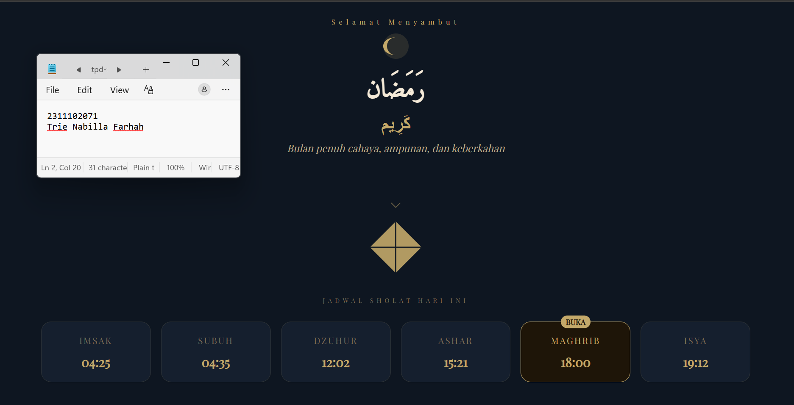
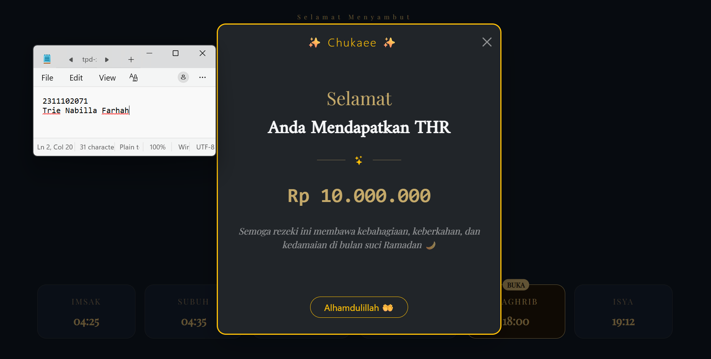

<div align="center">
  <br />
  <h1>LAPORAN PRAKTIKUM <br> APLIKASI BERBASIS PLATFORM </h1>
  <br />
  <h3>MODUL 5 <br> JavaScipt & jQuery </h3>
  <br />
  
  <br />
  <br />
  <br />
  <h3>Disusun Oleh :</h3>
  <p>
    <strong>Trie Nabilla Farhah</strong>
    <br>
    <strong>2311102071</strong>
    <br>
    <strong>S1 IF-11-REG05</strong>
  </p>
  <br />
  <h3>Dosen Pengampu :</h3>
  <p>
    <strong>Dedi Agung Prabowo, S.Kom., M.Kom</strong>
  </p>
  <br />
  <br />
  <h4>Asisten Praktikum :</h4>
  <strong>Apri Pandu Wicaksono </strong>
  <br>
  <strong>Hamka Zaenul Ardi</strong>
  <br />
  <h3>LABORATORIUM HIGH PERFORMANCE <br>FAKULTAS INFORMATIKA <br>UNIVERSITAS TELKOM PURWOKERTO <br>2026 </h3>
</div>

<hr>

## Dasar Teori

JavaScript merupakan bahasa pemrograman yang digunakan untuk membuat halaman web menjadi interaktif dan dinamis. Berbeda dengan HTML dan CSS yang berfokus pada struktur dan tampilan, JavaScript berperan dalam menangani logika, manipulasi elemen DOM (Document Object Model), serta pengolahan event seperti klik, input, dan animasi. JavaScript dapat dijalankan di sisi client (browser) maupun server (menggunakan teknologi seperti Node.js), serta mendukung konsep pemrograman seperti variabel, fungsi, objek, dan asynchronous programming untuk meningkatkan performa aplikasi web.

jQuery adalah library JavaScript yang dirancang untuk menyederhanakan penulisan kode JavaScript, terutama dalam manipulasi DOM, event handling, animasi, dan AJAX. Dengan sintaks yang lebih ringkas dan mudah dipahami, jQuery memungkinkan pengembang melakukan tugas kompleks hanya dengan sedikit kode dibandingkan JavaScript murni. Secara teoritis, jQuery bekerja dengan prinsip “write less, do more”, serta menyediakan kompatibilitas lintas browser sehingga mempercepat proses pengembangan dan meningkatkan efisiensi dalam membangun aplikasi web interaktif.

## Penjelasan Kode Bootstrap

Kode ini menggunakan Bootstrap untuk membuat tampilan web responsif dan rapi. Class Bootstrap dipakai untuk mengatur layout dan warna. Modal THR dibuat interaktif dengan JavaScript.

## Task 5: Fitur Cairin THR

```html
<!-- 2311102071
Trie Nabilla Farhah
IF-11-REG05 -->

<!DOCTYPE html>
<html lang="id">

<head>
    <meta charset="UTF-8">
    <meta name="viewport" content="width=device-width, initial-scale=1.0">

    <title>Mode Suci Ramadan</title>

    <link href="https://cdn.jsdelivr.net/npm/bootstrap@5.3.3/dist/css/bootstrap.min.css" rel="stylesheet">
    <link href="https://cdn.jsdelivr.net/npm/bootstrap-icons@1.11.3/font/bootstrap-icons.css" rel="stylesheet">

    <link href="https://fonts.googleapis.com/css2?family=Playfair+Display&family=Amiri&display=swap" rel="stylesheet">
    <script src="https://code.jquery.com/jquery-3.6.0.min.js"></script>
    <script src="script.js"></script>
</head>


<body>

    <div class="min-vh-100 d-flex flex-column justify-content-center"
        style="background:#0e1621; font-family:'Playfair Display',serif; color:#f5ead8;">

        <!-- HEADER -->
        <div
            class="d-flex justify-content-between align-items-center px-4 py-3 border-bottom border-secondary border-opacity-25">
            <span style="color:#c4a96a; letter-spacing:4px; font-size:11px;">1446 H</span>
            <span style="color:#c4a96a; font-family:monospace;">--:--:--</span>
            <span style="color:#c4a96a; letter-spacing:4px; font-size:11px;">JAKARTA</span>
        </div>

        <!-- HERO -->
        <div class="text-center py-5">

            <div style="color:#c4a96a; letter-spacing:6px; font-size:11px;">
                Selamat Menyambut
            </div>

            <svg width="120" height="60" viewBox="0 0 120 60" class="mb-3">
                <circle cx="60" cy="30" r="20" fill="#c4a96a" opacity="0.15" />
                <path d="M60 16 C48 16 40 22 40 30 C40 38 48 44 60 44 
        C52 44 46 38 46 30 C46 22 52 16 60 16Z" fill="#c4a96a" />
            </svg>

            <h1 class="fw-bold" style="font-family:'Amiri',serif;">رَمَضَان</h1>
            <h2 class="fw-bold" style="color:#c4a96a;">كَرِيم</h2>

            <p class="fst-italic" style="color:#b8a88a;">
                Bulan penuh cahaya, ampunan, dan keberkahan
            </p>

        </div>

        <div class="d-flex flex-column align-items-center mb-4">

            <div class="mb-2 opacity-50">
                <i class="bi bi-chevron-down" style="color:#c4a96a; font-size:18px;"></i>
            </div>

            <button class="border-0 bg-transparent p-0" data-bs-toggle="modal" data-bs-target="#thrModal">

                <svg width="90" height="90" viewBox="0 0 100 100">
                    <polygon points="50,5 95,50 50,95 5,50" fill="#c4a96a" opacity="0.9" />

                    <line x1="50" y1="5" x2="50" y2="95" stroke="#0e1621" stroke-width="2" />
                    <line x1="5" y1="50" x2="95" y2="50" stroke="#0e1621" stroke-width="2" />
                </svg>

            </button>

        </div>

        <div class="container pb-5">

            <div class="text-center mb-4">
                <span style="font-size:10px; letter-spacing:5px; color:#7a6a55;">
                    JADWAL SHOLAT HARI INI
                </span>
            </div>

            <div class="row g-3 justify-content-center">

                <div class="col-6 col-md-2">
                    <div class="p-3 rounded-4 text-center shadow-sm"
                        style="background:#151f2e; border:1px solid #c4a96a22;">
                        <small style="letter-spacing:2px; color:#7a6a55;">IMSAK</small>
                        <div class="fw-bold mt-2" style="color:#c4a96a; font-size:20px;">04:25</div>
                    </div>
                </div>

                <div class="col-6 col-md-2">
                    <div class="p-3 rounded-4 text-center shadow-sm"
                        style="background:#151f2e; border:1px solid #c4a96a22;">
                        <small style="letter-spacing:2px; color:#7a6a55;">SUBUH</small>
                        <div class="fw-bold mt-2" style="color:#c4a96a; font-size:20px;">04:35</div>
                    </div>
                </div>

                <div class="col-6 col-md-2">
                    <div class="p-3 rounded-4 text-center shadow-sm"
                        style="background:#151f2e; border:1px solid #c4a96a22;">
                        <small style="letter-spacing:2px; color:#7a6a55;">DZUHUR</small>
                        <div class="fw-bold mt-2" style="color:#c4a96a; font-size:20px;">12:02</div>
                    </div>
                </div>

                <div class="col-6 col-md-2">
                    <div class="p-3 rounded-4 text-center shadow-sm"
                        style="background:#151f2e; border:1px solid #c4a96a22;">
                        <small style="letter-spacing:2px; color:#7a6a55;">ASHAR</small>
                        <div class="fw-bold mt-2" style="color:#c4a96a; font-size:20px;">15:21</div>
                    </div>
                </div>

                <div class="col-6 col-md-2">
                    <div class="p-3 rounded-4 text-center shadow-sm position-relative"
                        style="background:#1e1508; border:1px solid #c4a96a;">
                        <span class="position-absolute top-0 start-50 translate-middle badge rounded-pill"
                            style="background:#c4a96a; color:#1e1508;">BUKA</span>
                        <small style="letter-spacing:2px; color:#c4a96a;">MAGHRIB</small>
                        <div class="fw-bold mt-2" style="color:#c4a96a; font-size:20px;">18:00</div>
                    </div>
                </div>

                <div class="col-6 col-md-2">
                    <div class="p-3 rounded-4 text-center shadow-sm"
                        style="background:#151f2e; border:1px solid #c4a96a22;">
                        <small style="letter-spacing:2px; color:#7a6a55;">ISYA</small>
                        <div class="fw-bold mt-2" style="color:#c4a96a; font-size:20px;">19:12</div>
                    </div>
                </div>

            </div>
        </div>

        <div class="container pb-5 text-center">

            <div style="letter-spacing:5px; font-size:10px; color:#7a6a55;" class="mb-3">
                HITUNG MUNDUR IMSAK
            </div>

            <div class="d-flex justify-content-center gap-4">

                <div>
                    <div class="fw-bold" style="font-size:40px;">05</div>
                    <small style="color:#7a6a55;">Jam</small>
                </div>

                <div>:</div>

                <div>
                    <div class="fw-bold" style="font-size:40px;">12</div>
                    <small style="color:#7a6a55;">Menit</small>
                </div>

                <div>:</div>

                <div>
                    <div class="fw-bold" style="font-size:40px;">30</div>
                    <small style="color:#7a6a55;">Detik</small>
                </div>

            </div>

        </div>

    </div>

    <div class="modal fade" id="thrModal" tabindex="-1">
        <div class="modal-dialog modal-dialog-centered">
            <div class="modal-content bg-dark text-light border-warning border-2 rounded-4 shadow-lg">

                <div class="modal-header border-0 text-center">
                    <h5 class="modal-title w-100 text-warning fw-light" style="letter-spacing:2px;">
                        ✨ Chukaee ✨
                    </h5>
                    <button type="button" class="btn-close btn-close-white" data-bs-dismiss="modal"></button>
                </div>

                <div class="modal-body text-center py-5">

                    <h2 class="mb-3" style="font-family:'Playfair Display',serif; color:#c4a96a;">
                        Selamat
                    </h2>

                    <h3 class="fw-bold mb-4" style="font-family:'Amiri',serif; font-size:2rem;">
                        Anda Mendapatkan THR
                    </h3>

                    <div class="d-flex justify-content-center align-items-center gap-3 mb-4">
                        <div style="height:1px; width:50px; background:#c4a96a; opacity:0.3;"></div>
                        <i class="bi bi-stars text-warning"></i>
                        <div style="height:1px; width:50px; background:#c4a96a; opacity:0.3;"></div>
                    </div>

                    <div class="mb-4" style="font-size:2.2rem; font-weight:bold; color:#c4a96a; font-family:monospace;">
                        Rp 10.000.000
                    </div>

                    <p class="fst-italic text-white-50 px-3" style="font-family:'Playfair Display',serif;">
                        Semoga rezeki ini membawa kebahagiaan, keberkahan, dan kedamaian
                        di bulan suci Ramadan 🌙
                    </p>

                </div>

                <div class="modal-footer border-0 justify-content-center pb-4">
                    <button class="btn btn-outline-warning px-4 rounded-pill" data-bs-dismiss="modal">
                        Alhamdulillah 🤲
                    </button>
                </div>

            </div>
        </div>
    </div>

    <script src="https://cdn.jsdelivr.net/npm/bootstrap@5.3.3/dist/js/bootstrap.bundle.min.js"></script>

</body>

</html>
```
script.js
```
function updateClock() {
    const now = new Date();

    const time = now.toLocaleTimeString('id-ID', {
        hour: '2-digit',
        minute: '2-digit',
        second: '2-digit'
    });

    document.querySelectorAll('span')[1].innerText = time;
}

setInterval(updateClock, 1000);
updateClock();

function countdown() {
    const target = new Date();
    target.setHours(4, 25, 0);

    const now = new Date();
    const selisih = target - now;

    if (selisih <= 0) return;

    const jam = Math.floor(selisih / (1000 * 60 * 60));
    const menit = Math.floor((selisih / (1000 * 60)) % 60);
    const detik = Math.floor((selisih / 1000) % 60);

    const el = document.querySelectorAll('.fw-bold');

    el[el.length - 3].innerText = jam.toString().padStart(2, '0');
    el[el.length - 2].innerText = menit.toString().padStart(2, '0');
    el[el.length - 1].innerText = detik.toString().padStart(2, '0');
}

setInterval(countdown, 1000);

$(document).ready(function () {
    $('button').click(function () {
        console.log("Ketupat diklik - Modal muncul");
    });
});

```
### Screenshot Output



## Penjelasan Code

Kode pada file merupakan implementasi halaman web yang dibangun menggunakan HTML dan Bootstrap untuk menampilkan antarmuka bertema Ramadan seperti header waktu, jadwal sholat, countdown, serta modal interaktif. Secara teoritis, HTML berperan sebagai struktur dasar (structure layer) dalam pengembangan web, sedangkan Bootstrap digunakan untuk menerapkan konsep responsive web design, yaitu tampilan yang dapat menyesuaikan berbagai ukuran layar. Komponen seperti grid system, card, dan modal merupakan bagian dari framework Bootstrap yang mempermudah pembuatan tampilan tanpa harus menulis CSS secara manual, sehingga menghasilkan antarmuka yang rapi dan konsisten.

Dengan penambahan JavaScript dan jQuery, halaman ini menjadi dynamic web page yang tidak hanya menampilkan informasi statis, tetapi juga mampu berinteraksi dengan pengguna. JavaScript digunakan untuk mengelola waktu secara real-time menggunakan objek Date dan fungsi setInterval(), yang merupakan bagian dari konsep asynchronous execution, serta melakukan manipulasi tampilan melalui Document Object Model (DOM). Sementara itu, jQuery mempermudah proses manipulasi elemen dan event handling melalui sintaks seperti $(document).ready() dan click, yang mencerminkan konsep event-driven programming. Secara keseluruhan, kode ini menunjukkan integrasi antara struktur (HTML), desain (Bootstrap), dan logika interaktif (JavaScript dan jQuery) dalam membangun aplikasi web yang dinamis dan user-friendly.