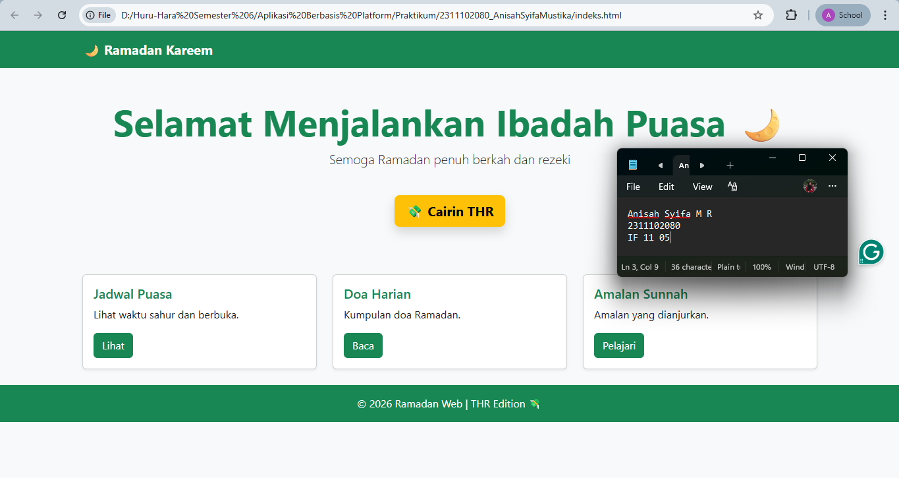
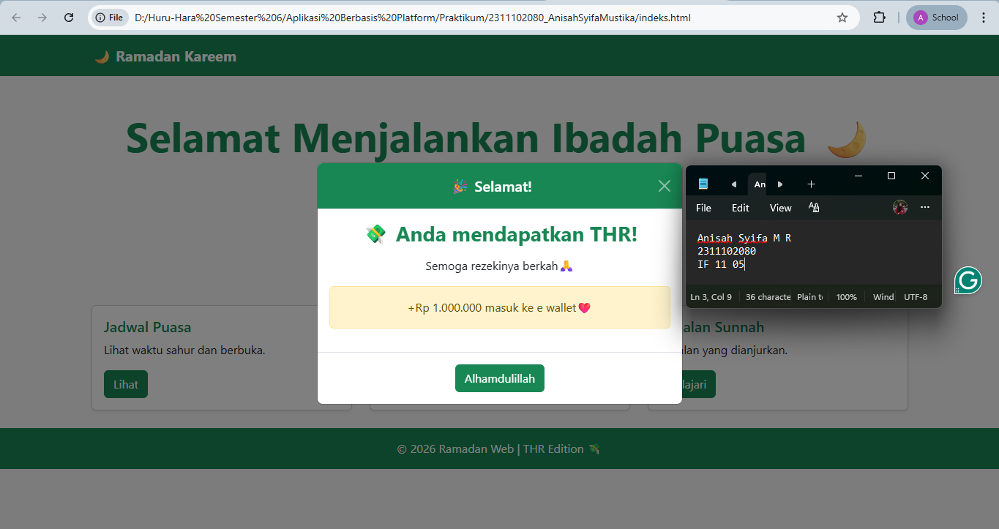

<div align="center">
  <br />
  <h1>LAPORAN PRAKTIKUM <br> APLIKASI BERBASIS PLATFORM </h1>
  <br />
  <h3>MODUL 5 <br> Javascript & JQueary </h3>
  <br />
  
  <br />
  <br />
  <br />
  <h3>Disusun Oleh :</h3>
  <p>
    <strong>Anisah Syifa Mustika Riyanto</strong>
    <br>
    <strong>2311102080</strong>
    <br>
    <strong>S1 IF-11-REG05</strong>
  </p>
  <br />
  <h3>Dosen Pengampu :</h3>
  <p>
    <strong>Dedi Agung Prabowo, S.Kom., M.Kom</strong>
  </p>
  <br />
  <br />
  <h4>Asisten Praktikum :</h4>
  <strong>Apri Pandu Wicaksono </strong>
  <br>
  <strong>Hamka Zaenul Ardi</strong>
  <br />
  <h3>LABORATORIUM HIGH PERFORMANCE <br>FAKULTAS INFORMATIKA <br>UNIVERSITAS TELKOM PURWOKERTO <br>2026</h3>
</div>

<hr>

### Dasar Teori

1. JavaScript

JavaScript merupakan bahasa pemrograman yang digunakan untuk membuat halaman web menjadi lebih interaktif dan dinamis. Berbeda dengan HTML yang berfungsi sebagai struktur dan CSS sebagai pengatur tampilan, JavaScript berperan dalam mengatur logika serta perilaku dari sebuah halaman web.

JavaScript dapat digunakan untuk berbagai keperluan seperti memvalidasi input pengguna, memanipulasi elemen HTML dan CSS, menangani event (seperti klik dan input), hingga berkomunikasi dengan server tanpa perlu memuat ulang halaman (melalui AJAX). Bahasa ini berjalan di sisi client (browser), sehingga dapat meningkatkan pengalaman pengguna secara langsung.

Beberapa konsep dasar dalam JavaScript meliputi:

Variabel dan tipe data (string, number, boolean, array, object)
Operator (aritmatika, logika, perbandingan)
Percabangan (if, else, switch)
Perulangan (for, while)
Fungsi
DOM (Document Object Model) untuk memanipulasi elemen HTML
Event handling untuk merespon aksi pengguna

2. jQuery

jQuery merupakan library JavaScript yang dirancang untuk menyederhanakan penulisan kode JavaScript. Dengan menggunakan jQuery, pengembang dapat melakukan manipulasi HTML, penanganan event, animasi, serta AJAX dengan lebih mudah dan cepat dibandingkan menggunakan JavaScript murni.

jQuery bekerja dengan prinsip “write less, do more”, yang artinya penulisan kode menjadi lebih ringkas namun tetap memiliki fungsi yang sama. Library ini sangat membantu terutama dalam menangani perbedaan kompatibilitas antar browser.

Beberapa fitur utama jQuery antara lain:

Seleksi dan manipulasi elemen HTML dengan mudah menggunakan selector
Penanganan event yang lebih sederhana
Efek dan animasi bawaan
AJAX untuk komunikasi dengan server tanpa reload halaman
Traversing DOM untuk menelusuri elemen HTML

Contoh penggunaan jQuery:

```
$(document).ready(function(){
    $("button").click(function(){
        $("p").hide();
    });
});
```

Kode tersebut berfungsi untuk menyembunyikan elemen paragraf ketika tombol diklik.

### Tugas 5 - Fitur Cairin THR

#### Source Code

```
<!-- Anisah Syifa 2311102080 -->

<!DOCTYPE html>
<html lang="id">
<head>
  <meta charset="UTF-8">
  <meta name="viewport" content="width=device-width, initial-scale=1">
  <title>Mode Suci - Ramadan</title>

  <!-- Bootstrap CSS -->
  <link href="https://cdn.jsdelivr.net/npm/bootstrap@5.3.3/dist/css/bootstrap.min.css" rel="stylesheet">
</head>
<body class="bg-light text-dark">

  <!-- Navbar -->
  <nav class="navbar navbar-expand-lg bg-success">
    <div class="container">
      <a class="navbar-brand fw-bold text-white" href="#">🌙 Ramadan Kareem</a>
    </div>
  </nav>

  <!-- Hero -->
  <div class="container text-center py-5">
    <h1 class="display-4 fw-bold text-success">Selamat Menjalankan Ibadah Puasa 🌙</h1>
    <p class="lead">Semoga Ramadan penuh berkah dan rezeki</p>

    <!-- Tombol THR -->
    <button
      class="btn btn-warning btn-lg mt-4 fw-bold shadow"
      data-bs-toggle="modal"
      data-bs-target="#thrModal">
      💸 Cairin THR
    </button>
  </div>

  <!-- Card Section -->
  <div class="container py-4">
    <div class="row g-4">
      <div class="col-md-4">
        <div class="card h-100 shadow-sm">
          <div class="card-body">
            <h5 class="card-title text-success">Jadwal Puasa</h5>
            <p class="card-text">Lihat waktu sahur dan berbuka.</p>
            <button class="btn btn-success">Lihat</button>
          </div>
        </div>
      </div>

      <div class="col-md-4">
        <div class="card h-100 shadow-sm">
          <div class="card-body">
            <h5 class="card-title text-success">Doa Harian</h5>
            <p class="card-text">Kumpulan doa Ramadan.</p>
            <button class="btn btn-success">Baca</button>
          </div>
        </div>
      </div>

      <div class="col-md-4">
        <div class="card h-100 shadow-sm">
          <div class="card-body">
            <h5 class="card-title text-success">Amalan Sunnah</h5>
            <p class="card-text">Amalan yang dianjurkan.</p>
            <button class="btn btn-success">Pelajari</button>
          </div>
        </div>
      </div>
    </div>
  </div>

  <!-- Modal THR -->
  <div class="modal fade" id="thrModal" tabindex="-1">
    <div class="modal-dialog modal-dialog-centered">
      <div class="modal-content text-center">

        <div class="modal-header bg-success text-white">
          <h5 class="modal-title w-100">🎉 Selamat!</h5>
          <button type="button" class="btn-close btn-close-white" data-bs-dismiss="modal"></button>
        </div>

        <div class="modal-body">
          <h3 class="fw-bold text-success">💸 Anda mendapatkan THR!</h3>
          <p class="mt-3">Semoga rezekinya berkah🙏</p>

          <div class="alert alert-warning mt-3">
            +Rp 1.000.000 masuk ke e wallet❤️
          </div>
        </div>

        <div class="modal-footer justify-content-center">
          <button class="btn btn-success" data-bs-dismiss="modal">Alhamdulillah</button>
        </div>

      </div>
    </div>
  </div>

  <!-- Footer -->
  <footer class="bg-success text-center text-white py-3">
    <p class="mb-0">© 2026 Ramadan Web | THR Edition 💸</p>
  </footer>

  <!-- Bootstrap JS -->
  <script src="https://cdn.jsdelivr.net/npm/bootstrap@5.3.3/dist/js/bootstrap.bundle.min.js"></script>

</body>
</html>

```

### Hasil Output





### Deskripsi Kode

```
Halaman web bertema Ramadan ini merupakan lanjutan dari Modul 4, di mana perbedaannya terletak pada penambahan fitur interaktif berupa tombol “Cairin THR” yang memunculkan modal pop-up menggunakan komponen Bootstrap. Jika pada modul sebelumnya fokus pada pembuatan tampilan statis menggunakan berbagai class bawaan Bootstrap, pada modul ini ditambahkan elemen interaksi untuk menggunakan JavaScript secara manual. Struktur halaman tetap diawali dengan bagian <head> yang menghubungkan Bootstrap melalui CDN agar seluruh komponen dan fitur dapat digunakan dengan mudah.

Fitur utama pada modul ini adalah modal pop-up yang dibuat menggunakan class modal, modal-dialog-centered, dan modal-content sehingga tampil di tengah layar. Modal ini berisi pesan “Selamat, Anda mendapatkan THR!”.
```
