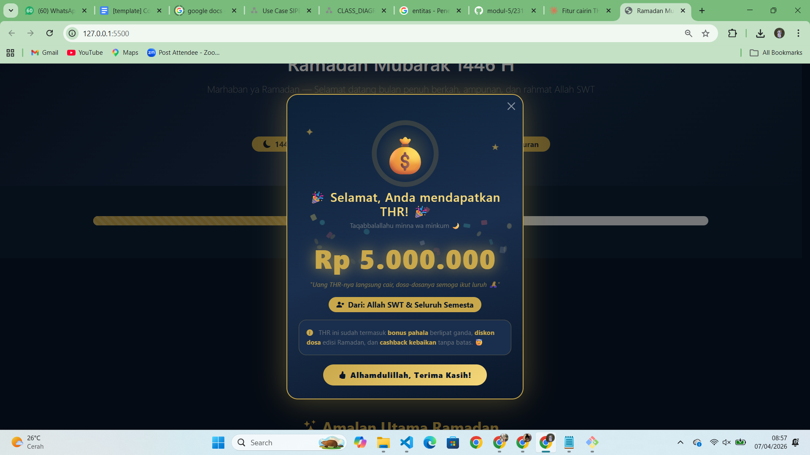

<div align="center">
  <br />
  <h1>LAPORAN PRAKTIKUM <br> APLIKASI BERBASIS PLATFORM </h1>
  <br />
  <h3>MODUL 5 <br> Bootstrap Modal & JavaScript Interaktif </h3>
  <br />
  
  <br />
  <br />
  <br />
  <h3>Disusun Oleh :</h3>
  <p>
    <strong>Ahmad Tegar Kahfi Asyngarinanto</strong>
    <br>
    <strong>2311102083</strong>
    <br>
    <strong>S1 IF-11-REG05</strong>
  </p>
  <br />
  <h3>Dosen Pengampu :</h3>
  <p>
    <strong>Dedi Agung Prabowo, S.Kom., M.Kom</strong>
  </p>
  <br />
  <br />
  <h4>Asisten Praktikum :</h4>
  <strong>Apri Pandu Wicaksono</strong>
  <br>
  <strong>Hamka Zaenul Ardi</strong>
  <br />
  <h3>LABORATORIUM HIGH PERFORMANCE <br>FAKULTAS INFORMATIKA <br>UNIVERSITAS TELKOM PURWOKERTO <br>2026 </h3>
</div>

<hr>

# Dasar Teori

## 1. Bootstrap Modal

Modal adalah komponen overlay (pop-up) yang ditampilkan di atas konten halaman utama. Modal digunakan untuk menampilkan informasi penting, konfirmasi aksi, atau konten interaktif tanpa berpindah halaman.

Bootstrap menyediakan komponen Modal yang lengkap dan responsif. Modal Bootstrap terdiri dari tiga bagian utama:

- **Modal Header** — Bagian atas modal, biasanya berisi judul dan tombol close.
- **Modal Body** — Bagian tengah, tempat konten utama ditampilkan.
- **Modal Footer** — Bagian bawah, biasanya berisi tombol aksi seperti simpan atau tutup.

---

## 2. Struktur Dasar Modal Bootstrap

```html
<!-- Trigger Button -->
<button type="button" class="btn btn-primary" data-bs-toggle="modal" data-bs-target="#contohModal">
  Buka Modal
</button>

<!-- Modal -->
<div class="modal fade" id="contohModal" tabindex="-1" aria-labelledby="contohModalLabel" aria-hidden="true">
  <div class="modal-dialog modal-dialog-centered">
    <div class="modal-content">

      <div class="modal-header">
        <h5 class="modal-title" id="contohModalLabel">Judul Modal</h5>
        <button type="button" class="btn-close" data-bs-dismiss="modal" aria-label="Close"></button>
      </div>

      <div class="modal-body">
        Isi konten modal di sini.
      </div>

      <div class="modal-footer">
        <button type="button" class="btn btn-secondary" data-bs-dismiss="modal">Tutup</button>
        <button type="button" class="btn btn-primary">Simpan</button>
      </div>

    </div>
  </div>
</div>
```

### Atribut Penting Modal:

| Atribut | Fungsi |
|---------|--------|
| `data-bs-toggle="modal"` | Menandai elemen sebagai trigger pembuka modal |
| `data-bs-target="#id"` | Menentukan modal mana yang akan dibuka (berdasarkan ID) |
| `data-bs-dismiss="modal"` | Menutup modal saat elemen diklik |
| `modal-dialog-centered` | Membuat modal tampil di tengah layar secara vertikal |
| `modal fade` | Menambahkan efek transisi fade saat modal muncul |

---

## 3. Modal Events (JavaScript)

Bootstrap menyediakan event lifecycle untuk modal yang bisa dimanfaatkan dengan JavaScript:

```javascript
const myModal = document.getElementById('myModal');

// Dipanggil tepat sebelum modal ditampilkan
myModal.addEventListener('show.bs.modal', () => {
  console.log('Modal akan terbuka...');
});

// Dipanggil setelah modal sepenuhnya terlihat
myModal.addEventListener('shown.bs.modal', () => {
  console.log('Modal sudah terbuka!');
});

// Dipanggil setelah modal sepenuhnya tersembunyi
myModal.addEventListener('hidden.bs.modal', () => {
  console.log('Modal sudah tertutup!');
});
```

Event `show.bs.modal` sangat berguna untuk menginisialisasi konten dinamis (seperti animasi atau data) tepat sebelum modal muncul ke pengguna.

---

## 4. Animasi CSS untuk Interaktivitas

Pada tugas ini digunakan beberapa teknik CSS Animation untuk meningkatkan UX:

### Keyframe Animation

```css
/* Animasi bounce untuk elemen emoji */
@keyframes envelope-bounce {
  0%   { transform: scale(0) rotate(-15deg); opacity: 0; }
  60%  { transform: scale(1.2) rotate(5deg);  opacity: 1; }
  100% { transform: scale(1) rotate(0deg);    opacity: 1; }
}

.elemen {
  animation: envelope-bounce 0.6s ease-out 0.3s both;
}
```

### Shimmer / Sweep Effect

```css
/* Efek kilatan cahaya pada tombol */
.btn-thr::before {
  content: '';
  position: absolute;
  top: -50%; left: -60%;
  width: 40%; height: 200%;
  background: rgba(255,255,255,0.35);
  transform: skewX(-20deg);
  animation: sweep 2.5s ease-in-out infinite;
}

@keyframes sweep {
  0%   { left: -60%;  }
  60%  { left: 120%;  }
  100% { left: 120%;  }
}
```

### Pulse Glow

```css
@keyframes pulse-glow {
  0%, 100% { box-shadow: 0 0 24px rgba(201,168,76,0.5); }
  50%       { box-shadow: 0 0 48px rgba(201,168,76,0.9); }
}
```

---

## 5. DOM Manipulation dengan JavaScript

### Membuat Elemen Dinamis (Confetti)

```javascript
function spawnConfetti() {
  const container = document.getElementById('confettiContainer');
  container.innerHTML = ''; // Reset

  for (let i = 0; i < 55; i++) {
    const piece = document.createElement('div');
    piece.classList.add('confetti-piece');
    piece.style.left = Math.random() * 100 + '%';
    piece.style.backgroundColor = COLORS[Math.floor(Math.random() * COLORS.length)];
    piece.style.animationDuration = (1.4 + Math.random() * 1.8) + 's';
    container.appendChild(piece);
  }
}
```

### Animasi Counter (Count-Up)

```javascript
function animateTHR() {
  const target = 1000000;
  let current = 0;
  const step = target / 60;

  const interval = setInterval(() => {
    current += step;
    if (current >= target) {
      current = target;
      clearInterval(interval);
    }
    thrAmountEl.textContent = new Intl.NumberFormat('id-ID', {
      style: 'currency',
      currency: 'IDR'
    }).format(Math.floor(current));
  }, 16); // ~60fps
}
```

`Intl.NumberFormat` adalah API bawaan JavaScript untuk memformat angka sesuai locale, termasuk format mata uang Indonesia (Rp).

---

## 6. Integrasi Modal Event dengan JavaScript

```javascript
const modalTHR = document.getElementById('modalTHR');

// Jalankan animasi setiap kali modal dibuka
modalTHR.addEventListener('show.bs.modal', () => {
  spawnConfetti();
  animateTHR();
});
```

Dengan memanfaatkan event `show.bs.modal`, animasi confetti dan counter THR akan selalu dijalankan ulang setiap kali modal dibuka — memberikan pengalaman yang konsisten dan interaktif.

---

# Tugas 5 — Fitur Cairin THR

## Deskripsi

Pada tugas ini, fitur **"Cairin THR"** ditambahkan ke halaman Ramadan dari Tugas 4. Fitur ini berupa tombol khusus yang saat diklik akan menampilkan modal pop-up dengan konten kejutan berupa animasi THR yang interaktif dan menarik.

## Fitur yang Diimplementasikan

1. **Tombol "Cairin THR"** — Tombol dengan efek shimmer, glow pulse, dan sweep animation yang menarik perhatian pengguna.
2. **Modal Pop-up** — Modal Bootstrap dengan tampilan dark theme bergaya Ramadan (warna navy & gold).
3. **Animasi Confetti** — Confetti berwarna-warni yang muncul otomatis saat modal dibuka, dibuat secara dinamis via JavaScript DOM manipulation.
4. **Count-Up Animation** — Nominal THR yang bertambah secara dramatis dari 0 hingga nilai akhir, menggunakan `setInterval` dan `Intl.NumberFormat`.
5. **Random THR Amount** — Nominal THR dipilih secara acak dari beberapa opsi setiap kali modal dibuka.
6. **Floating Stars** — Bintang-bintang kecil yang melayang menggunakan CSS animation `float-star`.
7. **Glow Ring** — Efek cincin cahaya berdenyut di sekitar emoji uang menggunakan `box-shadow` animation.
8. **Navbar Link** — Shortcut "Cairin THR" di navbar untuk akses cepat ke modal.

## Code

```html
<!-- Tombol Trigger THR -->
<button
  class="btn btn-thr px-5 py-3"
  data-bs-toggle="modal"
  data-bs-target="#modalTHR">
  <i class="bi bi-cash-coin me-2"></i>✨ Cairin THR Sekarang ✨
</button>

<!-- Modal THR -->
<div class="modal fade" id="modalTHR" tabindex="-1" aria-hidden="true">
  <div class="modal-dialog modal-dialog-centered">
    <div class="modal-content">
      <div class="confetti-container" id="confettiContainer"></div>
      <div class="modal-body text-center">
        <div class="thr-glow-ring">
          <div class="thr-envelope">💰</div>
        </div>
        <h2>🎉 Selamat, Anda mendapatkan THR! 🎉</h2>
        <div class="thr-amount" id="thrAmount">Rp 0</div>
      </div>
      <div class="modal-footer justify-content-center">
        <button class="btn btn-thr-close" data-bs-dismiss="modal">
          Alhamdulillah, Terima Kasih!
        </button>
      </div>
    </div>
  </div>
</div>
```

```javascript
// Inisialisasi animasi saat modal dibuka
const modalTHR = document.getElementById('modalTHR');
modalTHR.addEventListener('show.bs.modal', () => {
  spawnConfetti();
  animateTHR();
});
```

> Kode lengkap tersedia di file `index.html`

## Output


