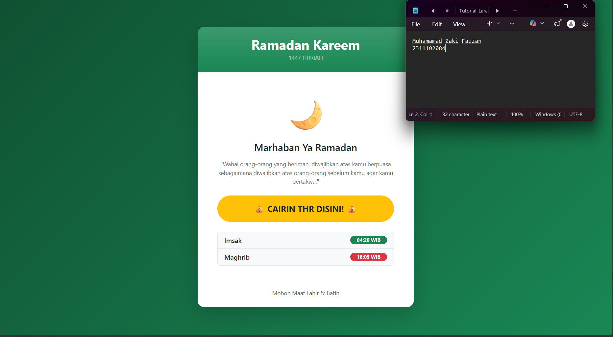
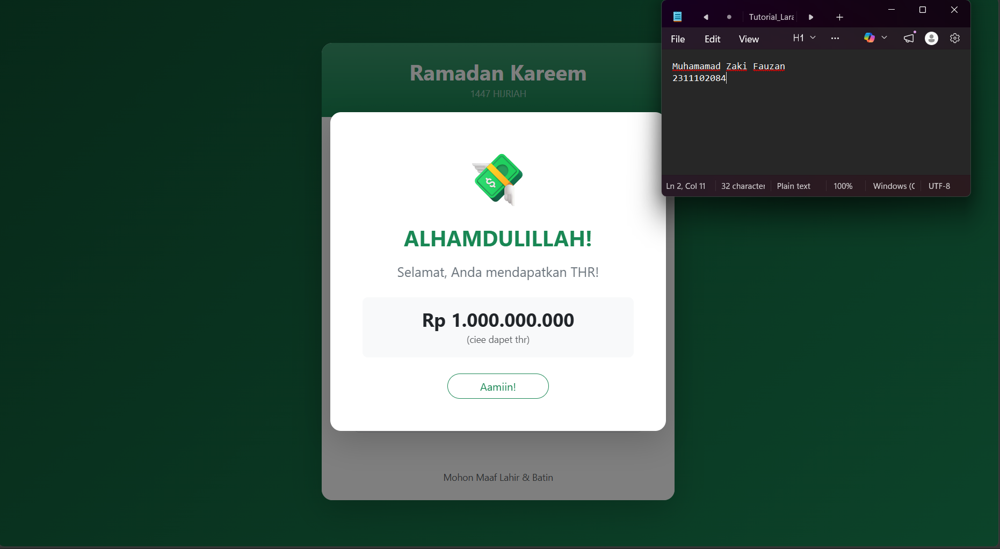

<div align="center">
  <br />
  <h1>LAPORAN PRAKTIKUM <br> APLIKASI BERBASIS PLATFORM </h1>
  <br />
  <h3>MODUL 5 <br> Bootstrap </h3>
  <br />
  
  <br />
  <br />
  <br />
  <h3>Disusun Oleh :</h3>
  <p>
    <strong>Rasyid Nafsyarie</strong>
    <br>
    <strong>2311102011</strong>
    <br>
    <strong>S1 IF-11-REG05</strong>
  </p>
  <br />
  <h3>Dosen Pengampu :</h3>
  <p>
    <strong>Dedi Agung Prabowo, S.Kom., M.Kom</strong>
  </p>
  <br />
  <br />
  <h4>Asisten Praktikum :</h4>
  <strong>Apri Pandu Wicaksono </strong>
  <br>
  <strong>Hamka Zaenul Ardi</strong>
  <br />
  <h3>LABORATORIUM HIGH PERFORMANCE <br>FAKULTAS INFORMATIKA <br>UNIVERSITAS TELKOM PURWOKERTO <br>2026 </h3>
</div>

<hr>

# Dasar Teori Bootstrap

## Pengertian Bootstrap
Bootstrap merupakan framework open-source berbasis HTML, CSS, dan JavaScript yang dirancang khusus untuk mempercepat proses pengembangan antarmuka website yang responsif dan mobile-first. Dengan menyediakan ekosistem komponen UI siap pakai seperti sistem grid 12 kolom, tipografi, tombol, hingga navigasi, Bootstrap memungkinkan pengembang untuk membangun tata letak yang konsisten di berbagai perangkat tanpa harus menulis kode CSS dari nol. Penggunaan utility classes pada framework ini tidak hanya meningkatkan efisiensi waktu kerja, tetapi juga menjamin standar desain yang profesional serta kompatibilitas lintas peramban (cross-browser) yang optimal.

## Contoh Implementasi
```html
<button class="btn btn-primary">Klik Saya</button>
```

### Source code - html
```html
<!DOCTYPE html>
<html lang="id">
<head>
    <meta charset="UTF-8">
    <meta name="viewport" content="width=device-width, initial-scale=1.0">
    <title>Ramadan Kareem - Fitur THR</title>
    <link href="https://cdn.jsdelivr.net/npm/bootstrap@5.3.0/dist/css/bootstrap.min.css" rel="stylesheet">
    <style>
        body {
            background: linear-gradient(135deg, #0f5132 0%, #198754 100%);
            min-height: 100vh;
        }
        /* Efek hover khusus untuk tombol THR agar lebih interaktif */
        .btn-thr {
            transition: transform 0.3s, box-shadow 0.3s;
        }
        .btn-thr:hover {
            transform: scale(1.05);
            box-shadow: 0 10px 20px rgba(0,0,0,0.2);
        }
    </style>
</head>
<body class="d-flex align-items-center justify-content-center">

    <div class="container">
        <div class="row justify-content-center">
            <div class="col-md-6 col-lg-5">
                
                <div class="card border-0 shadow-lg rounded-4 overflow-hidden">
                    <div class="card-header bg-success bg-gradient text-white text-center py-4 border-0">
                        <h2 class="fw-bold mb-0">Ramadan Kareem</h2>
                        <small class="text-white-50 text-uppercase tracking-widest">1447 Hijriah</small>
                    </div>

                    <div class="card-body p-5 text-center">
                        <div class="mb-4">
                            <span class="display-1">🌙</span>
                        </div>
                        
                        <h4 class="card-title fw-semibold text-dark mb-3">Marhaban Ya Ramadan</h4>
                        <p class="card-text text-secondary mb-4 small">
                            "Wahai orang-orang yang beriman, diwajibkan atas kamu berpuasa sebagaimana diwajibkan atas orang-orang sebelum kamu agar kamu bertakwa."
                        </p>

                        <div class="d-grid gap-2 mb-4">
                            <button type="button" class="btn btn-warning btn-lg rounded-pill fw-bold text-dark btn-thr py-3" data-bs-toggle="modal" data-bs-target="#thrModal">
                                💰 CAIRIN THR DISINI! 💰
                            </button>
                        </div>

                        <div class="list-group list-group-flush mb-0 rounded-3 border">
                            <div class="list-group-item d-flex justify-content-between align-items-center bg-light">
                                <span class="fw-medium">Imsak</span>
                                <span class="badge bg-success rounded-pill px-3">04:28 WIB</span>
                            </div>
                            <div class="list-group-item d-flex justify-content-between align-items-center bg-light">
                                <span class="fw-medium">Maghrib</span>
                                <span class="badge bg-danger rounded-pill px-3">18:05 WIB</span>
                            </div>
                        </div>
                    </div>

                    <div class="card-footer bg-white border-0 text-center pb-4">
                        <p class="small text-muted mb-0">Mohon Maaf Lahir & Batin</p>
                    </div>
                </div>

            </div>
        </div>
    </div>
// Selebihnya dapat cek pada file "index.html"
```
🔗 [Klik di sini untuk membuka file `index.html`](index.html)

Output:





## Penjelasan
Penerapan fitur "Cairin THR" ini memanfaatkan komponen Bootstrap Modal yang diintegrasikan dengan trigger atribut data-bs-toggle dan data-bs-target pada elemen tombol bertipe btn-warning untuk menciptakan interaksi pop-up yang instan. Struktur modal dirancang menggunakan kelas modal-dialog-centered agar muncul tepat di tengah layar, sementara efek transisi halus dikelola oleh kelas fade guna meningkatkan pengalaman pengguna (user experience). Secara keseluruhan, logika pemanggilan jendela pesan ini sepenuhnya ditangani oleh Bootstrap JS Bundle, sehingga memungkinkan pembuatan elemen antarmuka yang interaktif dan responsif tanpa perlu menulis baris kode JavaScript manual tambahan.