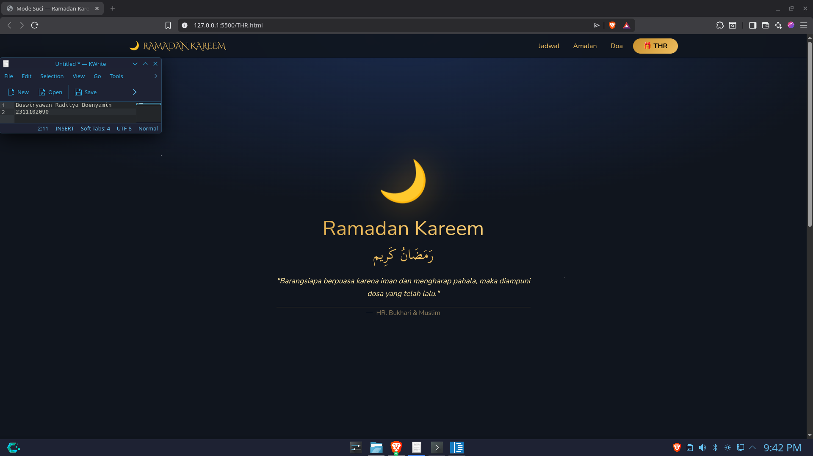

<div align="center">
  <br />
  <h1>LAPORAN PRAKTIKUM <br> APLIKASI BERBASIS PLATFORM </h1>
  <br />
  <h3>MODUL 5 <br> BOOTSTRAP </h3>
  <br />
  
  <br />
  <br />
  <br />
  <h3>Disusun Oleh :</h3>
  <p>
    <strong>Buswiryawan Raditya Boenyamin</strong>
    <br>
    <strong>2311102090</strong>
    <br>
    <strong>S1 IF-11-REG05</strong>
  </p>
  <br />
  <h3>Dosen Pengampu :</h3>
  <p>
    <strong>Dedi Agung Prabowo, S.Kom., M.Kom</strong>
  </p>
  <br />
  <br />
  <h4>Asisten Praktikum :</h4>
  <strong>Apri Pandu Wicaksono </strong>
  <br>
  <strong>Hamka Zaenul Ardi</strong>
  <br />
  <h3>LABORATORIUM HIGH PERFORMANCE <br>FAKULTAS INFORMATIKA <br>UNIVERSITAS TELKOM PURWOKERTO <br>2026 </h3>
</div>

<hr>

# Dasar Teori

## Bootstrap

Bootstrap adalah *front-end framework* gratis untuk pengembangan antarmuka web yang lebih cepat dan mudah. Dikembangkan oleh Mark Otto dan Jacob Thornton di Twitter, dirilis sebagai *open source* pada Agustus 2011 di GitHub. Bootstrap mencakup template desain berbasis HTML dan CSS untuk tipografi, form, button, navigasi, modal, image carousel, serta plugin JavaScript opsional. Bootstrap juga mendukung desain **responsif** yang otomatis menyesuaikan tampilan di berbagai perangkat.

---

## 1. Pemasangan Bootstrap

Bootstrap dapat dipasang dengan dua cara:

- **Unduh** di http://getbootstrap.com, lalu panggil seperti *External Style Sheet*.
- **CDN** — memanggil langsung dari sumber tanpa mengunduh (membutuhkan koneksi internet).

```html
<!-- CSS -->
<link href="https://cdn.jsdelivr.net/npm/bootstrap@5.3.0/dist/css/bootstrap.min.css" rel="stylesheet">

<!-- jQuery -->
<script src="https://code.jquery.com/jquery-3.7.0.min.js"></script>

<!-- JavaScript -->
<script src="https://cdn.jsdelivr.net/npm/bootstrap@5.3.0/dist/js/bootstrap.bundle.min.js"></script>
```

---

## 2. Bootstrap Container

Container adalah elemen dasar untuk *layouting* Bootstrap Grid, berupa class CSS pada elemen `<div>`.

| Class | Keterangan |
|-------|------------|
| `.container` | Lebar tetap, responsif |
| `.container-fluid` | Lebar penuh (100% area pandang) |

---

## 3. Bootstrap Grid

Sistem grid Bootstrap menggunakan *container*, *rows*, dan *columns* berbasis flexbox untuk tata letak yang responsif.

```html
<div class="container">
  <div class="row">
    <div class="col-*-#"></div>
    <div class="col-*-#"></div>
  </div>
</div>
```

| | Extra Small | Small | Medium | Large | Extra Large |
|---|---|---|---|---|---|
| **Max width** | Auto | 540px | 720px | 960px | 1140px |
| **Class prefix** | `.col-` | `.col-sm-` | `.col-md-` | `.col-lg-` | `.col-xl-` |
| **Kolom** | 12 | 12 | 12 | 12 | 12 |

---

## 4. Text Style

Bootstrap menyediakan class utilitas untuk mengatur tampilan teks.

| Class | Keterangan |
|-------|------------|
| `.text-left` / `.text-center` / `.text-right` | Perataan teks |
| `.text-lowercase` / `.text-uppercase` / `.text-capitalize` | Kapitalisasi teks |
| `.fw-bold` / `.fw-normal` / `.fw-light` | Ketebalan font |
| `.fst-italic` | Teks miring |
| `.h1` s.d. `.h6` | Tampilan seperti heading H1–H6 |

---

## 5. Bootstrap Table, Image & Button

### a) Table

Gunakan class `.table` pada elemen `<table>`, dengan class tambahan:

| Class | Keterangan |
|-------|------------|
| `.table-dark` | Latar belakang gelap |
| `.table-striped` | Baris bergantian warna |
| `.table-bordered` | Border tipis |
| `.table-hover` | Baris berubah warna saat di-hover |
| `.table-sm` | Padding minimal |
| `.thead-light` / `.thead-dark` | Latar `<thead>` cerah/gelap |

### b) Image

| Class | Keterangan |
|-------|------------|
| `.img-fluid` | Gambar responsif menyesuaikan container |
| `.img-thumbnail` | Gambar kecil dengan border |

```html


```

### c) Button

Gunakan class dasar `.btn` dikombinasikan dengan class berikut:

| Class | Keterangan |
|-------|------------|
| `.btn-primary` | Desain utama (biru) |
| `.btn-secondary` | Desain standar |
| `.btn-danger` | Merah |
| `.btn-success` | Hijau |
| `.btn-warning` | Kuning |
| `.btn-info` | Informasi |
| `.btn-link` | Tampilan hyperlink |
| `.btn-sm` / `.btn-lg` | Ukuran kecil / besar |

```html
<button class="btn btn-primary">Primary</button>
<button class="btn btn-danger btn-sm">Danger</button>
```

---

## 6. Bootstrap Form

Class `.form-control` digunakan pada elemen input untuk styling yang konsisten. Terdapat tiga tata letak form:

1. **Vertical Form** *(default)* — elemen form ditampilkan secara vertikal.
2. **Inline Form** — elemen form dalam satu baris menggunakan utility classes.
3. **Horizontal Form** — menggunakan sistem grid (`.row` dan `.col-*`) untuk menempatkan label dan input berdampingan.

```html
<!-- Contoh Horizontal Form -->
<form>
  <div class="row mb-3">
    <label class="col-sm-2 col-form-label">Username:</label>
    <div class="col-sm-10">
      <input type="text" class="form-control" placeholder="Enter username">
    </div>
  </div>
  <button type="submit" class="btn btn-success">Submit</button>
</form>

```

# Tugas 5: Fitur Cairin THR
Buka lagi file halaman Ramadan kalian dari Task 4, terus tambahin satu tombol surprise. Begitu tombolnya di-klik, harus muncul modal pop-up yang isinya "Selamat, Anda mendapatkan THR!". Bikin UI/UX-nya se-interaktif dan sekeren mungkin biar yang ngeklik beneran kerasa dapet duit. (jujur ane lagi BU)
```
<!-- 2311102090_Buswiryawan Raditya Boenyamin_S1IF-11-05 -->
<!DOCTYPE html>
<html lang="id" data-bs-theme="dark">
<head>
    <meta charset="UTF-8" />
    <meta name="viewport" content="width=device-width, initial-scale=1.0" />
    <title>Mode Suci — Ramadan Kareem 🌙</title>

    <!-- Bootstrap -->
    <link href="https://cdn.jsdelivr.net/npm/bootstrap@5.3.3/dist/css/bootstrap.min.css" rel="stylesheet">
    <link href="https://cdn.jsdelivr.net/npm/bootstrap-icons@1.11.3/font/bootstrap-icons.css" rel="stylesheet">

    <!-- Font -->
    <link href="https://fonts.googleapis.com/css2?family=Cinzel+Decorative:wght@400;700&family=Scheherazade+New&family=Nunito:wght@300;400;600;700&display=swap" rel="stylesheet">

    <!-- CSS -->
    <link rel="stylesheet" href="style.css">
</head>
<body>

<!-- NAVBAR -->
<nav class="navbar navbar-expand-lg navbar-ramadan sticky-top">
    <div class="container">
        <a class="navbar-brand d-flex align-items-center gap-2" href="#">
            🌙 <span class="font-cinzel text-gold">RAMADAN KAREEM</span>
        </a>

        <button class="navbar-toggler border-0" data-bs-toggle="collapse" data-bs-target="#navMain">
            <i class="bi bi-list text-gold fs-3"></i>
        </button>

        <div class="collapse navbar-collapse" id="navMain">
            <ul class="navbar-nav ms-auto gap-lg-3 align-items-lg-center">
                <li><a class="nav-link text-gold" href="#jadwal">Jadwal</a></li>
                <li><a class="nav-link text-gold" href="#amalan">Amalan</a></li>
                <li><a class="nav-link text-gold" href="#doa">Doa</a></li>
                </li>                
                    <button class="btn btn-gold rounded-pill px-4 pulse-ring" data-bs-toggle="modal" data-bs-target="#thrModal">
                        🎁 THR
                    </button>
                </li>
            </ul>
        </div>
    </div>
</nav>

<!-- HERO -->
<section class="hero-section d-flex align-items-center text-center">
    <div class="container">
        <div class="moon-glow">🌙</div>
        <h1 class="hero-title">Ramadan Kareem</h1>
        <p class="font-arabic hero-arabic">رَمَضَانُ كَرِيم</p>

<blockquote class="mt-4 mx-auto" style="max-width:600px">
    <p class="fst-italic text-gold-pale">
        "Barangsiapa berpuasa karena iman dan mengharap pahala,
        maka diampuni dosa yang telah lalu."
    </p>
    <footer class="blockquote-footer mt-2 text-muted">
        HR. Bukhari & Muslim
    </footer>
</blockquote>
    </div>
</section>

<section class="py-5" id="jadwal">
    <div class="container text-center">
        <h2 class="text-gold font-cinzel mb-4">JADWAL SHOLAT</h2>

        <div class="row g-3 justify-content-center">

            <!-- SUBUH -->
            <div class="col-6 col-md-4 col-lg-2">
                <div class="card card-ramadan p-3">
                    <div class="text-gold small">SUBUH</div>
                    <div class="fw-bold text-white fs-4">04:32</div>
                </div>
            </div>

            <!-- DZUHUR -->
            <div class="col-6 col-md-4 col-lg-2">
                <div class="card card-ramadan p-3">
                    <div class="text-gold small">DZUHUR</div>
                    <div class="fw-bold text-white fs-4">12:01</div>
                </div>
            </div>

            <!-- ASHAR -->
            <div class="col-6 col-md-4 col-lg-2">
                <div class="card card-ramadan p-3">
                    <div class="text-gold small">ASHAR</div>
                    <div class="fw-bold text-white fs-4">15:18</div>
                </div>
            </div>

            <!-- MAGHRIB (ACTIVE) -->
            <div class="col-6 col-md-4 col-lg-2">
                <div class="card card-ramadan prayer-active p-3">
                    <div class="text-gold small">MAGHRIB</div>
                    <div class="fw-bold text-white fs-4">17:58</div>
                </div>
            </div>

            <!-- ISYA -->
            <div class="col-6 col-md-4 col-lg-2">
                <div class="card card-ramadan p-3">
                    <div class="text-gold small">ISYA</div>
                    <div class="fw-bold text-white fs-4">19:11</div>
                </div>
            </div>

        </div>
    </div>
</section>

<!-- AMALAN -->
<section class="py-5" id="amalan">
    <div class="container">
        <div class="text-center mb-4">
            <h2 class="text-gold font-cinzel">AMALAN RAMADAN</h2>
        </div>

        <div class="row g-3">
            <div class="col-md-4">
                <div class="card card-ramadan p-4 text-center">
                    <i class="bi bi-moon-stars fs-1 text-gold mb-3"></i>
                    <h5 class="text-white">Tarawih</h5>
                    <p class="text-muted small">Sholat malam di bulan Ramadan</p>
                </div>
            </div>

            <div class="col-md-4">
                <div class="card card-ramadan p-4 text-center">
                    <i class="bi bi-book fs-1 text-gold mb-3"></i>
                    <h5 class="text-white">Al-Qur'an</h5>
                    <p class="text-muted small">Perbanyak membaca Al-Qur'an</p>
                </div>
            </div>

            <div class="col-md-4">
                <div class="card card-ramadan p-4 text-center">
                    <i class="bi bi-heart fs-1 text-gold mb-3"></i>
                    <h5 class="text-white">Sedekah</h5>
                    <p class="text-muted small">Berbagi kepada sesama</p>
                </div>
            </div>
        </div>
    </div>
</section>

<section class="py-5" id="doa">
    <div class="container text-center">
        <h2 class="text-gold font-cinzel mb-4">DOA RAMADAN</h2>

        <div class="row g-4 justify-content-center">

            <!-- DOA NIAT PUASA -->
            <div class="col-lg-5">
                <div class="card card-ramadan p-4 h-100">
                    <h5 class="text-white mb-3">Doa Niat Puasa</h5>

                    <p class="font-arabic fs-4 text-gold">
                        نَوَيْتُ صَوْمَ غَدٍ عَنْ أَدَاءِ فَرْضِ شَهْرِ رَمَضَانَ لِلّٰهِ تَعَالَى
                    </p>

                    <p class="text-muted small">
                        "Saya niat berpuasa esok hari untuk menunaikan kewajiban di bulan Ramadan karena Allah Ta'ala."
                    </p>
                </div>
            </div>

            <!-- DOA BERBUKA -->
            <div class="col-lg-5">
                <div class="card card-ramadan p-4 h-100">
                    <h5 class="text-white mb-3">Doa Berbuka Puasa</h5>

                    <p class="font-arabic fs-4 text-gold">
                        اللَّهُمَّ لَكَ صُمْتُ وَبِكَ آمَنْتُ وَعَلَىٰ رِزْقِكَ أَفْطَرْتُ
                    </p>

                    <p class="text-muted small">
                        "Ya Allah, untuk-Mu aku berpuasa, kepada-Mu aku beriman,
                        dan dengan rezeki-Mu aku berbuka."
                    </p>
                </div>
            </div>

        </div>
    </div>
</section>

<!-- MODAL THR -->
<div class="modal fade" id="thrModal">
    <div class="modal-dialog modal-dialog-centered">
        <div class="modal-content modal-ramadan text-center p-4">
            <div class="thr-envelope">&#127769</div>
            <h3 class="text-white">Selamat!</h3>
            <div class="thr-amount">Rp 10.000</div>
            <button class="btn btn-gold mt-3" data-bs-dismiss="modal">OK</button>
        </div>
    </div>
</div>

<!-- FOOTER -->
<footer class="text-center py-4 border-top">
    <p class="text-gold font-arabic">رَمَضَانُ كَرِيم</p>
    <p class="small text-muted">Ramadan 1446 H</p>
</footer>

<script src="https://cdn.jsdelivr.net/npm/bootstrap@5.3.3/dist/js/bootstrap.bundle.min.js"></script>
</body>
</html>
```
Output:

