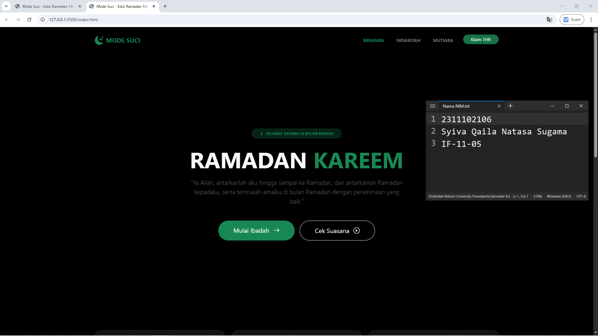
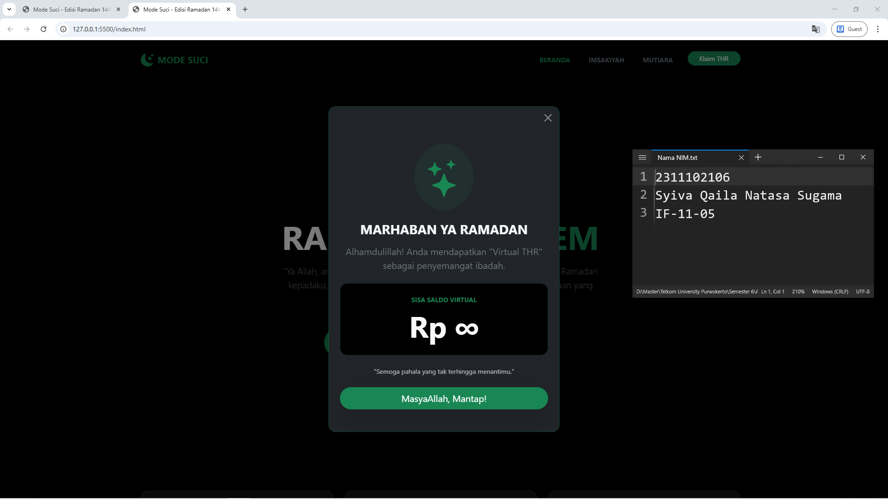

<div align="center">
  <br />
  <h1>LAPORAN PRAKTIKUM <br> APLIKASI BERBASIS PLATFORM </h1>
  <br />
  <h3>MODUL 5 <br> Bootstrap </h3>
  <br />
  
  <br />
  <br />
  <br />
  <h3>Disusun Oleh :</h3>
  <p>
    <strong>Syiva Qaila Natasha Sugama</strong>
    <br>
    <strong>2311102106</strong>
    <br>
    <strong>S1 IF-11-REG05</strong>
  </p>
  <br />
  <h3>Dosen Pengampu :</h3>
  <p>
    <strong>Dedi Agung Prabowo, S.Kom., M.Kom</strong>
  </p>
  <br />
  <br />
  <h4>Asisten Praktikum :</h4>
  <strong>Apri Pandu Wicaksono </strong>
  <br>
  <strong>Hamka Zaenul Ardi</strong>
  <br />
  <h3>LABORATORIUM HIGH PERFORMANCE <br>FAKULTAS INFORMATIKA <br>UNIVERSITAS TELKOM PURWOKERTO <br>2026 </h3>
</div>

<hr>

# Dasar Teori Bootstrap

## Bootstrap
Bootstrap adalah kerangka kerja (framework) open-source berbasis HTML, CSS, dan JavaScript yang dirancang khusus untuk mempercepat proses pengembangan tampilan web yang responsif dan mobile-first.

Dasar teori utama Bootstrap terletak pada Grid System yang membagi layar menjadi 12 kolom fleksibel, serta penggunaan Utility Classes yang memungkinkan pengembang mengatur tata letak, warna, dan tipografi hanya dengan menambahkan kelas tertentu pada elemen HTML tanpa perlu menulis kode CSS manual dari nol.


### Source code - html
```html
<!DOCTYPE html>
<html lang="id" data-bs-theme="dark">
<head>
    <meta charset="UTF-8">
    <meta name="viewport" content="width=device-width, initial-scale=1.0">
    <title>Mode Suci - Edisi Ramadan 1445H</title>
    <!-- Bootstrap 5.3 CSS -->
    <link href="https://cdn.jsdelivr.net/npm/bootstrap@5.3.3/dist/css/bootstrap.min.css" rel="stylesheet">
    <!-- Bootstrap Icons -->
    <link rel="stylesheet" href="https://cdn.jsdelivr.net/npm/bootstrap-icons@1.11.3/font/bootstrap-icons.min.css">
    <style>
        /* Modern Hero with Glassmorphism Overlay */
        .hero-section {
            background: linear-gradient(rgba(0, 0, 0, 0.7), rgba(0, 0, 0, 0.7)), url('ramadan_hero.png') center/cover no-repeat;
            min-height: 85vh;
            display: flex;
            align-items: center;
            justify-content: center;
        }
        .card-ramadan:hover {
            transform: translateY(-10px);
            transition: all 0.3s ease;
            border-color: #198754 !important;
        }
    </style>
</head>
<body class="bg-black text-light">

    <!-- Navbar -->
    <nav class="navbar navbar-expand-lg border-bottom border-success border-opacity-10 sticky-top bg-black bg-opacity-75" style="backdrop-filter: blur(10px);">
        <div class="container py-2">
            <a class="navbar-brand fw-bold text-success d-flex align-items-center" href="#">
                <i class="bi bi-moon-stars-fill fs-3 me-2"></i>
                <span class="tracking-widest">MODE SUCI</span>
            </a>
            <button class="navbar-toggler" type="button" data-bs-toggle="collapse" data-bs-target="#navbarNav">
                <span class="navbar-toggler-icon"></span>
            </button>
            <div class="collapse navbar-collapse" id="navbarNav">
                <ul class="navbar-nav ms-auto gap-lg-4 text-uppercase small fw-bold">
                    <li class="nav-item"><a class="nav-link text-success" href="#">Beranda</a></li>
                    <li class="nav-item"><a class="nav-link text-secondary" href="#jadwal">Imsakiyah</a></li>
                    <li class="nav-item"><a class="nav-link text-secondary" href="#quotes">Mutiara</a></li>
                    <li class="nav-item">
                        <button class="btn btn-success btn-sm rounded-pill px-4 shadow-lg" data-bs-toggle="modal" data-bs-target="#thrModal">Klaim THR</button>
                    </li>
                </ul>
            </div>
        </div>
    </nav>
    <!-- Selebihnya dapat cek pada file "index.html" -->
```
🔗 [Klik di sini untuk membuka file `index.html`](index.html)

Output:



## Penjelasan
Website "Mode Suci" ini merupakan landing page bertema Ramadan yang dirancang secara modern dan responsif menggunakan framework Bootstrap 5.3. Halaman ini menyajikan informasi jadwal imsakiyah, kartu target ibadah harian, serta fitur interaktif klaim THR virtual untuk memberikan pengalaman pengguna yang religius dan menarik.