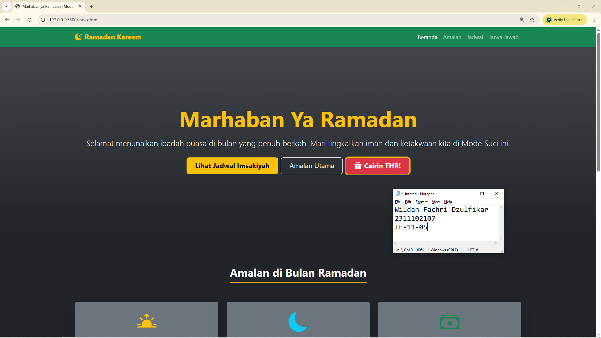
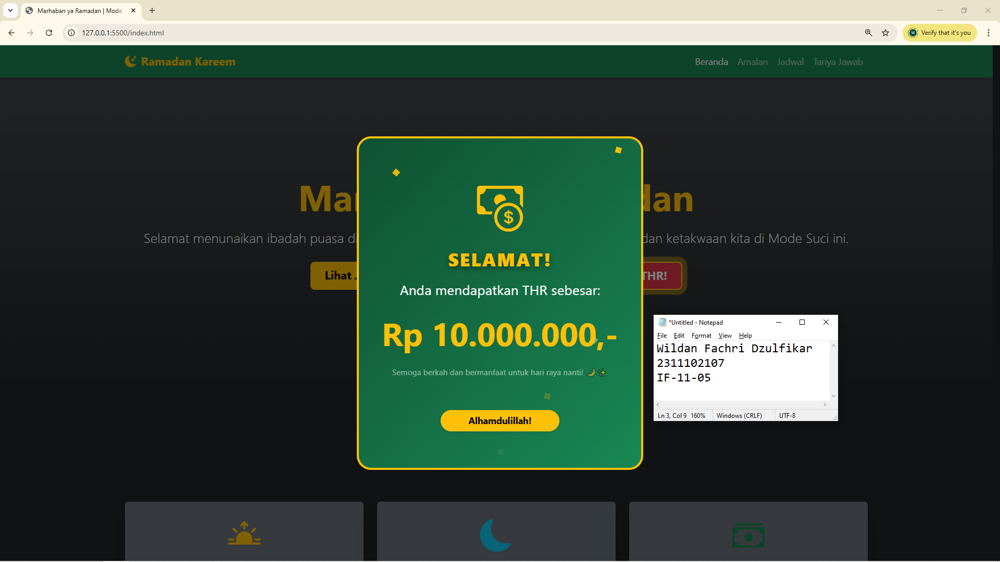

<div align="center">
  <br />
  <h1>LAPORAN PRAKTIKUM <br> APLIKASI BERBASIS PLATFORM </h1>
  <br />
  <h3>MODUL 5 <br> Bootstrap </h3>
  <br />
  
  <br />
  <br />
  <br />
  <h3>Disusun Oleh :</h3>
  <p>
    <strong>Wildan Fachri Dzulfikar</strong>
    <br>
    <strong>2311102107</strong>
    <br>
    <strong>S1 IF-11-REG05</strong>
  </p>
  <br />
  <h3>Dosen Pengampu :</h3>
  <p>
    <strong>Dedi Agung Prabowo, S.Kom., M.Kom</strong>
  </p>
  <br />
  <br />
  <h4>Asisten Praktikum :</h4>
  <strong>Apri Pandu Wicaksono </strong>
  <br>
  <strong>Hamka Zaenul Ardi</strong>
  <br />
  <h3>LABORATORIUM HIGH PERFORMANCE <br>FAKULTAS INFORMATIKA <br>UNIVERSITAS TELKOM PURWOKERTO <br>2026 </h3>
</div>

<hr>

# Dasar Teori Bootstrap

## 1. Pengertian Bootstrap
Bootstrap adalah kerangka kerja (framework) open-source berbasis CSS, HTML, dan JavaScript yang dikembangkan oleh tim Twitter. Tujuan utamanya adalah untuk mempermudah dan mempercepat pengembangan web yang responsif serta mengutamakan tampilan mobile (mobile-first).

## 2. Fitur Utama Bootstrap
*   **Responsive Grid System**: Memungkinkan pembuatan layout yang fleksibel dan adaptif terhadap berbagai ukuran layar.
*   **Pre-styled Components**: Menyediakan ribuan komponen UI seperti Button, Navbar, Card, Modal, dan Form yang siap pakai.
*   **Utility Classes**: Kumpulan class untuk mengatur margin, padding, warna, tipografi, dan perataan secara instan tanpa menulis CSS manual.
*   **JavaScript Plugins**: Integrasi fungsionalitas interaktif seperti drop-down, carousel, dan accordion menggunakan library Popper.js dan jQuery (pada versi lama) atau Vanilla JS (pada versi terbaru).

## 3. Sistem Grid Bootstrap
Sistem grid Bootstrap menggunakan flexbox dan memiliki struktur 12 kolom per baris. Struktur dasarnya terdiri dari:
1.  **Container**: Pembungkus utama untuk menyelaraskan konten (`.container` atau `.container-fluid`).
2.  **Row**: Pembungkus horizontal untuk kolom (`.row`).
3.  **Column**: Unit terkecil dalam baris yang menentukan lebar elemen (`.col-*`).

Bootstrap menggunakan **Breakpoints** untuk menentukan kapan layout harus berubah:
- **xs**: < 576px
- **sm**: ≥ 576px
- **md**: ≥ 768px
- **lg**: ≥ 992px
- **xl**: ≥ 1200px
- **xxl**: ≥ 1400px

## 4. Utility Classes & Components
Beberapa utility dan komponen penting yang sering digunakan:
*   **Spacing**: `m-*` (margin), `p-*` (padding) dengan skala 1-5.
*   **Colors**: `text-primary`, `bg-success`, `text-warning`, dll.
*   **Flexbox**: `d-flex`, `justify-content-center`, `align-items-center`.
*   **Cards**: `.card` untuk membungkus konten dalam satu kotak yang rapi.
*   **Accordion**: `.accordion` untuk menampilkan konten yang dapat di-expand/collapse.


### Source code - html
```html
<!DOCTYPE html>
<html lang="id">
<head>
    <meta charset="UTF-8">
    <meta name="viewport" content="width=device-width, initial-scale=1.0">
    <title>Marhaban ya Ramadan | Mode Suci</title>
    <!-- Bootstrap CSS -->
    <link href="https://cdn.jsdelivr.net/npm/bootstrap@5.3.3/dist/css/bootstrap.min.css" rel="stylesheet">
    <link rel="stylesheet" href="https://cdn.jsdelivr.net/npm/bootstrap-icons@1.11.3/font/bootstrap-icons.min.css">
    <style>
        /* Sesuai instruksi: Tidak ada custom CSS yang mendefinisikan style visual utama */
        /* Hanya memastikan image cover hero terlihat bagus menggunakan bootstrap utility jika memungkinkan */
        
        /* TASK 5: THR Feature Styles */
        @keyframes pulse-gold {
            0% { box-shadow: 0 0 0 0 rgba(255, 193, 7, 0.7); }
            70% { box-shadow: 0 0 0 20px rgba(255, 193, 7, 0); }
            100% { box-shadow: 0 0 0 0 rgba(255, 193, 7, 0); }
        }
        .btn-thr {
            animation: pulse-gold 1.5s infinite;
            transition: all 0.4s cubic-bezier(0.175, 0.885, 0.32, 1.275);
            border: 2px solid #ffc107 !important;
        }
        .btn-thr:hover {
            transform: scale(1.1) rotate(2deg);
            background-color: #ffc107 !important;
            color: #000 !important;
            box-shadow: 0 10px 20px rgba(0,0,0,0.3);
        }
        .modal-content-thr {
            background: linear-gradient(135deg, #0f5132 0%, #198754 100%);
            border: 4px solid #ffc107;
            border-radius: 25px;
            overflow: hidden;
        }
        .thr-title {
            color: #ffc107;
            font-weight: 800;
            text-transform: uppercase;
            letter-spacing: 2px;
            text-shadow: 0 4px 10px rgba(0,0,0,0.5);
        }
        .confetti-piece {
            position: absolute;
            width: 10px;
            height: 10px;
            background: #ffc107;
            top: -10px;
            opacity: 0;
            animation: fall 3s infinite linear;
        }
        @keyframes fall {
            0% { top: -10px; opacity: 1; transform: translateX(0) rotate(0deg); }
            100% { top: 100%; opacity: 0; transform: translateX(100px) rotate(360deg); }
        }
    </style>
</head>
<body class="bg-dark text-light">

    <!-- Navbar -->
    <nav class="navbar navbar-expand-lg navbar-dark bg-success sticky-top shadow-sm">
        <div class="container">
            <a class="navbar-brand fw-bold text-warning" href="#">
                <i class="bi bi-moon-stars-fill me-2"></i>Ramadan Kareem
            </a>
            <button class="navbar-toggler" type="button" data-bs-toggle="collapse" data-bs-target="#navbarNav">
                <span class="navbar-toggler-icon"></span>
            </button>
            <div class="collapse navbar-collapse" id="navbarNav">
                <ul class="navbar-nav ms-auto">
                    <li class="nav-item"><a class="nav-link active" href="#hero">Beranda</a></li>
                    <li class="nav-item"><a class="nav-link" href="#ibadah">Amalan</a></li>
                    <li class="nav-item"><a class="nav-link" href="#jadwal">Jadwal</a></li>
                    <li class="nav-item"><a class="nav-link" href="#faq">Tanya Jawab</a></li>
                </ul>
            </div>
        </div>
    </nav>

    <!-- Selebihnya dapat cek pada file "index.html" -->
```
🔗 [Klik di sini untuk membuka file `index.html`](index.html)

Output:



## Penjelasan
Website ini adalah landing page interaktif bertema Ramadan yang menyajikan informasi amalan ibadah dan jadwal imsakiyah, serta dilengkapi fitur kejutan "Cairin THR" yang interaktif. Seluruh tampilan dirancang secara responsif menggunakan Bootstrap 5 dengan desain yang modern, premium, dan penuh animasi untuk menyambut bulan suci.