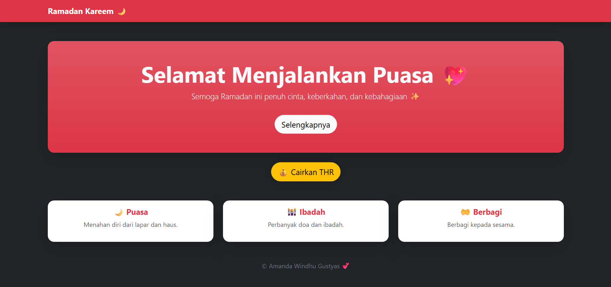

<div align="center">
  <br />
  <h1>LAPORAN PRAKTIKUM <br> APLIKASI BERBASIS PLATFORM </h1>
  <br />
  <h3>MODUL 5 <br> Boostrap </h3>
  <br />
  
  <br />
  <br />
  <br />
  <h3>Disusun Oleh :</h3>
  <p>
    <strong>Amanda Windhu Gustyas</strong>
    <br>
    <strong>2311102121</strong>
    <br>
    <strong>S1 IF-11-REG05</strong>
  </p>
  <br />
  <h3>Dosen Pengampu :</h3>
  <p>
    <strong>Dedi Agung Prabowo, S.Kom., M.Kom</strong>
  </p>
  <br />
  <br />
  <h4>Asisten Praktikum :</h4>
  <strong>Apri Pandu Wicaksono </strong>
  <br>
  <strong>Hamka Zaenul Ardi</strong>
  <br />
  <h3>LABORATORIUM HIGH PERFORMANCE <br>FAKULTAS INFORMATIKA <br>UNIVERSITAS TELKOM PURWOKERTO <br>2026 </h3>
</div>

<hr>

# Dasar Teori

1. JavaScript adalah bahasa pemrograman yang digunakan untuk membuat halaman web menjadi lebih interaktif dan dinamis. Bahasa ini bersifat interpreted sehingga tidak memerlukan proses kompilasi sebelum dijalankan, serta memiliki dynamic typing yang memungkinkan tipe data berubah secara fleksibel. JavaScript umumnya dijalankan di browser, namun juga dapat digunakan di sisi server dengan bantuan Node.js. Dalam penggunaannya, JavaScript mendukung konsep event-driven, yaitu menjalankan kode berdasarkan aksi pengguna seperti klik atau input, serta mendukung asynchronous programming melalui callback, promise, dan async/await untuk menangani proses tanpa menghambat eksekusi utama. Dalam JavaScript terdapat beberapa komponen dasar seperti variabel yang dideklarasikan menggunakan var, let, atau const, serta tipe data seperti string, number, boolean, object, array, null, dan undefined. JavaScript juga memiliki operator aritmatika, perbandingan, dan logika, serta struktur kontrol seperti percabangan (if-else, switch) dan perulangan (for, while). Selain itu, JavaScript menyediakan fungsi (function) untuk mengelompokkan kode agar lebih terstruktur. Salah satu konsep penting dalam JavaScript adalah Document Object Model (DOM), yang memungkinkan pengembang memanipulasi elemen HTML dan CSS secara langsung, seperti mengubah teks, gaya, atau menangani event. Dengan berbagai kemampuan tersebut, JavaScript menjadi teknologi utama dalam pengembangan web modern, baik untuk frontend maupun backend.

2. Bootstrap merupakan framework CSS yang digunakan untuk mempermudah pembuatan tampilan website secara cepat, responsif, dan konsisten tanpa perlu menulis CSS manual. Bootstrap menyediakan berbagai komponen siap pakai seperti navbar, button, card, serta sistem grid (container, row, col) untuk mengatur layout agar dapat menyesuaikan berbagai ukuran layar. Selain itu, Bootstrap juga memiliki komponen interaktif seperti modal, yaitu jendela pop-up yang muncul tanpa berpindah halaman dan dapat diaktifkan menggunakan atribut data-bs-toggle dan data-bs-target tanpa perlu JavaScript tambahan. Penggunaan Bootstrap juga berkaitan dengan konsep UI (User Interface) dan UX (User Experience), dimana UI berfokus pada tampilan visual seperti warna dan layout, sedangkan UX berfokus pada pengalaman pengguna saat berinteraksi, seperti munculnya modal saat tombol diklik. Dengan demikian, Bootstrap membantu menghasilkan tampilan web yang lebih menarik, interaktif, dan mudah digunakan.

# Tugas 5
```
//2311102121
//Amanda Windhu Gustyas

<!DOCTYPE html>
<html lang="id">
<head>
    <meta charset="UTF-8">
    <title>Ramadan Kareem</title>

    <!-- Bootstrap -->
    <link href="https://cdn.jsdelivr.net/npm/bootstrap@5.3.2/dist/css/bootstrap.min.css" rel="stylesheet">
</head>

<body class="bg-dark text-light">

    <!-- Navbar -->
    <nav class="navbar navbar-dark bg-danger shadow">
        <div class="container">
            <span class="navbar-brand fw-bold">Ramadan Kareem 🌙</span>
        </div>
    </nav>

    <!-- Hero -->
    <div class="container text-center mt-5">
        <div class="p-5 bg-danger bg-gradient rounded-4 shadow-lg">
            <h1 class="display-4 fw-bold">Selamat Menjalankan Puasa 💖</h1>
            <p class="lead">
                Semoga Ramadan ini penuh cinta, keberkahan, dan kebahagiaan ✨
            </p>

            <button class="btn btn-light btn-lg mt-3 rounded-pill">
                Selengkapnya
            </button>
        </div>
    </div>

    <!-- Tombol THR -->
    <div class="text-center mt-4">
        <button class="btn btn-warning btn-lg rounded-pill shadow"
                data-bs-toggle="modal"
                data-bs-target="#thrModal">
            💰 Cairkan THR
        </button>
    </div>

    <!-- Card Section -->
    <div class="container mt-5">
        <div class="row text-center g-4">

            <div class="col-md-4">
                <div class="card border-0 shadow-lg rounded-4">
                    <div class="card-body">
                        <h5 class="fw-bold text-danger">🌙 Puasa</h5>
                        <p class="text-muted">Menahan diri dari lapar dan haus.</p>
                    </div>
                </div>
            </div>

            <div class="col-md-4">
                <div class="card border-0 shadow-lg rounded-4">
                    <div class="card-body">
                        <h5 class="fw-bold text-danger">🕌 Ibadah</h5>
                        <p class="text-muted">Perbanyak doa dan ibadah.</p>
                    </div>
                </div>
            </div>

            <div class="col-md-4">
                <div class="card border-0 shadow-lg rounded-4">
                    <div class="card-body">
                        <h5 class="fw-bold text-danger">🤲 Berbagi</h5>
                        <p class="text-muted">Berbagi kepada sesama.</p>
                    </div>
                </div>
            </div>

        </div>
    </div>

    <!-- Footer -->
    <footer class="text-center mt-5 mb-3">
        <p class="text-secondary">© Amanda Windhu Gustyas 💕</p>
    </footer>

    <!-- Modal THR -->
    <div class="modal fade" id="thrModal" tabindex="-1">
      <div class="modal-dialog modal-dialog-centered">
        <div class="modal-content text-center">

          <div class="modal-header bg-warning">
            <h5 class="modal-title w-100">🎉 THR Cair!</h5>
            <button type="button" class="btn-close" data-bs-dismiss="modal"></button>
          </div>

          <div class="modal-body">
            <h3 class="text-success">💸 Selamat!</h3>
            <p class="fs-5">Anda mendapatkan THR 🎊</p>
            <p class="text-muted">Saldo sudah masuk ke rekening 💳</p>
          </div>

          <div class="modal-footer justify-content-center">
            <button type="button" class="btn btn-success rounded-pill" data-bs-dismiss="modal">
              Alhamdulillah 🤲
            </button>
          </div>

        </div>
      </div>
    </div>

    <!-- Bootstrap JS -->
    <script src="https://cdn.jsdelivr.net/npm/bootstrap@5.3.2/dist/js/bootstrap.bundle.min.js"></script>

</body>
</html>
```
Output:


# Penjelasan
Kode pada halaman ini menggunakan framework Bootstrap untuk membangun tampilan web bertema Ramadan yang responsif dan interaktif tanpa menggunakan CSS manual. Struktur halaman terdiri dari navbar, hero section, card, serta tombol “Cairkan THR” yang menggunakan atribut data-bs-toggle dan data-bs-target untuk memunculkan modal sebagai pop-up. Modal tersebut menampilkan pesan bahwa pengguna mendapatkan THR sehingga memberikan interaksi tanpa berpindah halaman. Output yang dihasilkan berupa halaman web yang rapi, modern, dan estetis dengan tampilan yang menyesuaikan berbagai ukuran layar, serta memiliki fitur interaktif berupa pop-up THR yang meningkatkan pengalaman
