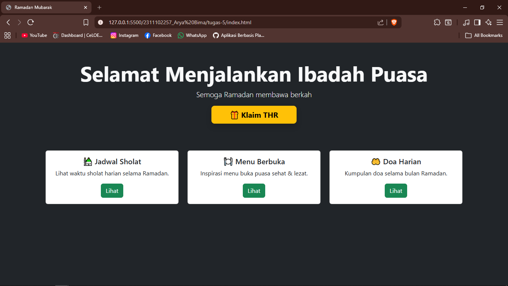
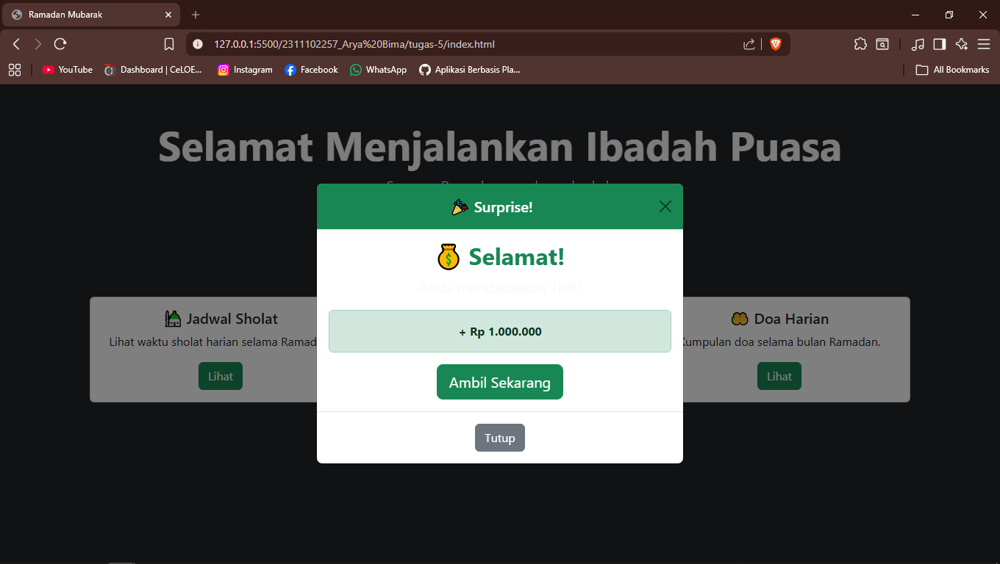

<div align="center">
  <br />
  <h1>LAPORAN PRAKTIKUM <br> APLIKASI BERBASIS PLATFORM </h1>
  <br />
  <h3>MODUL 5 <br> JAVASCRIPT & JQUERY </h3>
  <br />
  
  <br />
  <br />
  <br />
  <h3>Disusun Oleh :</h3>
  <p>
    <strong>Arya Bima</strong>
    <br>
    <strong>2311102257</strong>
    <br>
    <strong>S1 IF-11-REG05</strong>
  </p>
  <br />
  <h3>Dosen Pengampu :</h3>
  <p>
    <strong>Dedi Agung Prabowo, S.Kom., M.Kom</strong>
  </p>
  <br />
  <br />
  <h4>Asisten Praktikum :</h4>
  <strong>Apri Pandu Wicaksono </strong>
  <br>
  <strong>Hamka Zaenul Ardi</strong>
  <br />
  <h3>LABORATORIUM HIGH PERFORMANCE <br>FAKULTAS INFORMATIKA <br>UNIVERSITAS TELKOM PURWOKERTO <br>2026 </h3>
</div>

<hr>

# Dasar Teori

JavaScript adalah bahasa pemrograman scripting yang digunakan untuk membuat halaman web menjadi interaktif dan dinamis. Berbeda dengan HTML (struktur) dan CSS (tampilan), JavaScript berfungsi untuk menangani logika, manipulasi elemen DOM, validasi form, animasi, serta komunikasi dengan server secara asynchronous (AJAX). JavaScript dapat dijalankan di sisi client (browser) dan saat ini juga dapat digunakan di sisi server dengan Node.js.
jQuery adalah library JavaScript yang dikembangkan untuk menyederhanakan penulisan kode JavaScript. jQuery menyediakan sintaks yang lebih pendek dan mudah dibaca, serta menangani berbagai perbedaan antar browser secara otomatis. Beberapa fitur utama jQuery antara lain: seleksi elemen DOM yang mudah (misalnya `$("#id")` atau `$(".class")`), manipulasi konten, penanganan event, efek animasi, dan AJAX.
Meskipun saat ini JavaScript modern (ES6+) sudah sangat powerful dan banyak framework baru seperti React atau Vue.js, pemahaman dasar JavaScript dan jQuery tetap penting sebagai fondasi dalam pengembangan web, terutama untuk pemula.

---

# Tugas 5: Fitur Cairin THR

```html
<!doctype html>
<html lang="id">
  <head>
    <meta charset="UTF-8" />
    <meta name="viewport" content="width=device-width, initial-scale=1" />
    <title>Ramadan Mubarak</title>
    <link
      href="https://cdn.jsdelivr.net/npm/bootstrap@5.3.3/dist/css/bootstrap.min.css"
      rel="stylesheet"
    />
  </head>
  <body class="bg-dark text-light">
    <!-- Hero -->
    <section class="container text-center py-5">
      <h1 class="display-4 fw-bold">Selamat Menjalankan Ibadah Puasa</h1>
      <p class="lead">Semoga Ramadan membawa berkah</p>

      <!-- Surprise Button -->
      <button
        class="btn btn-warning btn-lg fw-bold px-5 shadow"
        data-bs-toggle="modal"
        data-bs-target="#surpriseModal"
      >
        🎁 Klaim THR
      </button>
    </section>

    <!-- Cards -->
    <section class="container py-4">
      <div class="row g-4">
        <div class="col-md-4">
          <div class="card text-dark">
            <div class="card-body text-center">
              <h5 class="card-title">🕌 Jadwal Sholat</h5>
              <p class="card-text">Lihat waktu sholat harian selama Ramadan.</p>
              <a href="#" class="btn btn-success">Lihat</a>
            </div>
          </div>
        </div>

        <div class="col-md-4">
          <div class="card text-dark">
            <div class="card-body text-center">
              <h5 class="card-title">🍽️ Menu Berbuka</h5>
              <p class="card-text">Inspirasi menu buka puasa sehat & lezat.</p>
              <a href="#" class="btn btn-success">Lihat</a>
            </div>
          </div>
        </div>

        <div class="col-md-4">
          <div class="card text-dark">
            <div class="card-body text-center">
              <h5 class="card-title">🤲 Doa Harian</h5>
              <p class="card-text">Kumpulan doa selama bulan Ramadan.</p>
              <a href="#" class="btn btn-success">Lihat</a>
            </div>
          </div>
        </div>
      </div>
    </section>

    <!-- Modal -->
    <div class="modal fade" id="surpriseModal" tabindex="-1">
      <div class="modal-dialog modal-dialog-centered">
        <div class="modal-content text-center">
          <!-- Header -->
          <div class="modal-header bg-success text-white">
            <h5 class="modal-title w-100">🎉 Surprise!</h5>
            <button
              type="button"
              class="btn-close"
              data-bs-dismiss="modal"
            ></button>
          </div>

          <!-- Body -->
          <div class="modal-body">
            <!-- Loading animation -->
            <div id="loadingState">
              <div class="spinner-border text-success mb-3"></div>
              <p class="fw-bold">Sedang memproses THR kamu...</p>

              <div class="progress">
                <div
                  class="progress-bar progress-bar-striped progress-bar-animated bg-success"
                  style="width: 100%"
                ></div>
              </div>
            </div>

            <!-- Result -->
            <div id="resultState" class="d-none">
              <h2 class="text-success fw-bold">💰 Selamat!</h2>
              <p class="fs-5">Anda mendapatkan THR!</p>

              <div class="alert alert-success fw-bold">+ Rp 1.000.000</div>

              <button class="btn btn-success btn-lg">Ambil Sekarang</button>
            </div>
          </div>

          <!-- Footer -->
          <div class="modal-footer justify-content-center">
            <button class="btn btn-secondary" data-bs-dismiss="modal">
              Tutup
            </button>
          </div>
        </div>
      </div>
    </div>

    <script src="https://cdn.jsdelivr.net/npm/bootstrap@5.3.3/dist/js/bootstrap.bundle.min.js"></script>

    <script>
      const modal = document.getElementById("surpriseModal");

      modal.addEventListener("shown.bs.modal", function () {
        const loading = document.getElementById("loadingState");
        const result = document.getElementById("resultState");

        // reset state
        loading.classList.remove("d-none");
        result.classList.add("d-none");

        setTimeout(() => {
          loading.classList.add("d-none");
          result.classList.remove("d-none");
        }, 2000);
      });
    </script>
  </body>
</html>
```

output:



**Penjelasan:**
Kode di atas merupakan halaman web bertema Ramadan Mubarak yang dibangun dengan HTML5 dan Bootstrap 5. Halaman ini menampilkan bagian hero dengan ucapan selamat puasa serta tombol “Klaim THR” yang memicu modal surprise. Kode ini menggunakan JavaScript sederhana untuk mengatur pergantian state antara tampilan loading dan hasil akhir saat modal ditampilkan.
