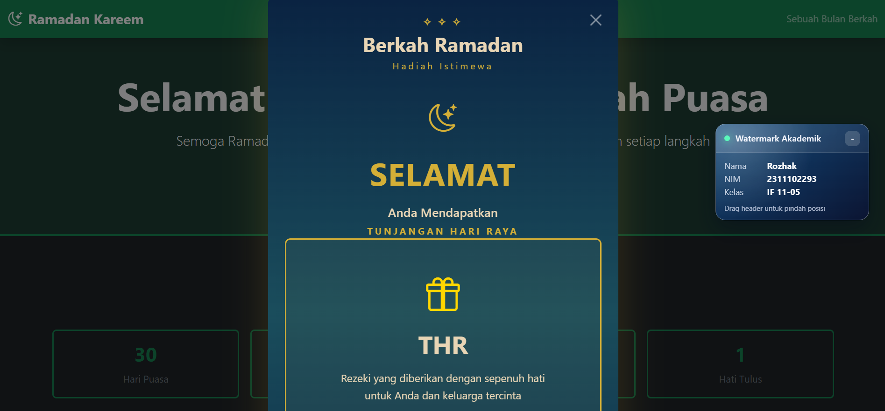

<div align="center">
    <br />
    <h1>LAPORAN PRAKTIKUM <br> APLIKASI BERBASIS PLATFORM </h1>
    <br />
    <h3>MODUL 5 <br> BOOTSTRAP </h3>
    <br />
    
    <br />
    <br />
    <br />
    <h3>Disusun Oleh :</h3>
    <p>
        <strong>Rozhak</strong>
        <br>
        <strong>2311102293</strong>
        <br>
        <strong>S1 IF-11-REG05</strong>
    </p>
    <br />
    <h3>Dosen Pengampu :</h3>
    <p>
        <strong>Dedi Agung Prabowo, S.Kom., M.Kom</strong>
    </p>
    <br />
    <br />
    <h4>Asisten Praktikum :</h4>
    <strong>Apri Pandu Wicaksono </strong>
    <br>
    <strong>Hamka Zaenul Ardi</strong>
    <br />
    <h3>LABORATORIUM HIGH PERFORMANCE <br>FAKULTAS INFORMATIKA <br>UNIVERSITAS TELKOM PURWOKERTO <br>2026 </h3>
</div>
<hr>

## Dasar Teori

Bootstrap merupakan **framework CSS** yang digunakan untuk mempercepat proses pengembangan tampilan web dengan menyediakan kumpulan class siap pakai. Dengan Bootsrap, developer tidak perlu menulis styling dari nol karena sudah tersedia komponen seperti grid system, navbar, card, button, utilities, yang dapat langsung digunakan untuk membangun antarmuka yang konsisten dan responsif.

Salah satu konsep utama dalam Bootstrap adalah **grid system**, yaitu sistem layout berbasis baris (`row`) dan kolom (`col`) yang memudahkan pengaturan posisi elemen secara fleksibel dan otomatis menyesuaikan berbagai ukuran layar. Hal ini menjadikan tampilan web lebih responsif tanpa perlu penulisan CSS tambahan.

Bootstrap juga menyediakan berbagai **komponen UI** seperti navbar, card, button, dan alert yang dapat digunakan dengan hanya menambahkan class tertentu pada elemen HTML. Selain itu, terdapat **utility class** seperti pengaturan warna (`bd-*`, `text-*`), spacing (`m-*`, `p-*`), serta alignment yang membantu mempercepat proses styling tanpa perlu membuat file CSS terpisah.

Dalam penggunaannya, Bootstrap biasanya diintegrasikan melalui **CDN (Content Delivery Network)** sehingga dapat langsung digunakan tanpa instalasi. Dengan pendekatan ini, pengembangan halaman menjadi lebih cepat, terstruktur, dan efisien, terutama untuk membangun tampilan modern berbasis komponen.

## Tugas 4: Mode Suci (Edisi Ramadan)

### 1. Source Code

```html
...
    <!-- THR Modal -->
    <div class="modal fade" id="thrModal" tabindex="-1">
        <div class="modal-dialog modal-dialog-centered">
            <div class="modal-content">
                
                <!-- Header -->
                <div class="modal-header pt-4 pb-0">
                    ...
                </div>
                
                <!-- Body -->
                <div class="modal-body">
                    <!-- Crescent & Star -->
                    <div class="mb-4">
                        <i class="bi bi-moon-stars text-warning" style="font-size: 2.5rem;"></i>
                    </div>
                    
                    <!-- Main Blessing -->
                    <h2 class="fw-bolder mb-3 text-warning">SELAMAT</h2>
                    
                    <!-- Subtitle -->
                    <p class="text-light mb-1 fw-semibold" style="font-size: 1.1rem;">Anda Mendapatkan</p>
                    <p class="text-warning fw-bold mb-5 decoration-text">TUNJANGAN HARI RAYA</p>
                    
                    <!-- THR Gift Card -->
                    <div class="gift-card">
                        ...
                    </div>
                    
                    <!-- Doa/Blessing -->
                    <div class="doa-section">
                        ...
                    </div>
                    
                    <!-- Bottom -->
                    <p class="text-warning fw-bold decoration-text">✧ ✧ ✧</p>
                </div>
                
                <!-- Footer -->
                <div class="modal-footer pb-4">
                    ...
                </div>
            </div>
        </div>
    </div>
...
```

**Kode Lengkap:** [index.html](index.html)

### 2. Penjelasan

Kode JavaScript pada fitur ini menggunakan pendekatan **Object-Oriented Programming (OOP)** melalui class `THRController` untuk mengelola interaksi tombol THR dan modal secara terstruktur. Pada construktor, dilakukan inisialisasi elemen DOM seperti tombol (`thrButton`), modal (`thrModal`), dan ikon hadiah (`gidtIcon`) yang akan digunakan dalam proses interaksi.

Modal diinisialisasi menggunakan `new bootstrap.Model()` yang menggunakan API bawaan Bootstrap untuk mengontrol modal melalui JavaScript tanpa perlu atribut HTML tambahan. Hal ini memberikan fleksibilitas lebih dalam mengatur perilaku modal secara dinamis.

Event handling diterapkan pada method `init()` dengan menambahkan event listiner `click` pada tombol THR. Ketika tombol di klik, method `handleClick()` akan dijalankan untuk memberikan efek animasi skala (scale) sebagai feedback visual, kemudian menampilkan modal menggunakan method `.show()` dari Bootstrap.

Selain itu, terdapat method `animateGiftIcon()` yang berfungsi untuk memicu animasi pada ikon hadian dengan cara mereset dan mengaktifkan kembali properti CSS animation. Teknik ini digunakan agar animasi dapat diputar ulang setiap kali modal ditampilkan.

Terakhir, penggunaan `DomContentLoaded` memastikan bahwa seluruh elemen HTML telah dimuat sebelum inisialisasi class dijalankan, sehingga menghindari error akibat elemen yang belum tersedia di DOM.

### 3. Output



## Kesimpulan

JavaScript memungkinkan pembuatan fitur interaktif yang terstruktur dan dinamis melalui pengelolaan event, manipulasi DOM, serta integrasi dan komponen Bootstrap seperti modal.