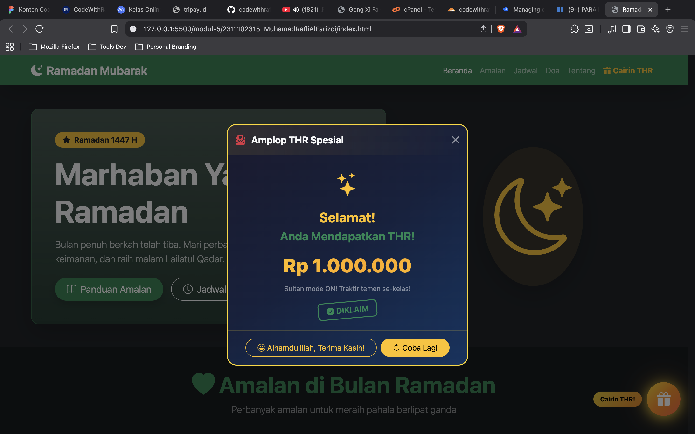

<div align="center">
  <br />
  <h1>LAPORAN PRAKTIKUM <br> APLIKASI BERBASIS PLATFORM </h1>
  <br />
  <h3>MODUL 5 <br> Bootstrap + JavaScript </h3>
  <br />
  
  <br />
  <br />
  <br />
  <h3>Disusun Oleh :</h3>
  <p>
    <strong>Muhamad Rafli Al Farizqi</strong>
    <br>
    <strong>2311102315</strong>
    <br>
    <strong>S1 IF-11-REG05</strong>
  </p>
  <br />
  <h3>Dosen Pengampu :</h3>
  <p>
    <strong>Dedi Agung Prabowo, S.Kom., M.Kom</strong>
  </p>
  <br />
  <br />
  <h4>Asisten Praktikum :</h4>
  <strong>Apri Pandu Wicaksono </strong>
  <br>
  <strong>Hamka Zaenul Ardi</strong>
  <br />
  <h3>LABORATORIUM HIGH PERFORMANCE <br>FAKULTAS INFORMATIKA <br>UNIVERSITAS TELKOM PURWOKERTO <br>2026 </h3>
</div>

<hr>

# Dasar Teori
JavaScript merupakan bahasa pemrograman yang digunakan untuk menambahkan interaktivitas pada halaman web. Dengan JavaScript, elemen-elemen HTML dapat dimanipulasi secara dinamis, mulai dari mengubah konten, menambahkan animasi, hingga merespons aksi pengguna seperti klik, hover, dan input data.

Dalam pengembangan web modern, JavaScript sering dikombinasikan dengan Bootstrap untuk menciptakan pengalaman pengguna yang lebih kaya. Bootstrap sendiri menyediakan komponen interaktif seperti modal, collapse, dan carousel yang memerlukan JavaScript (melalui Bootstrap JS Bundle) untuk dapat berfungsi. Selain itu, pengembang juga dapat menulis JavaScript kustom untuk menambahkan fitur-fitur unik yang tidak tersedia secara bawaan di Bootstrap.

Beberapa konsep JavaScript yang umum digunakan dalam pengembangan web antara lain DOM manipulation untuk mengakses dan mengubah elemen HTML, event listener untuk merespons interaksi pengguna, animasi menggunakan CSS transitions dan JavaScript timing functions, serta penggunaan template literals dan arrow functions dari ES6. Dengan menggabungkan Bootstrap dan JavaScript, pengembang dapat membangun halaman web yang tidak hanya responsif dan rapi, tetapi juga interaktif dan menarik.

# Tugas 5
## 1. Source Kode HTML
```html
 //2311102315
 //Muhamad Rafli Al Farizqi

<!DOCTYPE html>
<html lang="id">

<head>
    <meta charset="UTF-8">
    <meta name="viewport" content="width=device-width, initial-scale=1.0">
    <title>Ramadan Mubarak - Mode Suci</title>

    <!-- Bootstrap CSS -->
    <link href="https://cdn.jsdelivr.net/npm/bootstrap@5.3.2/dist/css/bootstrap.min.css" rel="stylesheet">
    <!-- Bootstrap Icons -->
    <link href="https://cdn.jsdelivr.net/npm/bootstrap-icons@1.11.3/font/bootstrap-icons.min.css" rel="stylesheet">

    <style>
        /* ===== Tombol Cairin THR ===== */
        .thr-float-btn {
            position: fixed;
            bottom: 30px;
            right: 30px;
            z-index: 1050;
            width: 70px;
            height: 70px;
            border-radius: 50%;
            border: none;
            background: linear-gradient(135deg, #ffd700, #ff8c00, #ff6347);
            color: #fff;
            font-size: 1.8rem;
            box-shadow: 0 4px 20px rgba(255, 215, 0, 0.6), 0 0 40px rgba(255, 165, 0, 0.3);
            cursor: pointer;
            animation: thrPulse 1.5s ease-in-out infinite, thrBounce 2s ease-in-out infinite;
            transition: transform 0.2s;
        }
        .thr-float-btn:hover {
            transform: scale(1.15) rotate(10deg);
            box-shadow: 0 6px 30px rgba(255, 215, 0, 0.8), 0 0 60px rgba(255, 165, 0, 0.5);
        }
        .thr-float-btn:active { transform: scale(0.95); }

        @keyframes thrPulse {
            0%, 100% { box-shadow: 0 4px 20px rgba(255, 215, 0, 0.6), 0 0 40px rgba(255, 165, 0, 0.3); }
            50% { box-shadow: 0 4px 30px rgba(255, 215, 0, 1), 0 0 60px rgba(255, 165, 0, 0.6); }
        }
        @keyframes thrBounce {
            0%, 100% { transform: translateY(0); }
            50% { transform: translateY(-8px); }
        }

        /* THR Modal custom */
        .thr-modal .modal-content {
            background: linear-gradient(135deg, #1a1a2e 0%, #16213e 50%, #0f3460 100%);
            border: 2px solid rgba(255, 215, 0, 0.3);
            border-radius: 20px;
        }
        .thr-modal .modal-header {
            border-bottom: 1px solid rgba(255, 215, 0, 0.2);
        }
        .thr-modal .modal-footer {
            border-top: 1px solid rgba(255, 215, 0, 0.2);
        }

        /* Amplop THR */
        .thr-envelope {
            position: relative;
            width: 180px;
            height: 140px;
            margin: 20px auto;
            cursor: pointer;
            transition: transform 0.3s;
        }
        .thr-envelope:hover { transform: scale(1.05); }

        .thr-envelope-body {
            position: absolute;
            bottom: 0;
            width: 100%;
            height: 100%;
            background: linear-gradient(135deg, #e74c3c, #c0392b);
            border-radius: 12px;
            display: flex;
            align-items: center;
            justify-content: center;
            box-shadow: 0 8px 25px rgba(231, 76, 60, 0.4);
            transition: transform 0.5s;
            overflow: hidden;
        }
        .thr-envelope-body::before {
            content: "";
            position: absolute;
            top: 0;
            left: 0;
            right: 0;
            height: 60%;
            background: linear-gradient(180deg, rgba(255,255,255,0.15), transparent);
            clip-path: polygon(0 0, 50% 60%, 100% 0);
        }
        .thr-envelope-body .thr-cn {
            font-size: 2.5rem;
            color: #ffd700;
            text-shadow: 0 2px 10px rgba(255, 215, 0, 0.5);
        }

        .thr-envelope.opened .thr-envelope-body {
            transform: translateY(20px);
        }

        /* Uang keluar dari amplop */
        .thr-money-card {
            position: absolute;
            top: 0;
            left: 50%;
            transform: translateX(-50%) translateY(0);
            width: 160px;
            background: linear-gradient(135deg, #27ae60, #2ecc71);
            border-radius: 8px;
            padding: 12px;
            text-align: center;
            color: #fff;
            font-weight: bold;
            font-size: 0.9rem;
            box-shadow: 0 4px 15px rgba(39, 174, 96, 0.4);
            opacity: 0;
            transition: all 0.6s cubic-bezier(0.34, 1.56, 0.64, 1);
            z-index: 1;
        }
        .thr-envelope.opened .thr-money-card {
            opacity: 1;
            transform: translateX(-50%) translateY(-80px);
        }

        /* Nominal THR */
        .thr-amount {
            font-size: 2.5rem;
            font-weight: 900;
            background: linear-gradient(135deg, #ffd700, #ffaa00, #ffd700);
            background-size: 200% auto;
            -webkit-background-clip: text;
            -webkit-text-fill-color: transparent;
            animation: goldShimmer 2s linear infinite;
        }
        @keyframes goldShimmer {
            to { background-position: 200% center; }
        }

        /* Confetti / Money Rain */
        .confetti-container {
            position: fixed;
            top: 0;
            left: 0;
            width: 100%;
            height: 100%;
            pointer-events: none;
            z-index: 1060;
            overflow: hidden;
        }
        .confetti-piece {
            position: absolute;
            top: -30px;
            font-size: 1.5rem;
            animation: confettiFall linear forwards;
            opacity: 0.9;
        }
        @keyframes confettiFall {
            0% { transform: translateY(0) rotate(0deg) scale(1); opacity: 1; }
            80% { opacity: 0.8; }
            100% { transform: translateY(100vh) rotate(720deg) scale(0.5); opacity: 0; }
        }

        /* Sparkle effect */
        .thr-sparkle {
            position: absolute;
            width: 6px;
            height: 6px;
            background: #ffd700;
            border-radius: 50%;
            animation: sparkle 0.8s ease-out forwards;
        }
        @keyframes sparkle {
            0% { transform: scale(0); opacity: 1; }
            50% { transform: scale(1.5); opacity: 0.8; }
            100% { transform: scale(0); opacity: 0; }
        }

        /* Stamp / Klaim animation */
        .thr-stamp {
            display: inline-block;
            transform: scale(0) rotate(-30deg);
            transition: transform 0.5s cubic-bezier(0.34, 1.56, 0.64, 1);
        }
        .thr-stamp.show {
            transform: scale(1) rotate(-5deg);
        }
    </style>
</head>

<body class="bg-dark text-light">

    <!-- Navbar -->
    <nav class="navbar navbar-expand-lg navbar-dark bg-success shadow-lg sticky-top">
        <div class="container">
            <a class="navbar-brand fw-bold fs-4" href="#">
                <i class="bi bi-moon-stars-fill me-2"></i>Ramadan Mubarak
            </a>
            <button class="navbar-toggler" type="button" data-bs-toggle="collapse" data-bs-target="#navMenu">
                <span class="navbar-toggler-icon"></span>
            </button>
            <div class="collapse navbar-collapse" id="navMenu">
                <ul class="navbar-nav ms-auto">
                    <li class="nav-item">
                        <a class="nav-link active" href="#hero">Beranda</a>
                    </li>
                    <li class="nav-item">
                        <a class="nav-link" href="#amalan">Amalan</a>
                    </li>
                    <li class="nav-item">
                        <a class="nav-link" href="#jadwal">Jadwal</a>
                    </li>
                    <li class="nav-item">
                        <a class="nav-link" href="#doa">Doa</a>
                    </li>
                    <li class="nav-item">
                        <a class="nav-link" href="#tentang">Tentang</a>
                    </li>
                    <li class="nav-item">
                        <a class="nav-link text-warning fw-bold" href="#" onclick="document.getElementById('thrBtn').click(); return false;">
                            <i class="bi bi-gift-fill me-1"></i>Cairin THR
                        </a>
                    </li>
                </ul>
            </div>
        </div>
    </nav>

    <!-- Hero Section -->
    <section id="hero" class="py-5">
        <div class="container">
            <div class="row align-items-center g-5">
                <div class="col-lg-7">
                    <div class="p-5 bg-success bg-gradient bg-opacity-25 rounded-4 shadow-lg border border-success border-opacity-50">
                        <span class="badge bg-warning text-dark fs-6 mb-3 rounded-pill px-3 py-2">
                            <i class="bi bi-star-fill me-1"></i> Ramadan 1447 H
                        </span>
                        <h1 class="display-3 fw-bold mb-3">Marhaban Ya Ramadan</h1>
                        <p class="lead text-light text-opacity-75 mb-4">
                            Bulan penuh berkah telah tiba. Mari perbanyak ibadah, tingkatkan
                            keimanan, dan raih malam Lailatul Qadar.
                        </p>
                        <div class="d-flex gap-3 flex-wrap">
                            <a href="#amalan" class="btn btn-success btn-lg rounded-pill px-4 shadow">
                                <i class="bi bi-book me-2"></i>Panduan Amalan
                            </a>
                            <a href="#jadwal" class="btn btn-outline-light btn-lg rounded-pill px-4">
                                <i class="bi bi-clock me-2"></i>Jadwal Imsakiyah
                            </a>
                        </div>
                    </div>
                </div>
                <div class="col-lg-5 text-center">
                    <div class="p-4 bg-warning bg-opacity-10 rounded-circle d-inline-block shadow-lg">
                        <i class="bi bi-moon-stars text-warning" style="font-size: 10rem;"></i>
                    </div>
                </div>
            </div>
        </div>
    </section>

    <!-- Amalan Ramadan -->
    <section id="amalan" class="py-5 bg-black bg-opacity-25">
        <div class="container">
            <div class="text-center mb-5">
                <h2 class="display-5 fw-bold text-success">
                    <i class="bi bi-heart-fill me-2"></i>Amalan di Bulan Ramadan
                </h2>
                <p class="lead text-light text-opacity-50">Perbanyak amalan untuk meraih pahala berlipat ganda</p>
            </div>
            <div class="row g-4">
                <!-- Card 1 -->
                <div class="col-lg-3 col-md-6">
                    <div class="card bg-dark border-success border-opacity-50 h-100 shadow-lg rounded-4 text-center">
                        <div class="card-body p-4">
                            <div class="bg-success bg-opacity-25 rounded-circle d-inline-flex align-items-center justify-content-center mb-3" style="width: 80px; height: 80px;">
                                <i class="bi bi-sunrise text-success fs-1"></i>
                            </div>
                            <h5 class="card-title fw-bold text-success">Puasa</h5>
                            <p class="card-text text-light text-opacity-75">Menahan diri dari makan, minum, dan hal yang membatalkan dari fajar hingga maghrib.</p>
                        </div>
                    </div>
                </div>
                <!-- Card 2 -->
                <div class="col-lg-3 col-md-6">
                    <div class="card bg-dark border-success border-opacity-50 h-100 shadow-lg rounded-4 text-center">
                        <div class="card-body p-4">
                            <div class="bg-success bg-opacity-25 rounded-circle d-inline-flex align-items-center justify-content-center mb-3" style="width: 80px; height: 80px;">
                                <i class="bi bi-book text-success fs-1"></i>
                            </div>
                            <h5 class="card-title fw-bold text-success">Tadarus Al-Quran</h5>
                            <p class="card-text text-light text-opacity-75">Membaca dan mentadabburi Al-Quran, targetkan khatam 30 juz selama Ramadan.</p>
                        </div>
                    </div>
                </div>
                <!-- Card 3 -->
                <div class="col-lg-3 col-md-6">
                    <div class="card bg-dark border-success border-opacity-50 h-100 shadow-lg rounded-4 text-center">
                        <div class="card-body p-4">
                            <div class="bg-success bg-opacity-25 rounded-circle d-inline-flex align-items-center justify-content-center mb-3" style="width: 80px; height: 80px;">
                                <i class="bi bi-moon text-success fs-1"></i>
                            </div>
                            <h5 class="card-title fw-bold text-success">Sholat Tarawih</h5>
                            <p class="card-text text-light text-opacity-75">Menunaikan sholat tarawih berjamaah di masjid setiap malam Ramadan.</p>
                        </div>
                    </div>
                </div>
                <!-- Card 4 -->
                <div class="col-lg-3 col-md-6">
                    <div class="card bg-dark border-success border-opacity-50 h-100 shadow-lg rounded-4 text-center">
                        <div class="card-body p-4">
                            <div class="bg-success bg-opacity-25 rounded-circle d-inline-flex align-items-center justify-content-center mb-3" style="width: 80px; height: 80px;">
                                <i class="bi bi-gift text-success fs-1"></i>
                            </div>
                            <h5 class="card-title fw-bold text-success">Sedekah & Zakat</h5>
                            <p class="card-text text-light text-opacity-75">Berbagi dengan sesama, keluarkan zakat fitrah dan perbanyak sedekah.</p>
                        </div>
                    </div>
                </div>
            </div>
        </div>
    </section>

    <!-- Jadwal Imsakiyah -->
    <section id="jadwal" class="py-5">
        <div class="container">
            <div class="text-center mb-5">
                <h2 class="display-5 fw-bold text-warning">
                    <i class="bi bi-clock-fill me-2"></i>Jadwal Imsakiyah
                </h2>
                <p class="lead text-light text-opacity-50">Purwokerto &mdash; Ramadan 1447 H</p>
            </div>
            <div class="row justify-content-center">
                <div class="col-lg-10">
                    <div class="table-responsive">
                        <table class="table table-dark table-striped table-hover align-middle rounded-4 overflow-hidden shadow-lg">
                            <thead class="table-success text-dark">
                                <tr>
                                    <th class="text-center">Hari</th>
                                    <th class="text-center">Tanggal</th>
                                    <th class="text-center">Imsak</th>
                                    <th class="text-center">Subuh</th>
                                    <th class="text-center">Dzuhur</th>
                                    <th class="text-center">Ashar</th>
                                    <th class="text-center">Maghrib</th>
                                    <th class="text-center">Isya</th>
                                </tr>
                            </thead>
                            <tbody>
                                <tr>
                                    <td class="text-center">Sabtu</td>
                                    <td class="text-center">1 Ramadan</td>
                                    <td class="text-center"><span class="badge bg-warning text-dark">04:12</span></td>
                                    <td class="text-center">04:22</td>
                                    <td class="text-center">11:48</td>
                                    <td class="text-center">15:05</td>
                                    <td class="text-center"><span class="badge bg-success">17:50</span></td>
                                    <td class="text-center">18:58</td>
                                </tr>
                                <tr>
                                    <td class="text-center">Ahad</td>
                                    <td class="text-center">2 Ramadan</td>
                                    <td class="text-center"><span class="badge bg-warning text-dark">04:12</span></td>
                                    <td class="text-center">04:22</td>
                                    <td class="text-center">11:48</td>
                                    <td class="text-center">15:04</td>
                                    <td class="text-center"><span class="badge bg-success">17:49</span></td>
                                    <td class="text-center">18:57</td>
                                </tr>
                                <tr>
                                    <td class="text-center">Senin</td>
                                    <td class="text-center">3 Ramadan</td>
                                    <td class="text-center"><span class="badge bg-warning text-dark">04:11</span></td>
                                    <td class="text-center">04:21</td>
                                    <td class="text-center">11:47</td>
                                    <td class="text-center">15:04</td>
                                    <td class="text-center"><span class="badge bg-success">17:49</span></td>
                                    <td class="text-center">18:57</td>
                                </tr>
                                <tr>
                                    <td class="text-center">Selasa</td>
                                    <td class="text-center">4 Ramadan</td>
                                    <td class="text-center"><span class="badge bg-warning text-dark">04:11</span></td>
                                    <td class="text-center">04:21</td>
                                    <td class="text-center">11:47</td>
                                    <td class="text-center">15:04</td>
                                    <td class="text-center"><span class="badge bg-success">17:49</span></td>
                                    <td class="text-center">18:56</td>
                                </tr>
                                <tr>
                                    <td class="text-center">Rabu</td>
                                    <td class="text-center">5 Ramadan</td>
                                    <td class="text-center"><span class="badge bg-warning text-dark">04:11</span></td>
                                    <td class="text-center">04:21</td>
                                    <td class="text-center">11:47</td>
                                    <td class="text-center">15:03</td>
                                    <td class="text-center"><span class="badge bg-success">17:48</span></td>
                                    <td class="text-center">18:56</td>
                                </tr>
                            </tbody>
                        </table>
                    </div>
                </div>
            </div>
        </div>
    </section>

    <!-- Doa Harian -->
    <section id="doa" class="py-5 bg-black bg-opacity-25">
        <div class="container">
            <div class="text-center mb-5">
                <h2 class="display-5 fw-bold text-info">
                    <i class="bi bi-chat-heart-fill me-2"></i>Doa-Doa Ramadan
                </h2>
                <p class="lead text-light text-opacity-50">Doa yang sering dibaca selama bulan Ramadan</p>
            </div>
            <div class="row g-4">
                <!-- Doa Niat Puasa -->
                <div class="col-md-6">
                    <div class="card bg-dark border-info border-opacity-50 h-100 shadow-lg rounded-4">
                        <div class="card-header bg-info bg-opacity-25 border-0 rounded-top-4">
                            <h5 class="card-title fw-bold text-info mb-0">
                                <i class="bi bi-star me-2"></i>Doa Niat Puasa
                            </h5>
                        </div>
                        <div class="card-body p-4">
                            <p class="fs-4 text-end text-warning mb-3" dir="rtl">
                                نَوَيْتُ صَوْمَ غَدٍ عَنْ أَدَاءِ فَرْضِ شَهْرِ رَمَضَانَ هٰذِهِ السَّنَةِ لِلّٰهِ تَعَالَى
                            </p>
                            <p class="text-light text-opacity-75 fst-italic">
                                "Nawaitu shauma ghadin 'an adaa-i fardhi syahri ramadhaana haadzihis sanati lillaahi ta'aalaa."
                            </p>
                            <p class="text-light text-opacity-50 small">
                                Artinya: Saya niat berpuasa esok hari untuk menunaikan fardhu di bulan Ramadan tahun ini karena Allah Ta'ala.
                            </p>
                        </div>
                    </div>
                </div>
                <!-- Doa Buka Puasa -->
                <div class="col-md-6">
                    <div class="card bg-dark border-info border-opacity-50 h-100 shadow-lg rounded-4">
                        <div class="card-header bg-info bg-opacity-25 border-0 rounded-top-4">
                            <h5 class="card-title fw-bold text-info mb-0">
                                <i class="bi bi-star me-2"></i>Doa Buka Puasa
                            </h5>
                        </div>
                        <div class="card-body p-4">
                            <p class="fs-4 text-end text-warning mb-3" dir="rtl">
                                اَللّٰهُمَّ لَكَ صُمْتُ وَبِكَ اٰمَنْتُ وَعَلَى رِزْقِكَ أَفْطَرْتُ
                            </p>
                            <p class="text-light text-opacity-75 fst-italic">
                                "Allahumma laka shumtu wa bika aamantu wa 'alaa rizqika afthartu."
                            </p>
                            <p class="text-light text-opacity-50 small">
                                Artinya: Ya Allah, karena-Mu aku berpuasa, kepada-Mu aku beriman, dan dengan rezeki-Mu aku berbuka.
                            </p>
                        </div>
                    </div>
                </div>
                <!-- Doa Lailatul Qadar -->
                <div class="col-md-6">
                    <div class="card bg-dark border-info border-opacity-50 h-100 shadow-lg rounded-4">
                        <div class="card-header bg-info bg-opacity-25 border-0 rounded-top-4">
                            <h5 class="card-title fw-bold text-info mb-0">
                                <i class="bi bi-star me-2"></i>Doa Lailatul Qadar
                            </h5>
                        </div>
                        <div class="card-body p-4">
                            <p class="fs-4 text-end text-warning mb-3" dir="rtl">
                                اَللّٰهُمَّ إِنَّكَ عَفُوٌّ تُحِبُّ الْعَفْوَ فَاعْفُ عَنِّي
                            </p>
                            <p class="text-light text-opacity-75 fst-italic">
                                "Allahumma innaka 'afuwwun tuhibbul 'afwa fa'fu 'annii."
                            </p>
                            <p class="text-light text-opacity-50 small">
                                Artinya: Ya Allah, sesungguhnya Engkau Maha Pemaaf, Engkau menyukai maaf, maka maafkanlah aku.
                            </p>
                        </div>
                    </div>
                </div>
                <!-- Doa Setelah Tarawih -->
                <div class="col-md-6">
                    <div class="card bg-dark border-info border-opacity-50 h-100 shadow-lg rounded-4">
                        <div class="card-header bg-info bg-opacity-25 border-0 rounded-top-4">
                            <h5 class="card-title fw-bold text-info mb-0">
                                <i class="bi bi-star me-2"></i>Doa Kamilin (Setelah Tarawih)
                            </h5>
                        </div>
                        <div class="card-body p-4">
                            <p class="fs-4 text-end text-warning mb-3" dir="rtl">
                                اَللّٰهُمَّ اجْعَلْنَا بِالْإِيْمَانِ كَامِلِيْنَ
                            </p>
                            <p class="text-light text-opacity-75 fst-italic">
                                "Allahummaj'alnaa bil iimaani kaamiliin."
                            </p>
                            <p class="text-light text-opacity-50 small">
                                Artinya: Ya Allah, jadikanlah kami orang yang sempurna imannya.
                            </p>
                        </div>
                    </div>
                </div>
            </div>
        </div>
    </section>

    <!-- Keutamaan Ramadan Accordion -->
    <section class="py-5">
        <div class="container">
            <div class="text-center mb-5">
                <h2 class="display-5 fw-bold text-success">
                    <i class="bi bi-gem me-2"></i>Keutamaan Ramadan
                </h2>
            </div>
            <div class="row justify-content-center">
                <div class="col-lg-8">
                    <div class="accordion accordion-flush" id="keutamaanAccordion">
                        <div class="accordion-item bg-dark border border-success border-opacity-25 rounded-3 mb-2">
                            <h2 class="accordion-header">
                                <button class="accordion-button collapsed bg-dark text-light rounded-3" type="button"
                                    data-bs-toggle="collapse" data-bs-target="#collapse1">
                                    Pahala Berlipat Ganda
                                </button>
                            </h2>
                            <div id="collapse1" class="accordion-collapse collapse"
                                data-bs-parent="#keutamaanAccordion">
                                <div class="accordion-body text-light text-opacity-75">
                                    Setiap amal kebaikan di bulan Ramadan akan dilipatgandakan pahalanya oleh Allah SWT. Ibadah sunnah bernilai seperti ibadah wajib, dan ibadah wajib bernilai 70 kali lipat.
                                </div>
                            </div>
                        </div>
                        <div class="accordion-item bg-dark border border-success border-opacity-25 rounded-3 mb-2">
                            <h2 class="accordion-header">
                                <button class="accordion-button collapsed bg-dark text-light rounded-3" type="button"
                                    data-bs-toggle="collapse" data-bs-target="#collapse2">
                                    Pintu Surga Dibuka
                                </button>
                            </h2>
                            <div id="collapse2" class="accordion-collapse collapse"
                                data-bs-parent="#keutamaanAccordion">
                                <div class="accordion-body text-light text-opacity-75">
                                    Rasulullah SAW bersabda: "Apabila bulan Ramadan tiba, pintu-pintu surga dibuka, pintu-pintu neraka ditutup, dan setan-setan dibelenggu." (HR. Bukhari & Muslim)
                                </div>
                            </div>
                        </div>
                        <div class="accordion-item bg-dark border border-success border-opacity-25 rounded-3 mb-2">
                            <h2 class="accordion-header">
                                <button class="accordion-button collapsed bg-dark text-light rounded-3" type="button"
                                    data-bs-toggle="collapse" data-bs-target="#collapse3">
                                    Lailatul Qadar
                                </button>
                            </h2>
                            <div id="collapse3" class="accordion-collapse collapse"
                                data-bs-parent="#keutamaanAccordion">
                                <div class="accordion-body text-light text-opacity-75">
                                    Di bulan Ramadan terdapat malam Lailatul Qadar yang lebih baik dari seribu bulan. Carilah di 10 malam terakhir Ramadan, terutama malam-malam ganjil (21, 23, 25, 27, 29).
                                </div>
                            </div>
                        </div>
                        <div class="accordion-item bg-dark border border-success border-opacity-25 rounded-3 mb-2">
                            <h2 class="accordion-header">
                                <button class="accordion-button collapsed bg-dark text-light rounded-3" type="button"
                                    data-bs-toggle="collapse" data-bs-target="#collapse4">
                                    Pengampunan Dosa
                                </button>
                            </h2>
                            <div id="collapse4" class="accordion-collapse collapse"
                                data-bs-parent="#keutamaanAccordion">
                                <div class="accordion-body text-light text-opacity-75">
                                    "Barangsiapa yang berpuasa Ramadan karena iman dan mengharap pahala, maka diampuni dosa-dosanya yang telah lalu." (HR. Bukhari & Muslim)
                                </div>
                            </div>
                        </div>
                    </div>
                </div>
            </div>
        </div>
    </section>

    <!-- Tentang / Progress Ramadan -->
    <section id="tentang" class="py-5 bg-black bg-opacity-25">
        <div class="container">
            <div class="text-center mb-5">
                <h2 class="display-5 fw-bold text-warning">
                    <i class="bi bi-trophy-fill me-2"></i>Target Ramadan
                </h2>
                <p class="lead text-light text-opacity-50">Pantau progres ibadahmu selama Ramadan</p>
            </div>
            <div class="row g-4 justify-content-center">
                <div class="col-lg-8">
                    <div class="card bg-dark border-warning border-opacity-50 shadow-lg rounded-4">
                        <div class="card-body p-4">
                            <div class="mb-4">
                                <div class="d-flex justify-content-between mb-1">
                                    <span class="fw-bold text-warning">Khatam Al-Quran</span>
                                    <span class="text-light text-opacity-50">10/30 Juz</span>
                                </div>
                                <div class="progress rounded-pill" style="height: 12px;">
                                    <div class="progress-bar bg-success progress-bar-striped progress-bar-animated rounded-pill"
                                        role="progressbar" style="width: 33%"></div>
                                </div>
                            </div>
                            <div class="mb-4">
                                <div class="d-flex justify-content-between mb-1">
                                    <span class="fw-bold text-warning">Sholat Tarawih</span>
                                    <span class="text-light text-opacity-50">5/30 Hari</span>
                                </div>
                                <div class="progress rounded-pill" style="height: 12px;">
                                    <div class="progress-bar bg-info progress-bar-striped progress-bar-animated rounded-pill"
                                        role="progressbar" style="width: 17%"></div>
                                </div>
                            </div>
                            <div class="mb-4">
                                <div class="d-flex justify-content-between mb-1">
                                    <span class="fw-bold text-warning">Sedekah Harian</span>
                                    <span class="text-light text-opacity-50">5/30 Hari</span>
                                </div>
                                <div class="progress rounded-pill" style="height: 12px;">
                                    <div class="progress-bar bg-warning progress-bar-striped progress-bar-animated rounded-pill"
                                        role="progressbar" style="width: 17%"></div>
                                </div>
                            </div>
                            <div class="mb-0">
                                <div class="d-flex justify-content-between mb-1">
                                    <span class="fw-bold text-warning">Puasa Penuh</span>
                                    <span class="text-light text-opacity-50">5/30 Hari</span>
                                </div>
                                <div class="progress rounded-pill" style="height: 12px;">
                                    <div class="progress-bar bg-danger progress-bar-striped progress-bar-animated rounded-pill"
                                        role="progressbar" style="width: 17%"></div>
                                </div>
                            </div>
                        </div>
                    </div>
                </div>
            </div>
        </div>
    </section>

    <!-- Carousel Motivasi -->
    <section class="py-5">
        <div class="container">
            <div class="row justify-content-center">
                <div class="col-lg-8">
                    <div id="motivasiCarousel" class="carousel slide shadow-lg rounded-4 overflow-hidden" data-bs-ride="carousel">
                        <div class="carousel-indicators">
                            <button type="button" data-bs-target="#motivasiCarousel" data-bs-slide-to="0" class="active"></button>
                            <button type="button" data-bs-target="#motivasiCarousel" data-bs-slide-to="1"></button>
                            <button type="button" data-bs-target="#motivasiCarousel" data-bs-slide-to="2"></button>
                        </div>
                        <div class="carousel-inner">
                            <div class="carousel-item active">
                                <div class="bg-success bg-gradient p-5 text-center">
                                    <i class="bi bi-quote fs-1 text-warning"></i>
                                    <p class="fs-4 fw-bold mb-2">"Puasa adalah perisai. Maka janganlah berkata kotor dan jangan pula bertindak bodoh."</p>
                                    <p class="text-light text-opacity-75">- HR. Bukhari & Muslim</p>
                                </div>
                            </div>
                            <div class="carousel-item">
                                <div class="bg-info bg-gradient p-5 text-center">
                                    <i class="bi bi-quote fs-1 text-warning"></i>
                                    <p class="fs-4 fw-bold mb-2">"Barangsiapa memberi makan orang yang berpuasa, maka baginya pahala seperti orang yang berpuasa tersebut."</p>
                                    <p class="text-light text-opacity-75">- HR. Tirmidzi</p>
                                </div>
                            </div>
                            <div class="carousel-item">
                                <div class="bg-warning bg-gradient p-5 text-center text-dark">
                                    <i class="bi bi-quote fs-1 text-success"></i>
                                    <p class="fs-4 fw-bold mb-2">"Sesungguhnya Kami menurunkan Al-Quran pada malam kemuliaan (Lailatul Qadar)."</p>
                                    <p class="text-dark text-opacity-75">- QS. Al-Qadr: 1</p>
                                </div>
                            </div>
                        </div>
                        <button class="carousel-control-prev" type="button" data-bs-target="#motivasiCarousel" data-bs-slide="prev">
                            <span class="carousel-control-prev-icon"></span>
                        </button>
                        <button class="carousel-control-next" type="button" data-bs-target="#motivasiCarousel" data-bs-slide="next">
                            <span class="carousel-control-next-icon"></span>
                        </button>
                    </div>
                </div>
            </div>
        </div>
    </section>

    <!-- Footer -->
    <footer class="py-4 bg-success bg-gradient">
        <div class="container text-center">
            <p class="mb-1 fw-bold fs-5">Ramadan Mubarak</p>
            <p class="mb-2 text-light text-opacity-75">Semoga ibadah kita diterima oleh Allah SWT</p>
            <hr class="border-light mx-auto w-25">
            <p class="mb-0 small text-light text-opacity-50">
                &copy; 2025 Muhamad Rafli Al Farizqi &mdash; 2311102315 | Aplikasi Berbasis Platform
            </p>
        </div>
    </footer>

    <!-- ===== Tombol Floating Cairin THR ===== -->
    <button class="thr-float-btn" id="thrBtn" title="Cairin THR Kamu!">
        <i class="bi bi-gift-fill"></i>
    </button>

    <!-- ===== Modal THR ===== -->
    <div class="modal fade thr-modal" id="thrModal" tabindex="-1" aria-hidden="true" data-bs-backdrop="static">
        <div class="modal-dialog modal-dialog-centered">
            <div class="modal-content text-light">
                <div class="modal-header">
                    <h5 class="modal-title fw-bold">
                        <i class="bi bi-envelope-paper-heart-fill text-danger me-2"></i>
                        Amplop THR Spesial
                    </h5>
                    <button type="button" class="btn-close btn-close-white" data-bs-dismiss="modal"></button>
                </div>
                <div class="modal-body text-center py-4">
                    <!-- State 1: Amplop belum dibuka -->
                    <div id="thrStateUnopened">
                        <p class="text-light text-opacity-75 mb-3">Kamu dapat amplop THR! Klik untuk buka...</p>
                        <div class="thr-envelope" id="thrEnvelope">
                            <div class="thr-money-card">
                                <i class="bi bi-cash-stack"></i> THR
                            </div>
                            <div class="thr-envelope-body">
                                <span class="thr-cn">&#31119;<!-- fu --></span>
                            </div>
                        </div>
                        <p class="small text-warning mt-2 fw-bold">
                            <i class="bi bi-hand-index-thumb-fill me-1"></i>Tap amplop untuk buka!
                        </p>
                    </div>

                    <!-- State 2: THR terbuka -->
                    <div id="thrStateOpened" class="d-none">
                        <div class="mb-3">
                            <i class="bi bi-stars text-warning" style="font-size: 3rem;"></i>
                        </div>
                        <h3 class="fw-bold text-warning mb-2">Selamat!</h3>
                        <h4 class="fw-bold text-success mb-3">Anda Mendapatkan THR!</h4>
                        <div class="thr-amount mb-2" id="thrAmount">Rp 0</div>
                        <p class="text-light text-opacity-50 small mb-3" id="thrMessage"></p>
                        <div class="thr-stamp border border-2 border-success rounded-3 d-inline-block px-3 py-1 text-success fw-bold" id="thrStamp">
                            <i class="bi bi-check-circle-fill me-1"></i>DIKLAIM
                        </div>
                    </div>
                </div>
                <div class="modal-footer justify-content-center">
                    <button type="button" class="btn btn-outline-warning rounded-pill px-4" data-bs-dismiss="modal" id="thrCloseBtn">
                        <i class="bi bi-emoji-laughing me-1"></i>Alhamdulillah, Terima Kasih!
                    </button>
                    <button type="button" class="btn btn-warning rounded-pill px-4 d-none" id="thrRetryBtn">
                        <i class="bi bi-arrow-clockwise me-1"></i>Coba Lagi
                    </button>
                </div>
            </div>
        </div>
    </div>

    <!-- Confetti container -->
    <div class="confetti-container d-none" id="confettiContainer"></div>

    <!-- Bootstrap JS -->
    <script src="https://cdn.jsdelivr.net/npm/bootstrap@5.3.2/dist/js/bootstrap.bundle.min.js"></script>

    <script>
    (function () {
        const thrBtn = document.getElementById('thrBtn');
        const thrModal = new bootstrap.Modal(document.getElementById('thrModal'));
        const thrEnvelope = document.getElementById('thrEnvelope');
        const thrStateUnopened = document.getElementById('thrStateUnopened');
        const thrStateOpened = document.getElementById('thrStateOpened');
        const thrAmount = document.getElementById('thrAmount');
        const thrMessage = document.getElementById('thrMessage');
        const thrStamp = document.getElementById('thrStamp');
        const thrRetryBtn = document.getElementById('thrRetryBtn');
        const confettiContainer = document.getElementById('confettiContainer');

        const thrNominals = [
            { amount: 50000, msg: "Lumayan buat beli takjil sebulan!" },
            { amount: 100000, msg: "Cukup buat bayar laundry + makan padang!" },
            { amount: 250000, msg: "Bisa buat jajan bareng temen!" },
            { amount: 500000, msg: "Wah, bisa buat bayar kos sebulan nih!" },
            { amount: 1000000, msg: "Sultan mode ON! Traktir temen se-kelas!" },
            { amount: 2000000, msg: "MasyaAllah, rejeki anak sholeh!" },
            { amount: 5000000, msg: "JACKPOT! Bisa beli laptop baru nih!" },
            { amount: 10000000, msg: "MEGA THR! Langsung bayar UKT!" }
        ];

        const confettiEmojis = ['💵', '💰', '🤑', '💸', '🧧', '✨', '⭐', '🎉', '🎊', '💎'];

        function formatRupiah(num) {
            return 'Rp ' + num.toLocaleString('id-ID');
        }

        // Animasi angka naik (count-up)
        function animateAmount(target, duration) {
            let start = 0;
            const step = target / (duration / 16);
            const interval = setInterval(() => {
                start += step;
                if (start >= target) {
                    start = target;
                    clearInterval(interval);
                }
                thrAmount.textContent = formatRupiah(Math.floor(start));
            }, 16);
        }

        // Confetti rain
        function launchConfetti() {
            confettiContainer.classList.remove('d-none');
            for (let i = 0; i < 60; i++) {
                setTimeout(() => {
                    const piece = document.createElement('span');
                    piece.className = 'confetti-piece';
                    piece.textContent = confettiEmojis[Math.floor(Math.random() * confettiEmojis.length)];
                    piece.style.left = Math.random() * 100 + '%';
                    piece.style.animationDuration = (2 + Math.random() * 3) + 's';
                    piece.style.fontSize = (1 + Math.random() * 1.5) + 'rem';
                    confettiContainer.appendChild(piece);
                    setTimeout(() => piece.remove(), 5000);
                }, i * 80);
            }
            setTimeout(() => confettiContainer.classList.add('d-none'), 8000);
        }

        // Reset modal state
        function resetModal() {
            thrStateUnopened.classList.remove('d-none');
            thrStateOpened.classList.add('d-none');
            thrEnvelope.classList.remove('opened');
            thrStamp.classList.remove('show');
            thrRetryBtn.classList.add('d-none');
        }

        // Buka amplop
        thrEnvelope.addEventListener('click', function () {
            if (this.classList.contains('opened')) return;
            this.classList.add('opened');

            setTimeout(() => {
                // Pick random THR
                const thr = thrNominals[Math.floor(Math.random() * thrNominals.length)];

                thrStateUnopened.classList.add('d-none');
                thrStateOpened.classList.remove('d-none');
                thrMessage.textContent = thr.msg;

                // Count-up animation
                animateAmount(thr.amount, 1500);

                // Stamp "DIKLAIM" muncul
                setTimeout(() => thrStamp.classList.add('show'), 1200);

                // Confetti!
                launchConfetti();

                // Show retry
                setTimeout(() => thrRetryBtn.classList.remove('d-none'), 2000);
            }, 800);
        });

        // Tombol floating -> buka modal
        thrBtn.addEventListener('click', function () {
            resetModal();
            thrModal.show();
        });

        // Retry
        thrRetryBtn.addEventListener('click', function () {
            resetModal();
        });

        // Cleanup confetti on modal close
        document.getElementById('thrModal').addEventListener('hidden.bs.modal', function () {
            confettiContainer.innerHTML = '';
            confettiContainer.classList.add('d-none');
        });
    })();
    </script>

</body>

</html>
```

Output:



# Penjelasan
Program ini merupakan pengembangan dari halaman web bertema Ramadan pada Modul 4, dengan penambahan fitur interaktif menggunakan **JavaScript** dan **CSS kustom**. Halaman tetap menggunakan Bootstrap 5 sebagai framework utama, namun kini diperkaya dengan animasi dan interaksi pengguna yang lebih dinamis.

Pada bagian `<head>`, selain link Bootstrap CSS dan Bootstrap Icons, terdapat tambahan blok `<style>` yang berisi **CSS kustom** untuk fitur Cairin THR. CSS ini mencakup styling untuk tombol floating dengan animasi pulse dan bounce, desain modal dengan gradient background, amplop THR dengan efek buka, animasi confetti/money rain, efek sparkle, dan animasi stamp "DIKLAIM". Penggunaan `@keyframes` untuk membuat berbagai animasi CSS seperti `thrPulse`, `thrBounce`, `goldShimmer`, `confettiFall`, dan `sparkle` menunjukkan penerapan CSS Animation yang lebih lanjut.

Struktur utama halaman tetap sama dengan Modul 4, meliputi **navbar**, **hero section**, **amalan Ramadan** (card), **jadwal imsakiyah** (table), **doa-doa Ramadan** (card), **keutamaan Ramadan** (accordion), **target Ramadan** (progress bar), **carousel motivasi**, dan **footer**. Perbedaan utama terletak pada penambahan menu "Cairin THR" di navbar yang menggunakan `onclick` event untuk memicu aksi JavaScript.

Fitur utama yang baru adalah **Tombol Floating Cairin THR** dan **Modal THR**. Tombol floating berbentuk lingkaran dengan ikon hadiah ditempatkan di pojok kanan bawah menggunakan `position: fixed`. Tombol ini memiliki animasi pulsating dan bouncing yang menarik perhatian pengguna.

Ketika tombol diklik, sebuah **Bootstrap Modal** akan muncul menampilkan amplop THR interaktif. Modal ini memiliki dua state: state pertama menampilkan amplop yang belum dibuka dengan instruksi untuk tap, dan state kedua menampilkan hasil THR setelah amplop dibuka. Amplop didesain menggunakan CSS dengan efek gradient merah dan simbol keberuntungan (福).

Pada bagian `<script>`, JavaScript menggunakan pola **IIFE (Immediately Invoked Function Expression)** untuk menghindari polusi global scope. Beberapa fitur JavaScript yang diimplementasikan antara lain:

1. **DOM Manipulation**: Menggunakan `document.getElementById()` untuk mengakses elemen-elemen HTML dan memanipulasi class-nya menggunakan `classList.add()`, `classList.remove()`, dan `classList.contains()`.

2. **Event Listener**: Menambahkan event listener pada tombol floating, amplop, tombol retry, dan modal untuk merespons interaksi pengguna seperti klik dan event Bootstrap `hidden.bs.modal`.

3. **Animasi Count-Up**: Fungsi `animateAmount()` menggunakan `setInterval()` untuk membuat efek angka yang naik secara bertahap dari 0 hingga nominal THR yang didapat, memberikan kesan dramatis saat menampilkan jumlah THR.

4. **Random THR Generator**: Array `thrNominals` berisi berbagai nominal THR (Rp 50.000 hingga Rp 10.000.000) beserta pesan unik. JavaScript menggunakan `Math.random()` untuk memilih nominal secara acak setiap kali amplop dibuka.

5. **Confetti Effect**: Fungsi `launchConfetti()` secara dinamis membuat 60 elemen confetti berupa emoji uang dan bintang yang jatuh dari atas layar menggunakan `document.createElement()` dan CSS animation. Setiap confetti memiliki posisi, durasi, dan ukuran yang random untuk efek yang lebih natural.

6. **State Management**: Modal THR memiliki sistem state sederhana yang dikelola melalui fungsi `resetModal()` untuk mengembalikan tampilan ke kondisi awal, memungkinkan pengguna untuk mencoba lagi membuka amplop THR.

7. **Format Rupiah**: Fungsi `formatRupiah()` menggunakan `toLocaleString('id-ID')` untuk memformat angka menjadi format mata uang Indonesia yang tepat.

Secara keseluruhan, program ini mendemonstrasikan integrasi antara Bootstrap 5, CSS kustom dengan animasi, dan JavaScript vanilla untuk menciptakan pengalaman pengguna yang interaktif dan menyenangkan. Fitur Cairin THR menunjukkan penerapan konsep DOM manipulation, event handling, timing functions, dynamic element creation, dan state management dalam JavaScript.